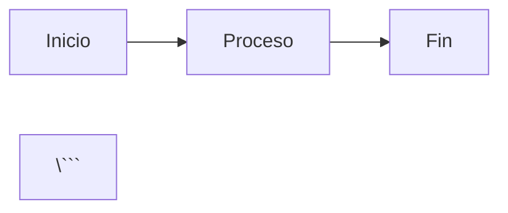

# 🤖 Guía de Agentes IA para MindArchive

Este documento contiene instrucciones, contexto y guías para agentes de IA (como GitHub Copilot, ChatGPT, Claude, etc.) que trabajen en este proyecto.

---

## 📋 Información General del Proyecto

### Nombre del Proyecto

**MindArchive** - Repositorio centralizado de apuntes académicos universitarios

### Descripción

Sitio web de documentación académica construido con Docusaurus 3.x que contiene apuntes, trabajos y recursos de diferentes materias universitarias, principalmente de Ingeniería en Sistemas.

### Stack Tecnológico

- **Framework:** Docusaurus 3.x (React + TypeScript)
- **Lenguajes:** TypeScript, Markdown, CSS
- **Matemáticas:** KaTeX para renderizado de fórmulas LaTeX
- **Diagramas:** Mermaid
- **Hosting:** GitHub Pages
- **Gestión:** npm, Git

### Estructura del Proyecto

```plain
d:\Estudios\apuntes\
├── docs/                          # Contenido académico (Markdown)
│   ├── index.md                   # Página de introducción
│   └── materias/                  # Materias organizadas
│       ├── algoritmos-y-estructuras-de-datos/
│       ├── analisis-matematico-2/
│       └── probabilidad-y-estadistica/
├── src/                           # Código fuente React/TypeScript
│   ├── components/                # Componentes React personalizados
│   ├── css/
│   │   └── custom.css            # Estilos personalizados
│   └── pages/
│       └── index.js              # Landing page
├── static/                        # Archivos estáticos
│   └── img/                      # Imágenes y recursos
├── build/                         # Build output (no versionar)
├── docusaurus.config.ts          # Configuración principal
├── sidebars.ts                   # Configuración del sidebar
├── tsconfig.json                 # Configuración TypeScript
├── package.json                  # Dependencias y scripts
├── MEJORAS.md                    # Lista de mejoras propuestas
└── AGENTS.md                     # Este archivo
```

---

## 🎯 Objetivos del Proyecto

1. **Centralizar conocimiento académico** de forma organizada y accesible
2. **Facilitar el estudio** con búsqueda rápida y navegación intuitiva
3. **Compartir recursos** con la comunidad estudiantil
4. **Mantener calidad** con formato consistente y validaciones automáticas
5. **Accesibilidad** en múltiples dispositivos (desktop, móvil, tablet)

---

## 📝 Convenciones y Estándares

### Convenciones de Nombres de Archivos

#### Archivos Markdown (Contenido)

```plain
docs/materias/[nombre-materia]/unidad-[XX].md
```

**Ejemplos:**

- `docs/materias/algoritmos-y-estructuras-de-datos/unidad-01.md`
- `docs/materias/analisis-matematico-2/unidad-08.md`

**Reglas:**

- Nombres en minúsculas con guiones
- Unidades numeradas con dos dígitos: `unidad-01`, `unidad-02`, etc.
- Sin espacios, sin caracteres especiales excepto guiones

#### Archivos de Imágenes

```plain
static/img/[nombre-materia]/[nombre-descriptivo].png
docs/materias/[nombre-materia]/images/[nombre-descriptivo].png
```

### Estructura de Frontmatter en Markdown

Cada archivo `.md` debe tener frontmatter con esta estructura:

```yaml
---
title: "Unidad X: Título Descriptivo"
description: "Breve descripción de los contenidos (1-2 líneas)"
sidebar_position: X
tags: [tag1, tag2, tag3]
---
```

**Ejemplo real:**

```yaml
---
title: "Unidad 7: Grafos"
description: "Conceptos fundamentales de teoría de grafos, algoritmos de recorrido (BFS, DFS), caminos mínimos (Dijkstra, Floyd-Warshall), y problemas clásicos"
sidebar_position: 7
tags: [grafos, algoritmos, bfs, dfs, dijkstra, floyd-warshall]
---
```

### Formato de Contenido Markdown

#### Jerarquía de Títulos

```markdown
# NO USAR H1 (reservado para title del frontmatter)

## Primer tema: 1.1 Título Principal
### 1.1.1 Subtítulo
#### Subsección
##### Detalles menores
```

#### Objetivos de Aprendizaje

Cada unidad debe comenzar con:

```markdown
## Objetivos de Aprendizaje

### Objetivo General
[Descripción del objetivo general en singular]

### Objetivos Específicos
- Objetivo específico 1
- Objetivo específico 2
- Objetivo específico 3
```

#### Fórmulas Matemáticas (KaTeX)

**IMPORTANTE:** Caracteres acentuados en modo matemático DEBEN usar `\text{}`:

❌ **INCORRECTO:**

```markdown
$$X_{máx} - X_{mín}$$
$\text{distancia mínima}$
```

✅ **CORRECTO:**

```markdown
$$X_{\text{máx}} - X_{\text{mín}}$$
$\text{distancia mínima en } (0,0)$
```

**Inline math:**

```markdown
La complejidad es $O(n \log n)$ en el peor caso.
```

**Block math:**

```markdown
$$
f(x) = \int_{a}^{b} x^2 \, dx
$$
```

#### Bloques de Código

**Con lenguaje especificado:**

```markdown
```cpp
#include <iostream>

int main() {
    std::cout << "Hello, World!" << std::endl;
    return 0;
}
\```
```

**Lenguajes soportados:**

- `cpp` - C++
- `java` - Java
- `python` - Python
- `javascript` / `typescript`
- `matlab` - MATLAB
- `bash` - Shell scripts

#### Diagramas Mermaid

```markdown


#### Tablas

```markdown
| Columna 1 | Columna 2 | Columna 3 |
|-----------|-----------|-----------|
| Dato 1    | Dato 2    | Dato 3    |
| Dato 4    | Dato 5    | Dato 6    |
```

#### Callouts/Admonitions

```markdown
:::note Nota
Contenido de la nota
:::

:::tip Consejo
Contenido del consejo
:::

:::warning Advertencia
Contenido de la advertencia
:::

:::danger Peligro
Contenido del peligro
:::

:::info Información
Contenido informativo
:::
```

#### Listas

**Listas numeradas:**

```markdown
1. Primer item
2. Segundo item
3. Tercer item
```

**Listas no numeradas:**

```markdown
- Item con guion
- Otro item
  - Sub-item indentado
  - Otro sub-item
```

#### Enlaces

**Internos (entre documentos):**

```markdown
Ver [Unidad 1](./unidad-01.md) para más detalles.
```

**Externos:**

```markdown
Consultar [documentación oficial](https://example.com)
```

---

## 🛠️ Configuración Técnica

### Configuración de Docusaurus

#### docusaurus.config.ts

**Aspectos importantes:**

1. **Organización y URLs:**

```typescript
const organizationName = "ArenasAgustin";
const projectName = "MindArchive";
url: `https://${organizationName}.github.io`,
baseUrl: `/${projectName}/`,
```

2. **Idioma:**

```typescript
i18n: {
  defaultLocale: "es",
  locales: ["es"],
}
```

3. **Markdown con Mermaid y KaTeX:**

```typescript
markdown: {
  mermaid: true,
  hooks: {
    onBrokenMarkdownLinks: "warn",
  },
}
```

4. **Plugins de Markdown:**

```typescript
remarkPlugins: [remarkMath],
rehypePlugins: [rehypeKatex],
```

5. **Tema:**

```typescript
colorMode: {
  defaultMode: "dark",
  disableSwitch: false,
  respectPrefersColorScheme: true,
}
```

#### sidebars.ts

**Estructura actual:**

```typescript
const sidebars: SidebarsConfig = {
  materiasSidebar: [
    {
      type: "doc",
      id: "index",
      label: "Introducción",
    },
    {
      type: "category",
      label: "Materias",
      collapsed: false,  // Expandido por defecto
      items: [
        {
          type: "autogenerated",
          dirName: "materias",
        },
      ],
    },
  ],
};
```

**Importante:**

- Sidebar autogenerado desde `docs/materias/`
- Usa `sidebar_position` en frontmatter para ordenar
- `collapsed: false` mantiene la categoría expandida

### Scripts npm Disponibles

```json
"scripts": {
  "start": "docusaurus start",      // Dev server (puerto 3000)
  "dev": "docusaurus start",         // Alias de start
  "build": "docusaurus build",       // Build de producción
  "serve": "docusaurus serve",       // Servir build localmente
  "clear": "docusaurus clear",       // Limpiar caché
  "deploy": "docusaurus deploy"      // Deploy a GitHub Pages
}
```

---

## 🎨 Estilo Visual

### Colores Principales (custom.css)

```css
:root {
  /* Modo claro */
  --ifm-color-primary: #7c3aed;          /* Púrpura/violeta */
  --ifm-color-primary-dark: #6d28d9;
  --ifm-color-primary-darker: #5b21b6;
  --ifm-color-primary-darkest: #4c1d95;
  --ifm-color-primary-light: #8b5cf6;
  --ifm-color-primary-lighter: #a78bfa;
  --ifm-color-primary-lightest: #c4b5fd;
}

[data-theme='dark'] {
  /* Modo oscuro */
  --ifm-color-primary: #a78bfa;
  --ifm-color-primary-dark: #8b5cf6;
  /* ... */
}
```

### Iconos en Navbar

```typescript
navbar: {
  title: "📚 MindArchive",
  items: [
    { label: "📖 Materias", /* ... */ },
    { label: "🎓 Recursos", /* ... */ },
    { className: "header-github-link", /* GitHub icon */ }
  ]
}
```

---

## 🔧 Tareas Comunes para Agentes

### 1. Agregar Nueva Unidad a una Materia

**Pasos:**

1. Crear archivo: `docs/materias/[nombre-materia]/unidad-XX.md`
2. Agregar frontmatter completo con `sidebar_position`
3. Estructurar contenido con objetivos de aprendizaje
4. Validar sintaxis KaTeX (usar `\text{}` para acentos)
5. Agregar tags relevantes
6. Verificar que la numeración de unidades sea secuencial

**Template:**

```markdown
---
title: "Unidad X: Título"
description: "Descripción breve"
sidebar_position: X
tags: [tag1, tag2]
---

## Objetivos de Aprendizaje

### Objetivo General
[Descripción]

### Objetivos Específicos
- Objetivo 1
- Objetivo 2

## Primer tema: X.1 Título Principal

### X.1.1 Subtítulo

Contenido...
```

### 2. Corregir Warnings de KaTeX

**Identificar:**

```bash
LaTeX-incompatible input and strict mode is set to 'warn': 
Accented Unicode text character "í" used in math mode
```

**Buscar con regex:**

```regex
\$[^$]*[íáéóúñÍÁÉÓÚÑ][^$]*\$
```

**Corregir:**

- `$máximo$` → `$\text{máximo}$`
- `$X_{mín}$` → `$X_{\text{mín}}$`
- `mínimo en $(0,0)$` → `$\text{mínimo en } (0,0)$`

### 3. Actualizar Objetivos de Aprendizaje

**Formato esperado:**

- **Objetivo General:** Uno solo, describe el propósito general de la unidad
- **Objetivos Específicos:** Lista de 5-10 objetivos concretos y medibles

**Características de buenos objetivos:**

- Comienzan con verbos de acción (comprender, implementar, analizar, aplicar)
- Son específicos y medibles
- Incluyen detalles técnicos relevantes (complejidades, estructuras, algoritmos)
- Mencionan capacidades prácticas

### 4. Agregar Nueva Materia

**Pasos:**

1. Crear directorio: `docs/materias/[nombre-materia]/`
2. Crear índice: `docs/materias/[nombre-materia]/index.md`
3. Agregar unidades numeradas
4. Configurar frontmatter con `sidebar_position` para ordenar en el sidebar
5. Agregar imágenes en: `static/img/[nombre-materia]/` si es necesario

**Frontmatter del índice de materia:**

```yaml
---
title: "Nombre de la Materia"
description: "Descripción general de la materia"
sidebar_position: X
---
```

### 5. Validar y Corregir Markdown

**Errores comunes de markdownlint:**

- `MD033`: HTML inline (a veces OK, configurar en `.markdownlint.json`)
- `MD037`: Espacios dentro de énfasis (`** texto **` → `**texto**`)
- `MD013`: Líneas muy largas (OK para contenido académico)
- `MD032`: Listas sin líneas en blanco alrededor

**Ignorar estos errores cuando sea apropiado para contenido académico.**

### 6. Optimizar Búsqueda de Contenido

**Para facilitar búsqueda:**

- Usar sinónimos en el texto (BFS = Búsqueda en Amplitud = Breadth-First Search)
- Incluir términos técnicos en español e inglés
- Agregar tags descriptivos en frontmatter
- Usar descripciones claras

### 7. Mejorar Accesibilidad

**Prácticas:**

- Texto alternativo en imágenes: ``
- Contraste adecuado en colores personalizados
- Jerarquía de encabezados lógica (no saltar niveles)
- Enlaces descriptivos (no usar "click aquí")

---

## 🚨 Errores Comunes y Soluciones

### Error: KaTeX parse error

**Causa:** Sintaxis LaTeX incorrecta o caracteres acentuados sin `\text{}`

**Solución:**

1. Envolver texto con acentos en `\text{}`
2. Verificar sintaxis LaTeX en [KaTeX Supported Functions](https://katex.org/docs/supported.html)
3. Usar `\\` para saltos de línea en ecuaciones

### Error: Broken markdown links

**Causa:** Enlaces internos rotos entre documentos

**Solución:**

1. Usar rutas relativas correctas: `./unidad-02.md` o `../otra-materia/unidad-01.md`
2. Verificar que el archivo destino exista
3. Usar nombres de archivo exactos (case-sensitive en producción)

### Error: Mermaid diagram not rendering

**Causa:** Sintaxis Mermaid incorrecta o configuración faltante

**Solución:**

1. Verificar sintaxis en [Mermaid Live Editor](https://mermaid.live/)
2. Asegurar que `themes: ["@docusaurus/theme-mermaid"]` esté en config
3. Cerrar bloque con triple backtick

### Error: Sidebar not updating

**Causa:** Caché de Docusaurus desactualizado

**Solución:**

```bash
npm run clear
npm run start
```

### Warning: deprecated onBrokenMarkdownLinks

**Ya corregido:** Movido a `markdown.hooks.onBrokenMarkdownLinks` en config

---

## 📚 Recursos de Referencia

### Documentación Oficial

- **Docusaurus:** <https://docusaurus.io/docs>
- **KaTeX:** <https://katex.org/docs/supported.html>
- **Mermaid:** <https://mermaid.js.org/intro/>
- **Markdown Guide:** <https://www.markdownguide.org/>

### Herramientas Útiles

- **KaTeX Live Editor:** <https://katex.org/>
- **Mermaid Live Editor:** <https://mermaid.live/>
- **Markdown Table Generator:** <https://www.tablesgenerator.com/markdown_tables>
- **RegEx Tester:** <https://regex101.com/>

### Comunidad

- **Docusaurus Discord:** <https://discord.gg/docusaurus>
- **GitHub Discussions:** En este repositorio

---

## 🎓 Materias Actuales del Proyecto

### 1. Algoritmos y Estructuras de Datos

**Directorio:** `docs/materias/algoritmos-y-estructuras-de-datos/`

**Unidades actuales:**

- Unidad 1: Fundamentos de C++
- Unidad 2: Recursividad
- Unidad 3A: Estructuras Lineales
- Unidad 3B: Colas y Pilas
- Unidad 4: Ordenamiento
- Unidad 5: Árboles
- Unidad 6: Búsqueda
- Unidad 7: Grafos

**Tags comunes:** algoritmos, estructuras-de-datos, c++, complejidad, ordenamiento, arboles, grafos

### 2. Análisis Matemático 2

**Directorio:** `docs/materias/analisis-matematico-2/`

**Unidades actuales:**

- Unidad 1-8: (Verificar estructura actual)

**Tags comunes:** matematica, calculo, limites, derivadas, integrales

### 3. Probabilidad y Estadística

**Directorio:** `docs/materias/probabilidad-y-estadistica/`

**Unidades actuales:**

- Unidad 1-3: (Verificar estructura actual)

**Tags comunes:** estadistica, probabilidad, variables-aleatorias, distribuciones

---

## 🤖 Prompts Útiles para Agentes

### Para crear contenido nuevo

```
Crea una nueva unidad para [materia] sobre [tema]. 
Debe incluir:
- Frontmatter completo con title, description, sidebar_position y tags
- Objetivos de aprendizaje (1 general + 5-10 específicos)
- Contenido estructurado con títulos jerárquicos
- Ejemplos de código en [lenguaje]
- Fórmulas matemáticas con KaTeX (usar \text{} para acentos)
- Diagramas Mermaid si son relevantes

Formato siguiendo AGENTS.md
```

### Para corregir errores

```
Revisa [archivo] y corrige:
- Warnings de KaTeX con caracteres acentuados (usar \text{})
- Errores de sintaxis Markdown
- Enlaces rotos
- Frontmatter faltante o incorrecto

Siguiendo las convenciones en AGENTS.md
```

### Para mejorar contenido existente

```
Mejora [unidad] agregando:
- Objetivos de aprendizaje más detallados y técnicos
- Ejemplos de código prácticos
- Visualizaciones con Mermaid
- Tablas comparativas
- Callouts para destacar conceptos importantes

Mantén el formato establecido en AGENTS.md
```

---

## 🔄 Workflow de Trabajo

### 1. Antes de comenzar

- [ ] Leer AGENTS.md y MEJORAS.md
- [ ] Revisar estructura actual del proyecto
- [ ] Entender el contexto de la tarea

### 2. Durante el desarrollo

- [ ] Seguir convenciones de nombres
- [ ] Usar formato correcto de frontmatter
- [ ] Validar sintaxis KaTeX (caracteres acentuados)
- [ ] Probar cambios localmente (`npm run start`)
- [ ] Verificar que no hay warnings en consola

### 3. Antes de finalizar

- [ ] Build exitoso (`npm run build`)
- [ ] Sin errores de KaTeX
- [ ] Enlaces internos funcionando
- [ ] Sidebar actualizado correctamente
- [ ] Diagramas Mermaid renderizando

### 4. Comunicación con usuario

- [ ] Explicar cambios realizados de forma concisa
- [ ] Mencionar archivos modificados
- [ ] Indicar si hay tareas pendientes
- [ ] Sugerir próximos pasos si es relevante

---

## ⚙️ Configuraciones Especiales

### TypeScript

**tsconfig.json:**

```json
{
  "extends": "@docusaurus/tsconfig",
  "compilerOptions": {
    "baseUrl": ".",
    "paths": {
      "@site/*": ["./*"]
    }
  }
}
```

### CSS Personalizado

**Ubicación:** `src/css/custom.css`

**Modificaciones comunes:**

- Colores del tema (variables CSS)
- Estilos de navbar y footer
- Estilos personalizados para componentes
- GitHub icon SVG

---

## 🎯 Objetivos de Calidad

### Contenido

- ✅ Sin errores de KaTeX
- ✅ Sin enlaces rotos
- ✅ Frontmatter completo en todos los archivos
- ✅ Objetivos de aprendizaje en todas las unidades
- ✅ Código con sintaxis resaltada correctamente

### Técnico

- ✅ Build sin errores ni warnings críticos
- ✅ TypeScript sin errores de tipos
- ✅ Lighthouse score > 90 (cuando se implemente)
- ✅ Responsive en móvil y desktop

### Mantenibilidad

- ✅ Código limpio y comentado cuando sea necesario
- ✅ Estructura de carpetas lógica
- ✅ Documentación actualizada (este archivo)
- ✅ Commits descriptivos y atómicos

---

## 📞 Contacto y Soporte

**Propietario del Proyecto:** Agustín Arenas  
**GitHub:** ArenasAgustin  
**Repositorio:** <https://github.com/ArenasAgustin/MindArchive>  
**Email:** <arenasagustin7@gmail.com>

---

## 📜 Historial de Cambios Importantes

### 2025-11-05

- ✅ Migración a TypeScript (docusaurus.config.ts, sidebars.ts)
- ✅ Corrección de warnings KaTeX con caracteres acentuados
- ✅ Actualización a Docusaurus 3.x
- ✅ Configuración de `onBrokenMarkdownLinks` movida a `markdown.hooks`
- ✅ Navbar mejorado con dropdown de recursos y GitHub icon
- ✅ Sidebar expandido por defecto (`collapsed: false`)
- ✅ Creación de MEJORAS.md con roadmap
- ✅ Creación de AGENTS.md (este archivo)

---

**Última actualización:** 2025-11-05  
**Versión de Docusaurus:** 3.x  
**Node.js:** ≥ 18.x recomendado

---

## 🚀 ¡Listo para Empezar

Este documento te proporciona todo lo necesario para trabajar efectivamente en MindArchive. Mantén este archivo actualizado cuando se agreguen nuevas convenciones o cambios estructurales importantes.

**¡Éxito con tu contribución al proyecto! 📚🤖**
