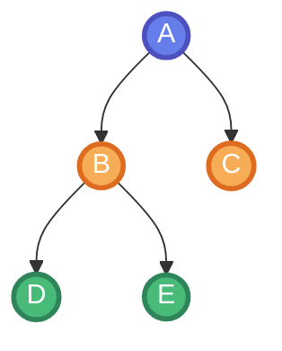
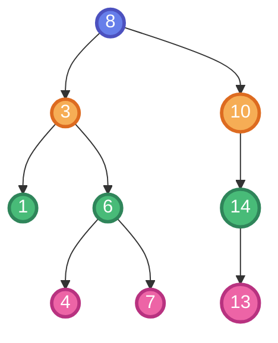
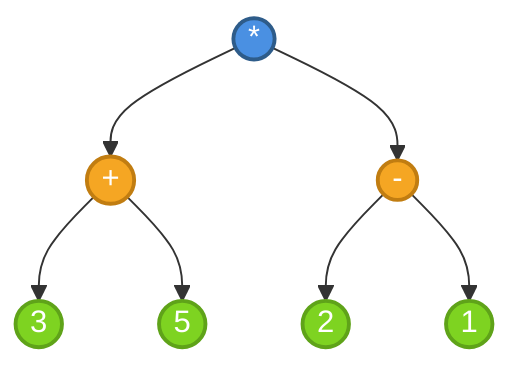

## 🎯 Objetivos de Aprendizaje

### Objetivo General

Comprender y aplicar la estructura de datos jerárquica de árboles, analizando sus propiedades, operaciones y diferentes formas de recorrido, con énfasis en los Árboles de Búsqueda Binaria.

### Objetivos Específicos

Al finalizar esta unidad, el estudiante será capaz de:

- Definir el concepto de árbol y sus componentes fundamentales
- Distinguir entre diferentes tipos de árboles (m-arios, binarios, llenos, completos)
- Especificar formalmente el Tipo de Dato Abstracto (TDA) de árbol binario
- Implementar operaciones básicas sobre árboles binarios
- Aplicar los diferentes métodos de recorrido de árboles
- Comprender y aplicar la propiedad fundamental de los Árboles de Búsqueda Binaria (ABB)

## 📋 Contenidos y recursos

### 5.1 Introducción a los Árboles

- **5.1.1** Contexto y estructuras vistas
- **5.1.2** Concepto de árbol
- **5.1.3** Componentes fundamentales

### 5.2 Tipos de Árboles

- **5.2.1** Árboles m-arios
- **5.2.2** Árboles binarios
- **5.2.3** Árboles binarios especiales

### 5.3 TDA Árbol Binario

- **5.3.1** Especificación formal
- **5.3.2** Operaciones constructoras
- **5.3.3** Operaciones consultoras

### 5.4 Recorridos de Árboles

- **5.4.1** Recorrido en preorden
- **5.4.2** Recorrido en inorden
- **5.4.3** Recorrido en posorden

### 5.5 Árboles de Búsqueda Binaria (ABB)

- **5.5.1** Introducción y propiedad fundamental
- **5.5.2** Especificación algebraica del TDA ABB
- **5.5.3** Implementación dinámica
- **5.5.4** Otros usos de árboles binarios

## Primer tema: 5.1 Introducción a los Árboles

### 5.1.1 Contexto y estructuras vistas

#### Temas Vistos Anteriormente

Hasta ahora hemos estudiado:

**Estructuras de datos:**

- Listas
- Pilas
- Colas

**Algoritmos de ordenamiento:**

- Burbuja
- Inserción
- Selección
- HeapSort
- QuickSort

#### Temas a Continuación

En las próximas unidades abordaremos:

**Estructuras de datos:**

- **Árboles** (esta unidad)
- Grafos (relación cíclica entre los nodos)

**Algoritmos de búsqueda:**

- Búsqueda en profundidad
- Búsqueda en amplitud

### 5.1.2 Concepto de árbol

Un **Árbol** es una estructura de datos jerárquica (no lineal) con las siguientes características:

- Está basada en nodos que almacenan un tipo de dato (por ejemplo, un árbol de enteros)
- Puede tener dos o más nodos relacionados
- El número de nodos relacionados es finito y se define como un parámetro del árbol

#### Estructura Jerárquica vs. Estructura Lineal

| Estructura Jerárquica | Estructura Lineal |
|-----------------------|-------------------|
| El nodo A es padre de B y C | El nodo A está enlazado linealmente a B |
| Múltiples relaciones por nodo | Una relación por nodo |
| Organización en niveles | Organización secuencial |

### 5.1.3 Componentes fundamentales

| Componente | Definición |
|------------|------------|
| **Nodo** | Almacena la información y, en estructuras dinámicas, las referencias a sus hijos |
| **Raíz** | El único nodo que no tiene padre (es el ancestro de todos) |
| **Padre** | Nodo inmediatamente superior a otro nodo |
| **Hijo** | Nodo que tiene un padre |
| **Hermanos** | Nodos que comparten el mismo padre |
| **Hoja** | Nodo que no tiene hijos (nodo terminal) |
| **Rama (Intermedio)** | Nodo que no es la Raíz y tiene hijos |
| **Arista** | Conexión o enlace entre dos nodos |
| **Subárbol** | Un árbol cuya raíz es algún nodo n del árbol principal T, y que contiene a n y a todos sus descendientes en T |
| **Camino** | Secuencia de nodos donde cada nodo consecutivo está conectado por una arista |
| **Longitud de un camino** | Número de aristas de un camino |
| **Profundidad de un Nodo** | La longitud del camino desde la raíz hasta el nodo n. La profundidad de la raíz es 0 |
| **Nivel** | Cada generación dentro del árbol. Cada generación tiene un número de nivel distinto |
| **Altura del Árbol** | El número máximo de niveles de un árbol (o la longitud del camino más largo desde la raíz hasta una hoja) |

## Segundo tema: 5.2 Tipos de Árboles

### 5.2.1 Árboles m-arios

Si **m** es el máximo de nodos relacionados que puede tener un nodo, el árbol es un **m-ario**.

**Clasificación según m:**

- **Árbol General:** Cada nodo puede tener un número arbitrario de hijos (ejemplo: organigrama)
- **Árbol Binario (m=2):** Cada nodo se vincula con un máximo de dos hijos (hijo izquierdo e hijo derecho). Es el tipo más común en informática
- **Árbol Ternario (m=3):** Cada nodo puede tener hasta tres hijos
- **Árbol Cuaternario (m=4):** Cada nodo puede tener hasta cuatro hijos

### 5.2.2 Árboles binarios

El **Árbol Binario** es el tipo de árbol más utilizado en ciencias de la computación.

**Características:**

- Cada nodo tiene como máximo dos hijos
- Los hijos se distinguen como **hijo izquierdo** e **hijo derecho**
- La distinción entre izquierdo y derecho es importante (no son intercambiables)

### 5.2.3 Árboles binarios especiales

#### Árbol Binario Lleno

**Definición:** Cada nodo tiene exactamente cero o dos hijos. Ningún nodo tiene solo un hijo.

**Características:**

- Todos los nodos internos tienen exactamente dos hijos
- Todas las hojas están en el mismo nivel o en dos niveles consecutivos

#### Árbol Binario Completo

**Definición:** Todos los niveles, excepto posiblemente el último, están completamente llenos, y todos los nodos en el último nivel están lo más a la izquierda posible.

**Características:**

- Los niveles se llenan de izquierda a derecha
- Es la estructura más eficiente en términos de espacio
- Se utiliza comúnmente en heaps

## Tercer tema: 5.3 TDA Árbol Binario

### 5.3.1 Especificación formal

Un árbol binario es una **estructura recursiva**. Un nodo puede ser:

1. Un nodo vacío
2. Un nodo con un dato (α) y la relación con dos subárboles

**Definición formal:**
> Un árbol vacío es un nodo que no tiene dato y sus enlaces (hijos) son nulos.

### 5.3.2 Operaciones constructoras

| Operación | Sintaxis | Descripción |
|-----------|----------|-------------|
| **Crear Árbol** | `crearArb: → Arbol` | Crea un árbol vacío |
| **Plantar** | `plantar: α × Arbol × Arbol → Arbol` | Crea un nuevo árbol con un dato y dos subárboles (izquierdo y derecho) como hijos |

**Ejemplo conceptual:**

```cpp
// Crear un árbol vacío
Arbol<int> arbol = crearArb();

// Plantar un nuevo nodo con valor 10 y dos subárboles vacíos
Arbol<int> nuevoArbol = plantar(10, crearArb(), crearArb());
```

### 5.3.3 Operaciones consultoras

| Operación | Sintaxis | Descripción |
|-----------|----------|-------------|
| **Hijo Izquierdo** | `hijoIzq: Arbol → Arbol` | Devuelve el subárbol izquierdo |
| **Hijo Derecho** | `hijoDer: Arbol → Arbol` | Devuelve el subárbol derecho |
| **Dato** | `dato: Arbol → α` | Devuelve el valor del nodo |
| **Nulo** | `nulo: Arbol → bool` | Indica si el árbol está vacío |

### Axiomas del TDA Árbol Binario

Los axiomas definen el comportamiento esperado de las operaciones:

1. `nulo(crearArb()) = true`
2. `nulo(plantar(a, t1, t2)) = false`
3. `hijoIzq(plantar(a, t1, t2)) = t1`
4. `hijoDer(plantar(a, t1, t2)) = t2`
5. `dato(plantar(a, t1, t2)) = a`

> **Importante:** Las operaciones `hijoIzq`, `hijoDer`, `dato` generan error si el árbol es nulo/vacío, es decir, si se llama a `crearArb()`.

## Cuarto tema: 5.4 Recorridos de Árboles

Los recorridos se refieren al **orden en que se visitan los nodos** de un árbol. Sea **R** la Raíz, **hi** el Hijo Izquierdo y **hd** el Hijo Derecho:

### 5.4.1 Recorrido en Preorden

**Orden:** R, hi, hd

**Descripción:** Se visita la raíz antes que los subárboles.

**Algoritmo:**

1. Visitar el nodo raíz
2. Recorrer el subárbol izquierdo en preorden
3. Recorrer el subárbol derecho en preorden

**Pseudocódigo:**

```plain
preorden(arbol):
    si no nulo(arbol):
        visitar(dato(arbol))
        preorden(hijoIzq(arbol))
        preorden(hijoDer(arbol))
```

**Uso común:** Copiar un árbol, obtener expresiones en notación prefija.

### 5.4.2 Recorrido en Inorden

**Orden:** hi, R, hd

**Descripción:** Se visita la raíz entre los subárboles.

**Algoritmo:**

1. Recorrer el subárbol izquierdo en inorden
2. Visitar el nodo raíz
3. Recorrer el subárbol derecho en inorden

**Pseudocódigo:**

```plain
inorden(arbol):
    si no nulo(arbol):
        inorden(hijoIzq(arbol))
        visitar(dato(arbol))
        inorden(hijoDer(arbol))
```

**Uso común:** En árboles binarios de búsqueda, produce los elementos en orden ascendente.

### 5.4.3 Recorrido en Posorden

**Orden:** hi, hd, R

**Descripción:** Se visita la raíz después de los subárboles.

**Algoritmo:**

1. Recorrer el subárbol izquierdo en posorden
2. Recorrer el subárbol derecho en posorden
3. Visitar el nodo raíz

**Pseudocódigo:**

```plain
posorden(arbol):
    si no nulo(arbol):
        posorden(hijoIzq(arbol))
        posorden(hijoDer(arbol))
        visitar(dato(arbol))
```

**Uso común:** Eliminar un árbol, evaluar expresiones en notación postfija.

### Tabla Comparativa de Recorridos

| Recorrido | Orden | Cuándo visitar la raíz | Aplicaciones típicas |
|-----------|-------|------------------------|---------------------|
| **Preorden** | R, hi, hd | Antes que los subárboles | Copiar árbol, notación prefija |
| **Inorden** | hi, R, hd | Entre los subárboles | Ordenar elementos, notación infija |
| **Posorden** | hi, hd, R | Después de los subárboles | Eliminar árbol, notación postfija |

### Ejemplo de Recorridos

Consideremos el siguiente árbol:



**Recorridos:**

- **Preorden:** A, B, D, E, C
- **Inorden:** D, B, E, A, C
- **Posorden:** D, E, B, C, A

## Quinto tema: 5.5 Árboles de Búsqueda Binaria (ABB)

### 5.5.1 Introducción y propiedad fundamental

El **Árbol de Búsqueda Binaria (ABB)** o **Binary Search Tree (BST)** es uno de los tipos de árboles binarios más comunes y útiles en informática.

#### Propiedad Fundamental de un ABB

En un ABB, para cualquier nodo, se cumple que:

1. El valor de la raíz es **mayor** que el valor de cualquier nodo en su subárbol izquierdo
   - `raíz > todos los nodos del subárbol izquierdo`

2. El valor de la raíz es **menor** que el valor de cualquier nodo en su subárbol derecho
   - `raíz < todos los nodos del subárbol derecho`

3. El subárbol izquierdo también es un ABB

4. El subárbol derecho también es un ABB

**Ejemplo de ABB:**



En este árbol:

- Todos los valores del subárbol izquierdo de 8 (1, 3, 4, 6, 7) son menores que 8
- Todos los valores del subárbol derecho de 8 (10, 13, 14) son mayores que 8

### 5.5.2 Especificación algebraica del TDA ABB

#### 1. Signatura

**Tipos:**

- Árbol (T)
- Elementos del árbol (α)

**Operaciones:**

| Operación | Sintaxis | Descripción |
|-----------|----------|-------------|
| **Crear** | `crear: → Arbol` | Crea un ABB vacío |
| **Agregar** | `agregar: α × Arbol → Arbol` | Agrega elemento e al árbol T |
| **Raíz** | `raiz: Arbol → α` | Devuelve la raíz del árbol T |
| **Pertenece** | `pertenece: α × Arbol → bool` | Verifica si el elemento e está en T |
| **Eliminar** | `eliminar: α × Arbol → Arbol` | Devuelve T sin el elemento e |

#### 2. Axiomas (Reglas de Comportamiento)

Los axiomas definen las propiedades y comportamiento esperado del ABB:

1. **Árbol vacío:** `nulo(crear()) = true`
   - Un árbol recién creado está vacío

2. **Árbol con elementos:** `nulo(agregar(e, T)) = false`
   - Un árbol con elementos no está vacío

3. **Búsqueda en árbol vacío:** `pertenece(e, crear()) = false`
   - Buscar en un árbol vacío siempre es falso

4. **Búsqueda elemento insertado:** `pertenece(e, agregar(e, T)) = true`
   - Buscar un elemento recién insertado siempre es verdadero

5. **Eliminación de elemento insertado:** `eliminar(e, agregar(e, T)) = T`
   - Eliminar un elemento recién insertado devuelve el árbol original

### 5.5.3 Implementación dinámica

Un ABB puede implementarse dinámicamente utilizando **nodos enlazados**. Cada nodo (o celda) típicamente almacena:

**Estructura de un nodo:**

1. **El dato del nodo** - El valor almacenado (tipo α)
2. **Una referencia (puntero) al hijo izquierdo** - Enlace al subárbol izquierdo
3. **Una referencia (puntero) al hijo derecho** - Enlace al subárbol derecho

**Representación en C++:**

```cpp
template<typename T>
struct Nodo {
    T dato;                // Valor almacenado
    Nodo<T>* izquierdo;   // Puntero al hijo izquierdo
    Nodo<T>* derecho;     // Puntero al hijo derecho
    
    // Constructor
    Nodo(T valor) : dato(valor), izquierdo(nullptr), derecho(nullptr) {}
};
```

**Características de la implementación:**

- Los enlaces a hijos inexistentes se representan como **Nulos** (nullptr en C++)
- La estructura es recursiva por naturaleza
- Permite operaciones eficientes de búsqueda, inserción y eliminación

**Complejidad de operaciones en ABB:**

| Operación | Mejor caso | Caso promedio | Peor caso |
|-----------|------------|---------------|-----------|
| Búsqueda | O(log n) | O(log n) | O(n) |
| Inserción | O(log n) | O(log n) | O(n) |
| Eliminación | O(log n) | O(log n) | O(n) |

> **Nota:** El peor caso O(n) ocurre cuando el árbol está completamente desbalanceado (como una lista enlazada).

### 5.5.4 Otros usos de árboles binarios

#### Árbol de Expresiones Aritméticas

Cada nodo almacena un **operador** o un **operando**.

**Ejemplo:** Expresión `(3 + 5) * (2 - 1)`



**Características:**

- Las hojas contienen operandos (números)
- Los nodos internos contienen operadores (+, -, *, /)
- Se puede evaluar mediante recorrido posorden

#### Árbol de Huffman

Se utiliza para la **compresión de archivos de texto**.

**Principio:**

- Usa **menos bits** para letras comunes (alta frecuencia)
- Usa **más bits** para letras menos comunes (baja frecuencia)

**Aplicaciones:**

- Compresión de archivos (ZIP, GZIP)
- Codificación de datos
- Transmisión eficiente de información

**Ejemplo simplificado:**

```plain
Frecuencias: A=5, B=9, C=12, D=13, E=16, F=45

Árbol resultante asigna:
- Códigos cortos a letras frecuentes (F, E)
- Códigos largos a letras menos frecuentes (A, B)
```

### Ventajas de los ABB

1. **Búsqueda eficiente:** O(log n) en promedio
2. **Inserción ordenada:** Mantiene los elementos ordenados
3. **Recorrido inorden:** Produce elementos en orden ascendente
4. **Versatilidad:** Base para estructuras más avanzadas (AVL, Red-Black)

Los árboles son fundamentales en ciencias de la computación y tienen aplicaciones en sistemas de archivos, bases de datos, compiladores, inteligencia artificial y muchas otras áreas.
