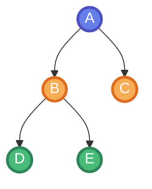
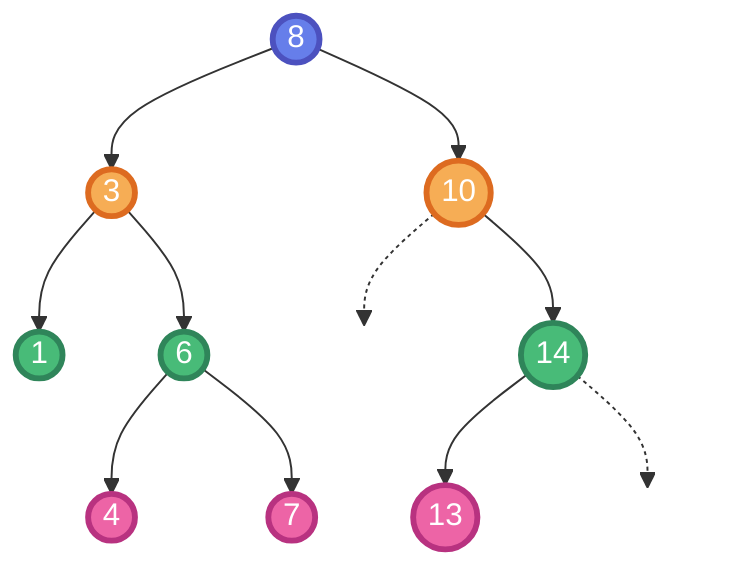
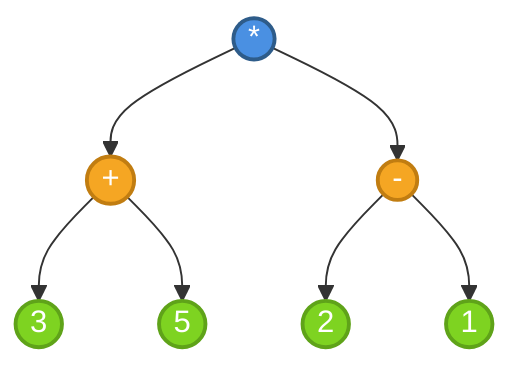
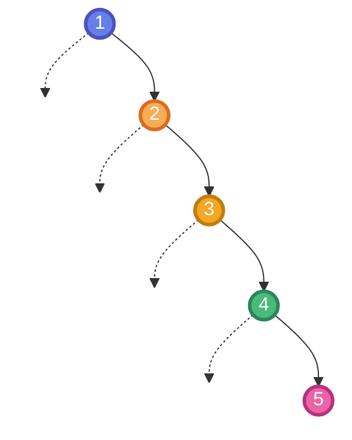
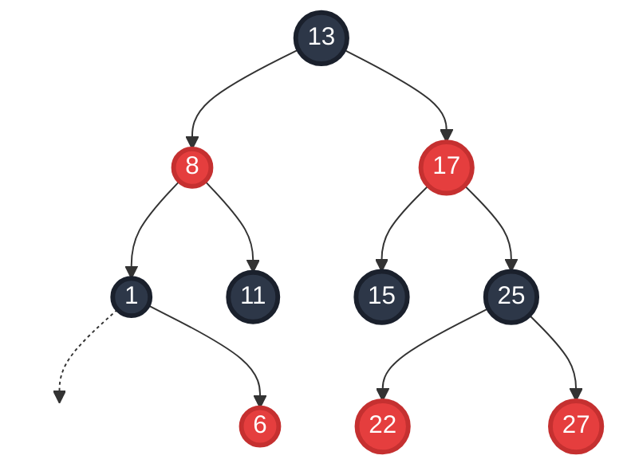
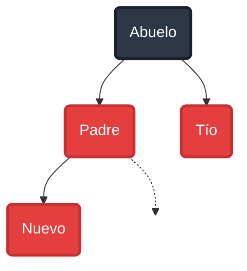
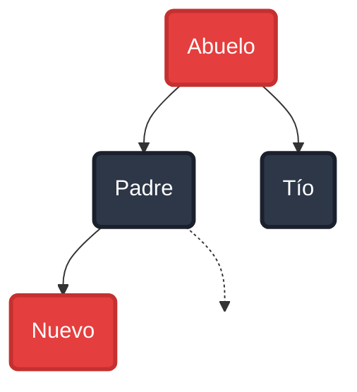

## 🎯 Objetivos de Aprendizaje

### Objetivo General

Comprender y aplicar la estructura de datos jerárquica de árboles, analizando sus propiedades, operaciones y diferentes formas de recorrido, con énfasis en los Árboles de Búsqueda Binaria y estructuras avanzadas auto-equilibradas.

### Objetivos Específicos

Al finalizar esta unidad, el estudiante será capaz de:

- Definir el concepto de árbol y sus componentes fundamentales
- Distinguir entre diferentes tipos de árboles (m-arios, binarios, llenos, completos)
- Especificar formalmente el Tipo de Dato Abstracto (TDA) de árbol binario
- Implementar operaciones básicas sobre árboles binarios
- Aplicar los diferentes métodos de recorrido de árboles
- Comprender y aplicar la propiedad fundamental de los Árboles de Búsqueda Binaria (ABB)
- Identificar las limitaciones del ABB simple y la necesidad de estructuras auto-equilibradas
- Comprender el funcionamiento de los Árboles AVL y sus mecanismos de reequilibrio
- Analizar los Árboles Rojo-Negro y su balance entre eficiencia de inserción y búsqueda
- Aplicar Árboles B y B+ en el contexto de bases de datos y sistemas de almacenamiento
- Seleccionar la estructura de árbol adecuada según los requisitos del problema

## 📋 Contenidos y recursos

### 5.1 Introducción a los Árboles

- **5.1.1** Contexto y estructuras vistas
- **5.1.2** Concepto de árbol
- **5.1.3** Componentes fundamentales

### 5.2 Tipos de Árboles

- **5.2.1** Árboles m-arios
- **5.2.2** Árboles binarios
- **5.2.3** Árboles binarios especiales

### 5.3 TDA Árbol Binario

- **5.3.1** Especificación formal
- **5.3.2** Operaciones constructoras
- **5.3.3** Operaciones consultoras

### 5.4 Recorridos de Árboles

- **5.4.1** Recorrido en preorden
- **5.4.2** Recorrido en inorden
- **5.4.3** Recorrido en posorden

### 5.5 Árboles de Búsqueda Binaria (ABB)

- **5.5.1** Introducción y propiedad fundamental
- **5.5.2** Especificación algebraica del TDA ABB
- **5.5.3** Implementación dinámica
- **5.5.4** Otros usos de árboles binarios

### 5.6 Limitaciones del ABB y Estructuras Avanzadas

- **5.6.1** Limitaciones del ABB Simple
- **5.6.2** Introducción a estructuras auto-equilibradas

### 5.7 Árboles AVL

- **5.7.1** Definición y motivación
- **5.7.2** Altura y factor de balance
- **5.7.3** Rotaciones y reequilibrio
- **5.7.4** Complejidad y rendimiento

### 5.8 Árboles Rojo-Negro (Red-Black Trees)

- **5.8.1** Definición y motivación
- **5.8.2** Propiedades fundamentales
- **5.8.3** Operaciones y reequilibrio
- **5.8.4** Comparación con AVL

### 5.9 Árboles B (B-Trees)

- **5.9.1** Motivación y contexto de uso
- **5.9.2** Definición y propiedades
- **5.9.3** Operaciones básicas
- **5.9.4** Aplicaciones en sistemas de almacenamiento

### 5.10 Árboles B+ (B+ Trees)

- **5.10.1** Diferencias con Árboles B
- **5.10.2** Estructura y propiedades
- **5.10.3** Ventajas para bases de datos
- **5.10.4** Comparación de estructuras

### 5.11 Recursos y Visualizaciones

- **5.11.1** Herramientas de visualización interactiva
- **5.11.2** Comparación general de estructuras

### 🔗 Recursos Complementarios

- [AyED 04 - Arboles 01](https://res.cloudinary.com/dmwto06rn/raw/upload/v1761174457/pdfs/AyED_04_-_Arboles_01_zrr7pb.pdf)
- [AyED 05 - Arboles 02](https://res.cloudinary.com/dmwto06rn/raw/upload/v1761174276/pdfs/AyED_05_-_Arboles_02_v2_hwevta.pdf)
- [AyED - Arboles](https://res.cloudinary.com/dmwto06rn/raw/upload/v1761174458/pdfs/AyED_-_Arboles_zvalh3.pdf)
- [Visualización de Árboles AAB](https://www.cs.usfca.edu/~galles/visualization/BST.html)
- [Visualización de Árboles AVL](https://www.cs.usfca.edu/~galles/visualization/AVLtree.html)
- [Visualización de Árboles Rojo-Negro](https://www.cs.usfca.edu/~galles/visualization/RedBlack.html)
- [Visualización de Árboles B](https://www.cs.usfca.edu/~galles/visualization/BTree.html)
- [Visualización de Árboles B+](https://www.cs.usfca.edu/~galles/visualization/BPlusTree.html)

## Primer tema: 5.1 Introducción a los Árboles

### 5.1.1 Contexto y estructuras vistas

#### Temas Vistos Anteriormente

Hasta ahora hemos estudiado:

**Estructuras de datos:**

- Listas
- Pilas
- Colas

**Algoritmos de ordenamiento:**

- Burbuja
- Inserción
- Selección
- HeapSort
- QuickSort

#### Temas a Continuación

En las próximas unidades abordaremos:

**Estructuras de datos:**

- **Árboles** (esta unidad)
- Grafos (relación cíclica entre los nodos)

**Algoritmos de búsqueda:**

- Búsqueda en profundidad
- Búsqueda en amplitud

### 5.1.2 Concepto de árbol

Un **Árbol** es una estructura de datos jerárquica (no lineal) con las siguientes características:

- Está basada en nodos que almacenan un tipo de dato (por ejemplo, un árbol de enteros)
- Puede tener dos o más nodos relacionados
- El número de nodos relacionados es finito y se define como un parámetro del árbol

#### Estructura Jerárquica vs. Estructura Lineal

| Estructura Jerárquica | Estructura Lineal |
|-----------------------|-------------------|
| El nodo A es padre de B y C | El nodo A está enlazado linealmente a B |
| Múltiples relaciones por nodo | Una relación por nodo |
| Organización en niveles | Organización secuencial |

### 5.1.3 Componentes fundamentales

| Componente | Definición |
|------------|------------|
| **Nodo** | Almacena la información y, en estructuras dinámicas, las referencias a sus hijos |
| **Raíz** | El único nodo que no tiene padre (es el ancestro de todos) |
| **Padre** | Nodo inmediatamente superior a otro nodo |
| **Hijo** | Nodo que tiene un padre |
| **Hermanos** | Nodos que comparten el mismo padre |
| **Hoja** | Nodo que no tiene hijos (nodo terminal) |
| **Rama (Intermedio)** | Nodo que no es la Raíz y tiene hijos |
| **Arista** | Conexión o enlace entre dos nodos |
| **Subárbol** | Un árbol cuya raíz es algún nodo n del árbol principal T, y que contiene a n y a todos sus descendientes en T |
| **Camino** | Secuencia de nodos donde cada nodo consecutivo está conectado por una arista |
| **Longitud de un camino** | Número de aristas de un camino |
| **Profundidad de un Nodo** | La longitud del camino desde la raíz hasta el nodo n. La profundidad de la raíz es 0 |
| **Nivel** | Cada generación dentro del árbol. Cada generación tiene un número de nivel distinto |
| **Altura del Árbol** | El número máximo de niveles de un árbol (o la longitud del camino más largo desde la raíz hasta una hoja) |

## Segundo tema: 5.2 Tipos de Árboles

### 5.2.1 Árboles m-arios

Si **m** es el máximo de nodos relacionados que puede tener un nodo, el árbol es un **m-ario**.

**Clasificación según m:**

- **Árbol General:** Cada nodo puede tener un número arbitrario de hijos (ejemplo: organigrama)
- **Árbol Binario (m=2):** Cada nodo se vincula con un máximo de dos hijos (hijo izquierdo e hijo derecho). Es el tipo más común en informática
- **Árbol Ternario (m=3):** Cada nodo puede tener hasta tres hijos
- **Árbol Cuaternario (m=4):** Cada nodo puede tener hasta cuatro hijos

### 5.2.2 Árboles binarios

El **Árbol Binario** es el tipo de árbol más utilizado en ciencias de la computación.

**Características:**

- Cada nodo tiene como máximo dos hijos
- Los hijos se distinguen como **hijo izquierdo** e **hijo derecho**
- La distinción entre izquierdo y derecho es importante (no son intercambiables)

### 5.2.3 Árboles binarios especiales

#### Árbol Binario Lleno

**Definición:** Cada nodo tiene exactamente cero o dos hijos. Ningún nodo tiene solo un hijo.

**Características:**

- Todos los nodos internos tienen exactamente dos hijos
- Todas las hojas están en el mismo nivel o en dos niveles consecutivos

#### Árbol Binario Completo

**Definición:** Todos los niveles, excepto posiblemente el último, están completamente llenos, y todos los nodos en el último nivel están lo más a la izquierda posible.

**Características:**

- Los niveles se llenan de izquierda a derecha
- Es la estructura más eficiente en términos de espacio
- Se utiliza comúnmente en heaps

## Tercer tema: 5.3 TDA Árbol Binario

### 5.3.1 Especificación formal

Un árbol binario es una **estructura recursiva**. Un nodo puede ser:

1. Un nodo vacío
2. Un nodo con un dato (α) y la relación con dos subárboles

**Definición formal:**
> Un árbol vacío es un nodo que no tiene dato y sus enlaces (hijos) son nulos.

### 5.3.2 Operaciones constructoras

| Operación | Sintaxis | Descripción |
|-----------|----------|-------------|
| **Crear Árbol** | `crearArb: → Arbol` | Crea un árbol vacío |
| **Plantar** | `plantar: α × Arbol × Arbol → Arbol` | Crea un nuevo árbol con un dato y dos subárboles (izquierdo y derecho) como hijos |

**Ejemplo conceptual:**

```cpp
// Crear un árbol vacío
Arbol<int> arbol = crearArb();

// Plantar un nuevo nodo con valor 10 y dos subárboles vacíos
Arbol<int> nuevoArbol = plantar(10, crearArb(), crearArb());
```

### 5.3.3 Operaciones consultoras

| Operación | Sintaxis | Descripción |
|-----------|----------|-------------|
| **Hijo Izquierdo** | `hijoIzq: Arbol → Arbol` | Devuelve el subárbol izquierdo |
| **Hijo Derecho** | `hijoDer: Arbol → Arbol` | Devuelve el subárbol derecho |
| **Dato** | `dato: Arbol → α` | Devuelve el valor del nodo |
| **Nulo** | `nulo: Arbol → bool` | Indica si el árbol está vacío |

### Axiomas del TDA Árbol Binario

Los axiomas definen el comportamiento esperado de las operaciones:

1. `nulo(crearArb()) = true`
2. `nulo(plantar(a, t1, t2)) = false`
3. `hijoIzq(plantar(a, t1, t2)) = t1`
4. `hijoDer(plantar(a, t1, t2)) = t2`
5. `dato(plantar(a, t1, t2)) = a`

> **Importante:** Las operaciones `hijoIzq`, `hijoDer`, `dato` generan error si el árbol es nulo/vacío, es decir, si se llama a `crearArb()`.

## Cuarto tema: 5.4 Recorridos de Árboles

Los recorridos se refieren al **orden en que se visitan los nodos** de un árbol. Sea **R** la Raíz, **hi** el Hijo Izquierdo y **hd** el Hijo Derecho:

### 5.4.1 Recorrido en Preorden

**Orden:** R, hi, hd

**Descripción:** Se visita la raíz antes que los subárboles.

**Algoritmo:**

1. Visitar el nodo raíz
2. Recorrer el subárbol izquierdo en preorden
3. Recorrer el subárbol derecho en preorden

**Pseudocódigo:**

```plain
preorden(arbol):
    si no nulo(arbol):
        visitar(dato(arbol))
        preorden(hijoIzq(arbol))
        preorden(hijoDer(arbol))
```

**Uso común:** Copiar un árbol, obtener expresiones en notación prefija.

### 5.4.2 Recorrido en Inorden

**Orden:** hi, R, hd

**Descripción:** Se visita la raíz entre los subárboles.

**Algoritmo:**

1. Recorrer el subárbol izquierdo en inorden
2. Visitar el nodo raíz
3. Recorrer el subárbol derecho en inorden

**Pseudocódigo:**

```plain
inorden(arbol):
    si no nulo(arbol):
        inorden(hijoIzq(arbol))
        visitar(dato(arbol))
        inorden(hijoDer(arbol))
```

**Uso común:** En árboles binarios de búsqueda, produce los elementos en orden ascendente.

### 5.4.3 Recorrido en Posorden

**Orden:** hi, hd, R

**Descripción:** Se visita la raíz después de los subárboles.

**Algoritmo:**

1. Recorrer el subárbol izquierdo en posorden
2. Recorrer el subárbol derecho en posorden
3. Visitar el nodo raíz

**Pseudocódigo:**

```plain
posorden(arbol):
    si no nulo(arbol):
        posorden(hijoIzq(arbol))
        posorden(hijoDer(arbol))
        visitar(dato(arbol))
```

**Uso común:** Eliminar un árbol, evaluar expresiones en notación postfija.

### Tabla Comparativa de Recorridos

| Recorrido | Orden | Cuándo visitar la raíz | Aplicaciones típicas |
|-----------|-------|------------------------|---------------------|
| **Preorden** | R, hi, hd | Antes que los subárboles | Copiar árbol, notación prefija |
| **Inorden** | hi, R, hd | Entre los subárboles | Ordenar elementos, notación infija |
| **Posorden** | hi, hd, R | Después de los subárboles | Eliminar árbol, notación postfija |

### Ejemplo de Recorridos

Consideremos el siguiente árbol:



**Recorridos:**

- **Preorden:** A, B, D, E, C
- **Inorden:** D, B, E, A, C
- **Posorden:** D, E, B, C, A

## Quinto tema: 5.5 Árboles de Búsqueda Binaria (ABB)

### 5.5.1 Introducción y propiedad fundamental

El **Árbol de Búsqueda Binaria (ABB)** o **Binary Search Tree (BST)** es uno de los tipos de árboles binarios más comunes y útiles en informática.

#### Propiedad Fundamental de un ABB

En un ABB, para cualquier nodo, se cumple que:

1. El valor de la raíz es **mayor** que el valor de cualquier nodo en su subárbol izquierdo
   - `raíz > todos los nodos del subárbol izquierdo`

2. El valor de la raíz es **menor** que el valor de cualquier nodo en su subárbol derecho
   - `raíz < todos los nodos del subárbol derecho`

3. El subárbol izquierdo también es un ABB

4. El subárbol derecho también es un ABB

**Ejemplo de ABB:**



En este árbol:

- Todos los valores del subárbol izquierdo de 8 (1, 3, 4, 6, 7) son menores que 8
- Todos los valores del subárbol derecho de 8 (10, 13, 14) son mayores que 8

### 5.5.2 Especificación algebraica del TDA ABB

#### 1. Signatura

**Tipos:**

- Árbol (T)
- Elementos del árbol (α)

**Operaciones:**

| Operación | Sintaxis | Descripción |
|-----------|----------|-------------|
| **Crear** | `crear: → Arbol` | Crea un ABB vacío |
| **Agregar** | `agregar: α × Arbol → Arbol` | Agrega elemento e al árbol T |
| **Raíz** | `raiz: Arbol → α` | Devuelve la raíz del árbol T |
| **Pertenece** | `pertenece: α × Arbol → bool` | Verifica si el elemento e está en T |
| **Eliminar** | `eliminar: α × Arbol → Arbol` | Devuelve T sin el elemento e |

#### 2. Axiomas (Reglas de Comportamiento)

Los axiomas definen las propiedades y comportamiento esperado del ABB:

1. **Árbol vacío:** `nulo(crear()) = true`
   - Un árbol recién creado está vacío

2. **Árbol con elementos:** `nulo(agregar(e, T)) = false`
   - Un árbol con elementos no está vacío

3. **Búsqueda en árbol vacío:** `pertenece(e, crear()) = false`
   - Buscar en un árbol vacío siempre es falso

4. **Búsqueda elemento insertado:** `pertenece(e, agregar(e, T)) = true`
   - Buscar un elemento recién insertado siempre es verdadero

5. **Eliminación de elemento insertado:** `eliminar(e, agregar(e, T)) = T`
   - Eliminar un elemento recién insertado devuelve el árbol original

### 5.5.3 Implementación dinámica

Un ABB puede implementarse dinámicamente utilizando **nodos enlazados**. Cada nodo (o celda) típicamente almacena:

**Estructura de un nodo:**

1. **El dato del nodo** - El valor almacenado (tipo α)
2. **Una referencia (puntero) al hijo izquierdo** - Enlace al subárbol izquierdo
3. **Una referencia (puntero) al hijo derecho** - Enlace al subárbol derecho

**Representación en C++:**

```cpp
template<typename T>
struct Nodo {
    T dato;                // Valor almacenado
    Nodo<T>* izquierdo;   // Puntero al hijo izquierdo
    Nodo<T>* derecho;     // Puntero al hijo derecho
    
    // Constructor
    Nodo(T valor) : dato(valor), izquierdo(nullptr), derecho(nullptr) {}
};
```

**Características de la implementación:**

- Los enlaces a hijos inexistentes se representan como **Nulos** (nullptr en C++)
- La estructura es recursiva por naturaleza
- Permite operaciones eficientes de búsqueda, inserción y eliminación

**Complejidad de operaciones en ABB:**

| Operación | Mejor caso | Caso promedio | Peor caso |
|-----------|------------|---------------|-----------|
| Búsqueda | O(log n) | O(log n) | O(n) |
| Inserción | O(log n) | O(log n) | O(n) |
| Eliminación | O(log n) | O(log n) | O(n) |

> **Nota:** El peor caso O(n) ocurre cuando el árbol está completamente desbalanceado (como una lista enlazada).

### 5.5.4 Otros usos de árboles binarios

#### Árbol de Expresiones Aritméticas

Cada nodo almacena un **operador** o un **operando**.

**Ejemplo:** Expresión `(3 + 5) * (2 - 1)`



**Características:**

- Las hojas contienen operandos (números)
- Los nodos internos contienen operadores (+, -, *, /)
- Se puede evaluar mediante recorrido posorden

#### Árbol de Huffman

Se utiliza para la **compresión de archivos de texto**.

**Principio:**

- Usa **menos bits** para letras comunes (alta frecuencia)
- Usa **más bits** para letras menos comunes (baja frecuencia)

**Aplicaciones:**

- Compresión de archivos (ZIP, GZIP)
- Codificación de datos
- Transmisión eficiente de información

**Ejemplo simplificado:**

```plain
Frecuencias: A=5, B=9, C=12, D=13, E=16, F=45

Árbol resultante asigna:
- Códigos cortos a letras frecuentes (F, E)
- Códigos largos a letras menos frecuentes (A, B)
```

### Ventajas de los ABB

1. **Búsqueda eficiente:** O(log n) en promedio
2. **Inserción ordenada:** Mantiene los elementos ordenados
3. **Recorrido inorden:** Produce elementos en orden ascendente
4. **Versatilidad:** Base para estructuras más avanzadas (AVL, Red-Black)

Los árboles son fundamentales en ciencias de la computación y tienen aplicaciones en sistemas de archivos, bases de datos, compiladores, inteligencia artificial y muchas otras áreas.

## Sexto tema: 5.6 Limitaciones del ABB y Estructuras Avanzadas

### 5.6.1 Limitaciones del ABB Simple

El **Árbol Binario de Búsqueda (ABB - BST)** es la base para estructuras más complejas. Sin embargo, tiene una limitación importante:

**Principal problema:** En el peor de los casos (inserción ordenada), el ABB puede **degenerar en una lista**, resultando en:

- Altura: $O(n)$
- Rendimiento de búsqueda ineficiente

**Ejemplo de degeneración:**

Si insertamos elementos en orden ascendente (1, 2, 3, 4, 5), el árbol se convierte en una cadena lineal:



Esto elimina las ventajas del árbol y lo convierte en una estructura lineal.

### 5.6.2 Introducción a estructuras auto-equilibradas

Para resolver este problema, se han desarrollado varias estructuras de datos que mantienen el árbol **balanceado automáticamente**:

#### Estructuras Auto-equilibradas

1. **Árboles AVL** - Balanceo estricto mediante rotaciones
2. **Árboles Rojo-Negro** - Balanceo más relajado, menos rotaciones
3. **Árboles B y B+** - Optimizados para almacenamiento en disco

#### Comparación de enfoques

| Estructura | Balanceo | Altura Garantizada | Uso Principal |
|------------|----------|-------------------|---------------|
| **ABB Simple** | No automático | $O(n)$ peor caso | Casos simples, datos aleatorios |
| **AVL** | Estricto | $O(\log n)$ | Búsquedas frecuentes en memoria |
| **Rojo-Negro** | Relajado | $O(\log n)$ | Balance entre inserción y búsqueda |
| **B/B+** | Por niveles | $O(\log_m n)$ | Bases de datos, sistemas de archivos |

En los siguientes temas estudiaremos en detalle los **Árboles AVL**, **Árboles Rojo-Negro**, **Árboles B** y **Árboles B+**.

## Séptimo tema: 5.7 Árboles AVL

### 5.7.1 Definición y motivación

El **Árbol AVL** (nombrado por sus inventores **Adelson-Velskii y Landis**) es un Árbol Binario de Búsqueda **auto-equilibrado** que garantiza que la altura del árbol se mantenga en $O(\log n)$, optimizando el tiempo de búsqueda, inserción y eliminación.

**Motivación:**

- Garantizar rendimiento predecible
- Evitar degeneración del ABB
- Mantener operaciones en tiempo logarítmico

### 5.7.2 Altura y factor de balance

#### Definición de Altura

**Altura de un Árbol ($H(T)$):**

- $H(T) = 0$ si $T$ solo contiene la raíz
- $H(T) = 1 + \max(H(T_i), H(T_d))$ (donde $T_i$ es el subárbol izquierdo y $T_d$ el derecho)

#### Definición de Árbol AVL

Un árbol $T$ es AVL si:

1. Es un árbol vacío, **o**
2. Si $T$ es no vacío y $T_i$ y $T_d$ son sus subárboles, entonces $T$ es AVL si:
   - $T_i$ es AVL
   - $T_d$ es AVL
   - El **factor de balance** (diferencia de alturas) cumple:

$$\left|H(T_i) - H(T_d)\right| \le 1$$

#### Factor de Balance

**Definición:**
$$\text{Balance} = H(T_d) - H(T_i)$$

**Estados de balance:**

- **Balance = -1:** Subárbol izquierdo más alto
- **Balance = 0:** Subárboles de igual altura (perfectamente balanceado)
- **Balance = +1:** Subárbol derecho más alto
- **Balance = ±2:** Desbalanceado, requiere rotación

Un nodo está **balanceado** si su factor de balance es $-1$, $0$, o $+1$.

### 5.7.3 Rotaciones y reequilibrio

Cuando se rompe la propiedad AVL (el factor de balance es $\pm 2$), se aplican **rotaciones** para restaurar el equilibrio.

#### Tipos de rotaciones

| Tipo de Rotación | Desbalance | Condición del Hijo | Mecanismo |
|------------------|------------|--------------------|-----------|
| **Izquierda-Izquierda (LL)** | Padre con balance $-2$ | Hijo Izquierdo con balance $-1$ | Rotar a la derecha alrededor del padre |
| **Derecha-Derecha (RR)** | Padre con balance $+2$ | Hijo Derecho con balance $+1$ | Rotar a la izquierda alrededor del padre |
| **Izquierda-Derecha (LR)** | Padre con balance $-2$ | Hijo Izquierdo con balance $+1$ | Rotación Doble: 1. Rotación Izquierda en el Hijo, 2. Rotación Derecha en el Padre |
| **Derecha-Izquierda (RL)** | Padre con balance $+2$ | Hijo Derecho con balance $-1$ | Rotación Doble: 1. Rotación Derecha en el Hijo, 2. Rotación Izquierda en el Padre |

#### Descripción de rotaciones

**Rotación Simple Derecha (LL):**

- **Cuándo:** Inserción en el subárbol izquierdo del hijo izquierdo
- **Acción:** El hijo izquierdo se convierte en la nueva raíz

**Rotación Simple Izquierda (RR):**

- **Cuándo:** Inserción en el subárbol derecho del hijo derecho
- **Acción:** El hijo derecho se convierte en la nueva raíz

**Rotación Doble Izquierda-Derecha (LR):**

- **Cuándo:** Inserción en el subárbol derecho del hijo izquierdo
- **Acción:** Primero rotar izquierda en el hijo, luego derecha en el padre

**Rotación Doble Derecha-Izquierda (RL):**

- **Cuándo:** Inserción en el subárbol izquierdo del hijo derecho
- **Acción:** Primero rotar derecha en el hijo, luego izquierda en el padre

### 5.7.4 Complejidad y rendimiento

#### Complejidad garantizada en AVL

| Operación | Complejidad |
|-----------|-------------|
| Búsqueda | $O(\log n)$ |
| Inserción | $O(\log n)$ |
| Eliminación | $O(\log n)$ |

#### Ventajas del Árbol AVL

1. **Altura garantizada:** Siempre $O(\log n)$, nunca degenera
2. **Búsquedas rápidas:** Ideal para aplicaciones con muchas búsquedas
3. **Predecible:** Rendimiento consistente independiente del orden de inserción

#### Desventajas del Árbol AVL

1. **Rotaciones frecuentes:** Cada inserción/eliminación puede requerir rotaciones
2. **Overhead de memoria:** Necesita almacenar el factor de balance
3. **Inserción más lenta:** Comparado con ABB simple o árboles Rojo-Negro

## Octavo tema: 5.8 Árboles Rojo-Negro (Red-Black Trees)

### 5.8.1 Definición y motivación

El **Árbol Rojo-Negro** (Red-Black Tree) es un Árbol Binario de Búsqueda **auto-equilibrado** que ofrece un **balance entre la eficiencia de inserción y búsqueda**.

**Nombre:** Proviene del uso de dos colores (rojo y negro) para marcar los nodos y mantener el equilibrio del árbol.

**Inventores:** Rudolf Bayer (1972), formalizados por Leo J. Guibas y Robert Sedgewick (1978)

#### Motivación

Los Árboles Rojo-Negro fueron diseñados para resolver una limitación de los Árboles AVL:

**Problema de AVL:**

- El balanceo estricto (factor de balance ≤ 1) requiere **rotaciones frecuentes**
- Cada inserción/eliminación puede requerir múltiples rotaciones hacia la raíz
- Esto hace que las operaciones de escritura sean más costosas

**Solución Rojo-Negro:**

- Criterio de balance **más relajado**
- **Menos rotaciones** en promedio (máximo 2 rotaciones para inserción, 3 para eliminación)
- Mejor rendimiento cuando hay muchas inserciones/eliminaciones
- Mantiene altura garantizada $O(\log n)$, aunque ligeramente mayor que AVL

#### Aplicaciones

Los Árboles Rojo-Negro son ampliamente utilizados en:

1. **Bibliotecas estándar de lenguajes:**
   - C++ STL: `std::map`, `std::set`
   - Java: `TreeMap`, `TreeSet`
   - C#: `SortedDictionary`, `SortedSet`

2. **Kernel de Linux:**
   - Planificador de procesos CFS (Completely Fair Scheduler)
   - Gestión de memoria virtual

3. **Bases de datos:**
   - Implementación de índices en memoria

### 5.8.2 Propiedades fundamentales

Un Árbol Rojo-Negro debe cumplir **cinco propiedades fundamentales**:

#### Las 5 Propiedades

| # | Propiedad | Descripción |
|---|-----------|-------------|
| **1** | **Color del nodo** | Cada nodo es **ROJO** o **NEGRO** |
| **2** | **Raíz negra** | La **raíz** siempre es **NEGRA** |
| **3** | **Hojas negras** | Todas las **hojas** (nodos NIL/NULL) son **NEGRAS** |
| **4** | **Hijos de nodo rojo** | Si un nodo es **ROJO**, entonces ambos hijos son **NEGROS** (no puede haber dos nodos rojos consecutivos en un camino) |
| **5** | **Altura negra uniforme** | Para cada nodo, todos los caminos desde ese nodo hasta cualquier hoja descendiente contienen el **mismo número de nodos negros** |

#### Altura Negra

**Definición:** La **altura negra** de un nodo es el número de nodos negros en cualquier camino desde ese nodo (sin incluirlo) hasta una hoja.

**Notación:** $bh(x)$ = altura negra del nodo $x$

**Importancia:** La propiedad 5 garantiza que la altura negra es la misma para todos los caminos desde un nodo hasta sus hojas.

#### Ejemplo visual



**Análisis del ejemplo:**

- La raíz (13) es **negra** ✓
- No hay dos nodos rojos consecutivos ✓
- Altura negra desde la raíz: 2 (todos los caminos tienen 2 nodos negros) ✓

#### Garantía de altura

**Teorema:** Un Árbol Rojo-Negro con $n$ nodos internos tiene altura máxima:

$$h \le 2\log_2(n+1)$$

**Consecuencia:** La altura está acotada por $O(\log n)$, lo que garantiza operaciones eficientes.

**Comparación de alturas:**

| Estructura | Altura máxima |
|------------|---------------|
| AVL | $1.44 \log_2 n$ |
| Rojo-Negro | $2 \log_2 n$ |
| ABB desbalanceado | $n$ |

Aunque el Árbol Rojo-Negro tiene una altura mayor que AVL, sigue siendo logarítmica.

### 5.8.3 Operaciones y reequilibrio

#### Búsqueda en Árboles Rojo-Negro

La búsqueda en un Árbol Rojo-Negro es **idéntica** a la búsqueda en un ABB normal:

1. Comenzar en la raíz
2. Comparar el valor buscado con el nodo actual
3. Si es igual, retornar
4. Si es menor, ir al hijo izquierdo
5. Si es mayor, ir al hijo derecho
6. Repetir hasta encontrar o llegar a NIL

**Complejidad:** $O(\log n)$

**Nota:** Los colores no afectan la búsqueda, solo el balanceo.

#### Inserción en Árboles Rojo-Negro

La inserción es más compleja y requiere mantener las 5 propiedades:

**Proceso de inserción:**

1. **Insertar como en ABB normal:**
   - Buscar la posición correcta
   - Insertar el nuevo nodo

2. **Colorear el nodo como ROJO:**
   - Esto minimiza violaciones (no afecta altura negra)

3. **Reparar violaciones:**
   - Si el padre es NEGRO → listo ✓
   - Si el padre es ROJO → violación de propiedad 4

**Casos de reequilibrio:**

| Caso | Condición | Acción |
|------|-----------|--------|
| **Caso 1** | El tío es ROJO | Recolorear (padre, tío → NEGRO; abuelo → ROJO), propagar hacia arriba |
| **Caso 2** | El tío es NEGRO y el nodo está en posición "intermedia" (zigzag) | Rotación para convertir a Caso 3 |
| **Caso 3** | El tío es NEGRO y el nodo está en posición "externa" (línea recta) | Rotación + recoloreo |

**Ejemplo de Caso 1 (Tío Rojo):**

Antes:



Después (recolorear):



**Complejidad:** $O(\log n)$ - Máximo 2 rotaciones

#### Eliminación en Árboles Rojo-Negro

La eliminación es la operación más compleja:

**Proceso:**

1. **Eliminar como en ABB normal:**
   - Encontrar el nodo a eliminar
   - Aplicar las reglas estándar de eliminación en ABB

2. **Si el nodo eliminado es ROJO:**
   - No hay problemas, las propiedades se mantienen ✓

3. **Si el nodo eliminado es NEGRO:**
   - Se viola la propiedad 5 (altura negra)
   - Requiere reequilibrio complejo

**Casos de reequilibrio (cuando se elimina un nodo NEGRO):**

- **Caso 1:** Hermano es ROJO
- **Caso 2:** Hermano es NEGRO y ambos sobrinos son NEGROS
- **Caso 3:** Hermano es NEGRO, sobrino externo es NEGRO, sobrino interno es ROJO
- **Caso 4:** Hermano es NEGRO y sobrino externo es ROJO

**Complejidad:** $O(\log n)$ - Máximo 3 rotaciones

### 5.8.4 Comparación con AVL

#### Tabla comparativa detallada

| Característica | Árbol AVL | Árbol Rojo-Negro |
|----------------|-----------|------------------|
| **Criterio de balance** | Estricto: diferencia de alturas ≤ 1 | Relajado: propiedades de color |
| **Altura máxima** | $1.44 \log_2 n$ | $2 \log_2 n$ |
| **Búsqueda** | Más rápida (árbol más bajo) | Ligeramente más lenta |
| **Inserción** | Más lenta (más rotaciones) | Más rápida (menos rotaciones) |
| **Eliminación** | Más lenta (más rotaciones) | Más rápida (menos rotaciones) |
| **Rotaciones (inserción)** | Hasta $O(\log n)$ rotaciones | Máximo 2 rotaciones |
| **Rotaciones (eliminación)** | Hasta $O(\log n)$ rotaciones | Máximo 3 rotaciones |
| **Memoria extra** | Factor de balance (entero) | 1 bit para el color |
| **Uso común** | Búsquedas muy frecuentes | Balance entre búsqueda e inserción |

#### Cuándo usar AVL vs Rojo-Negro

**Usar Árbol AVL cuando:**

- Las **búsquedas** son mucho más frecuentes que inserciones/eliminaciones
- Se requiere el **mínimo tiempo de búsqueda** posible
- El overhead de rotaciones en inserción/eliminación es aceptable

**Usar Árbol Rojo-Negro cuando:**

- Hay un **balance** entre búsquedas e inserciones/eliminaciones
- Se necesita **rendimiento predecible** en todas las operaciones
- Se requiere una implementación estándar (bibliotecas de lenguajes)

#### Comparación de complejidad

| Operación | AVL | Rojo-Negro | Ganador |
|-----------|-----|------------|---------|
| Búsqueda | $O(\log n)$ | $O(\log n)$ | AVL (constante menor) |
| Inserción | $O(\log n)$ con más rotaciones | $O(\log n)$ con ≤2 rotaciones | Rojo-Negro |
| Eliminación | $O(\log n)$ con más rotaciones | $O(\log n)$ con ≤3 rotaciones | Rojo-Negro |
| Memoria | Factor de balance | 1 bit de color | Rojo-Negro |

#### Ventajas del Árbol Rojo-Negro

1. **Inserción/Eliminación más rápida:** Menos rotaciones = menos operaciones
2. **Memoria eficiente:** Solo 1 bit extra por nodo
3. **Implementación estándar:** Ampliamente usado en bibliotecas
4. **Balance entre operaciones:** Buen rendimiento general

#### Desventajas del Árbol Rojo-Negro

1. **Búsqueda más lenta:** Árbol ligeramente más alto
2. **Implementación compleja:** Muchos casos de reequilibrio
3. **Difícil de entender:** Las propiedades de color son menos intuitivas

### Ejemplo práctico: C++ STL

```cpp
#include <map>
#include <set>
#include <iostream>

int main() {
    // std::map usa internamente un Árbol Rojo-Negro
    std::map<int, std::string> mapa;
    mapa[3] = "tres";
    mapa[1] = "uno";
    mapa[5] = "cinco";
    mapa[2] = "dos";
    
    // Las claves se mantienen ordenadas automáticamente
    for (const auto& par : mapa) {
        std::cout << par.first << ": " << par.second << std::endl;
    }
    
    // std::set también usa un Árbol Rojo-Negro
    std::set<int> conjunto = {5, 2, 8, 1, 9};
    
    // Búsqueda eficiente O(log n)
    if (conjunto.find(5) != conjunto.end()) {
        std::cout << "5 está en el conjunto" << std::endl;
    }
    
    return 0;
}
```

**Salida:**

```plain
1: uno
2: dos
3: tres
5: cinco
5 está en el conjunto
```

Los Árboles Rojo-Negro son una excelente opción cuando se necesita un balance entre todas las operaciones, y son la implementación preferida en muchas bibliotecas estándar por su rendimiento consistente y eficiente.

## Noveno tema: 5.9 Árboles B (B-Trees)

### 5.9.1 Motivación y contexto de uso

Los **Árboles B** fueron diseñados específicamente para trabajar con **sistemas de almacenamiento** que acceden a datos en bloques grandes, como discos duros.

#### Problema a resolver

**Características del almacenamiento en disco:**

- Acceso a disco es **muy lento** comparado con memoria RAM
- Los datos se leen/escriben en **bloques** (páginas)
- Es más eficiente leer un bloque grande que múltiples bloques pequeños

**Solución de los Árboles B:**

- Cada nodo almacena **múltiples claves** (un bloque completo)
- Reduce la **altura del árbol** significativamente
- Minimiza el **número de accesos a disco**

#### Aplicaciones principales

1. **Sistemas de archivos:** NTFS, ext4, HFS+
2. **Bases de datos:** Índices en MySQL, PostgreSQL, MongoDB
3. **Sistemas de almacenamiento:** Motores de búsqueda, sistemas distribuidos

### 5.9.2 Definición y propiedades

Un **Árbol B de orden $m$** tiene las siguientes propiedades:

#### Propiedades fundamentales

1. **Todas las hojas están en el mismo nivel**
   - Esto garantiza una longitud de camino uniforme para todas las búsquedas
   - El árbol está perfectamente balanceado en altura

2. **Cada nodo, excepto la raíz y las hojas, tiene entre $\lceil m/2 \rceil$ y $m$ hijos**
   - Mantiene un mínimo de ocupación (al menos 50%)

3. **La raíz tiene entre 2 y $m$ hijos**
   - A menos que sea una hoja, en cuyo caso tiene 0 hijos

4. **Cada nodo (excepto la raíz) contiene $k$ claves**, donde:
   $$\lceil m/2 \rceil - 1 \le k \le m - 1$$

5. **Cada nodo interno con $k$ claves tiene $k+1$ punteros/hijos**
   - Las claves separan los rangos de valores

6. **Las claves dentro de cada nodo se almacenan de forma ascendente**
   - Permite búsqueda binaria dentro del nodo

### 5.9.3 Operaciones básicas

#### Búsqueda en Árboles B

1. Comenzar en la raíz
2. Buscar la clave dentro del nodo (búsqueda binaria)
3. Si se encuentra, retornar
4. Si no, seguir al hijo apropiado
5. Repetir hasta encontrar o llegar a una hoja

**Complejidad:** $O(\log_m n)$ accesos a disco

#### Inserción en Árboles B

1. Buscar la hoja donde insertar
2. Si la hoja tiene espacio, insertar ordenadamente
3. Si la hoja está llena, **dividir** el nodo:
   - Crear dos nodos con $\lceil m/2 \rceil$ claves cada uno
   - Promover la clave del medio al padre
   - Propagar división hacia arriba si es necesario

#### Eliminación en Árboles B

Más compleja, puede requerir:

- **Fusión** de nodos si queda con muy pocas claves
- **Redistribución** de claves entre hermanos

### 5.9.4 Aplicaciones en sistemas de almacenamiento

#### Ventajas de los Árboles B

- **Minimiza accesos a disco:** Cada nodo contiene múltiples claves, reduciendo la altura del árbol
- **Altura balanceada:** Todas las hojas al mismo nivel garantiza eficiencia uniforme
- **Eficiente para grandes volúmenes de datos:** Ideal para bases de datos y sistemas de archivos
- **Aprovecha bloques de disco:** Un nodo = un bloque de disco

#### Complejidad

| Operación | Complejidad |
|-----------|-------------|
| Búsqueda | $O(\log_m n)$ |
| Inserción | $O(\log_m n)$ |
| Eliminación | $O(\log_m n)$ |

Donde $m$ es el orden del árbol y $n$ el número de claves.

#### Ejemplo de rendimiento

Para un Árbol B de orden $m = 100$ con 1 millón de claves:

- **Altura máxima:** $\log_{100}(1,000,000) \approx 3$
- **Accesos a disco:** Máximo 3 lecturas
- **Comparación con ABB:** Un ABB balanceado requeriría $\log_2(1,000,000) \approx 20$ accesos

## Décimo tema: 5.10 Árboles B+ (B+ Trees)

### 5.10.1 Diferencias con Árboles B

El **Árbol B+** es una variación del Árbol B, optimizada específicamente para **bases de datos** y **sistemas de gestión de archivos**.

#### Características distintivas

**Principal diferencia:** El Árbol B+ **separa completamente los datos del índice**

1. **Nodos internos:**
   - Solo almacenan **claves** y **punteros**
   - Actúan como un **índice puro**
   - No contienen datos reales

2. **Nodos hoja:**
   - Contienen **todas las claves** y sus **datos asociados**
   - Están **enlazados secuencialmente** (lista enlazada)
   - Permiten recorrido secuencial eficiente

3. **Redundancia controlada:**
   - Las claves se duplican en nodos internos y hojas
   - Los nodos internos sirven solo como guía de navegación

### 5.10.2 Estructura y propiedades

#### Propiedad Fundamental

$$\text{Nodos Internos} \rightarrow \text{Solo Índice (Claves + Punteros)}$$
$$\text{Nodos Hoja} \rightarrow \text{Datos Completos + Enlaces}$$

#### Estructura de nodos

**Nodo Interno:**

```plaintext
[K1 | K2 | K3 | ... | Kn]
 ↓   ↓    ↓         ↓
[P0 | P1 | P2 | ... | Pn]
```

**Nodo Hoja:**

```plaintext
[K1:D1 | K2:D2 | K3:D3 | ... | Kn:Dn] → [Siguiente Hoja]
```

Donde:

- `Ki` = Clave i
- `Di` = Dato asociado a la clave i
- `Pi` = Puntero al hijo i
- `→` = Enlace al siguiente nodo hoja

#### Propiedades adicionales

1. **Todas las claves aparecen en las hojas**
2. **Las hojas forman una secuencia enlazada**
3. **Altura uniforme:** Todas las hojas al mismo nivel
4. **Orden mantenido:** Tanto en nodos como en la lista de hojas

### 5.10.3 Ventajas para bases de datos

#### Operaciones eficientes

**Búsqueda por clave única:**

- Similar a Árbol B: $O(\log_m n)$
- Siempre llega hasta una hoja

**Búsqueda por rango (Range Query):**

- **Muy eficiente** gracias a los enlaces entre hojas
- Una vez encontrada la clave inicial, se recorre secuencialmente

**Ejemplo de consulta de rango:**

```sql
SELECT * FROM tabla WHERE clave BETWEEN 10 AND 50
```

**Proceso:**

1. Buscar clave 10 en el árbol → $O(\log_m n)$
2. Recorrer hojas enlazadas hasta clave 50 → $O(k)$ donde k es el número de resultados

#### Ventajas del Árbol B+ sobre el Árbol B

| Aspecto | Ventaja | Explicación |
|---------|---------|-------------|
| **Consultas de Rango** | ⭐⭐⭐ | Enlaces entre hojas permiten escaneo secuencial |
| **Nodos Internos** | ⭐⭐ | Más pequeños (solo claves), más claves por nodo |
| **Fanout** | ⭐⭐ | Mayor fanout reduce la altura del árbol |
| **Cache** | ⭐⭐ | Mejor localidad espacial en hojas |
| **Consistencia** | ⭐⭐ | Todas las búsquedas tienen tiempo predecible |

#### Aplicaciones en bases de datos

1. **Índices de bases de datos relacionales:**
   - MySQL (InnoDB)
   - PostgreSQL
   - Oracle Database

2. **Sistemas de archivos:**
   - NTFS (Windows)
   - ext4 (Linux)

3. **Motores de búsqueda:**
   - Índices invertidos
   - Almacenamiento de documentos

### 5.10.4 Comparación de estructuras

#### Tabla comparativa completa

| Característica | Árbol B | Árbol B+ |
|----------------|---------|----------|
| **Almacenamiento de Datos** | Los datos pueden residir en cualquier nodo (interno o hoja) | Los datos solo residen en los nodos hoja. Los nodos internos solo contienen claves de índice |
| **Búsqueda** | La búsqueda puede terminar en cualquier nodo (interno o hoja) | La búsqueda siempre debe llegar hasta un nodo hoja para recuperar el dato |
| **Consultas de Rango** | Menos eficiente; requiere subir y bajar por el árbol | Muy eficiente debido a la lista enlazada de nodos hoja (se recorre secuencialmente) |
| **Inserción/Eliminación** | Puede ser más complejo, afectando a la estructura del índice y datos | Tiende a ser más sencilla, ya que solo afecta directamente a las hojas (donde están los datos) |
| **Uso de Espacio** | Más compacto, datos distribuidos en todo el árbol | Menos compacto, duplica claves en nodos internos |
| **Acceso Secuencial** | Requiere recorrido inorden completo del árbol | Muy eficiente, solo recorrer la lista de hojas |
| **Altura del Árbol** | Menor en algunos casos | Ligeramente menor (más claves por nodo interno) |

#### Cuándo usar Árbol B vs Árbol B+

**Usar Árbol B cuando:**

- El espacio es crítico
- Las consultas de rango son poco frecuentes
- Se necesita acceso rápido a cualquier clave

**Usar Árbol B+ cuando:**

- Las consultas de rango son frecuentes
- Se requiere escaneo secuencial eficiente
- Se trabaja con bases de datos o índices
- La duplicación de claves no es problema

## Undécimo tema: 5.11 Resumen y comparación de estructuras

### 5.11.2 Comparación general de estructuras

#### Tabla de resumen ejecutivo

| Estructura | Altura | Uso Principal | Ventaja Principal | Desventaja |
|------------|--------|---------------|-------------------|------------|
| **ABB** | $O(n)$ peor caso | Búsquedas simples en memoria | Simple de implementar | Puede degenerar |
| **AVL** | $O(\log n)$ garantizado | Búsquedas muy frecuentes | Altura balanceada garantizada | Rotaciones costosas |
| **Rojo-Negro** | $O(\log n)$ garantizado | Bibliotecas estándar, balance general | Menos rotaciones que AVL | Búsquedas ligeramente más lentas que AVL |
| **Árbol B** | $O(\log_m n)$ | Bases de datos, sistemas de archivos | Minimiza accesos a disco | Más complejo de implementar |
| **Árbol B+** | $O(\log_m n)$ | Índices de bases de datos | Consultas de rango eficientes | Duplicación de claves |

#### Criterios de selección

**Elige la estructura según:**

1. **Tipo de almacenamiento:**
   - Memoria → AVL, Rojo-Negro o ABB
   - Disco → Árbol B o B+

2. **Patrón de acceso:**
   - Búsquedas puntuales muy frecuentes → AVL
   - Balance búsquedas/inserciones → Rojo-Negro
   - Consultas de rango → B+

3. **Frecuencia de operaciones:**
   - Muchas búsquedas, pocas inserciones → AVL
   - Balance búsquedas/inserciones → Rojo-Negro
   - Grandes volúmenes en disco → B/B+

4. **Restricciones:**
   - Memoria limitada → Rojo-Negro (1 bit) o B
   - Rendimiento predecible → AVL, Rojo-Negro o B+
   - Implementación estándar → Rojo-Negro

### Conclusión de la Unidad

Las estructuras de datos avanzadas como AVL, Rojo-Negro, B y B+ son fundamentales en la construcción de sistemas eficientes. Cada una tiene su nicho específico:

- **AVL:** Cuando necesitas garantías de rendimiento óptimo en búsquedas en memoria
- **Rojo-Negro:** Para bibliotecas estándar y balance general entre todas las operaciones
- **Árbol B:** Para sistemas de almacenamiento con acceso a disco
- **Árbol B+:** Para bases de datos que requieren búsquedas de rango eficientes

Comprender estas estructuras es esencial para el diseño de sistemas de bases de datos, motores de búsqueda, y cualquier aplicación que maneje grandes volúmenes de datos de manera eficiente.
