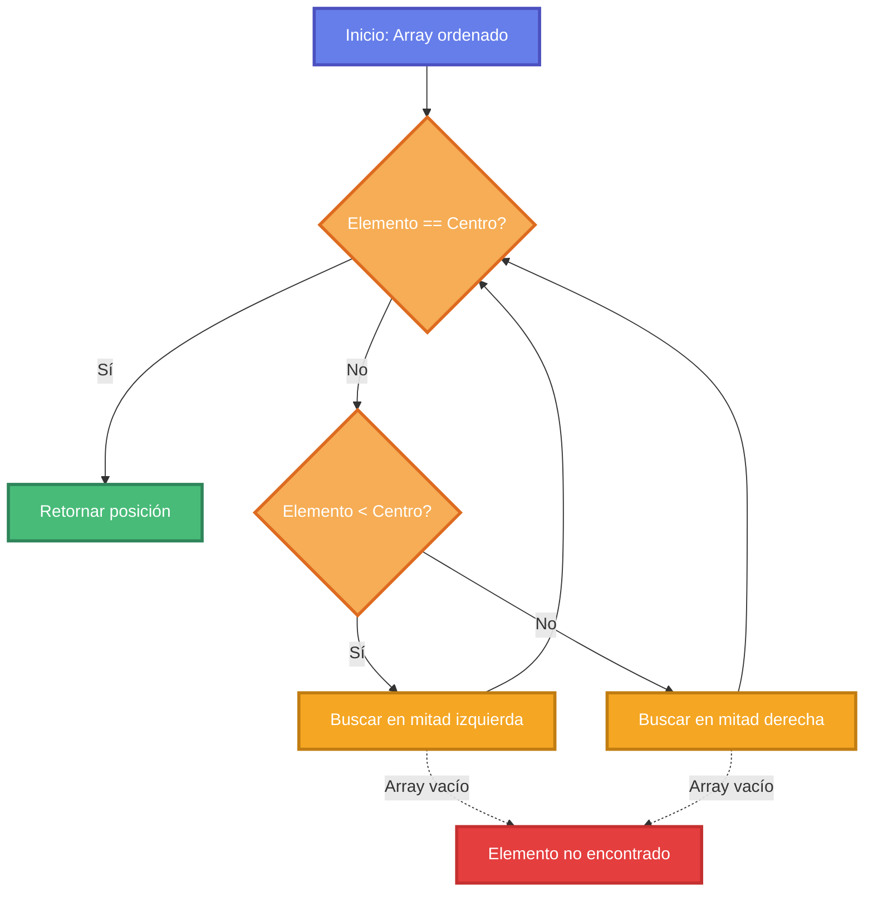
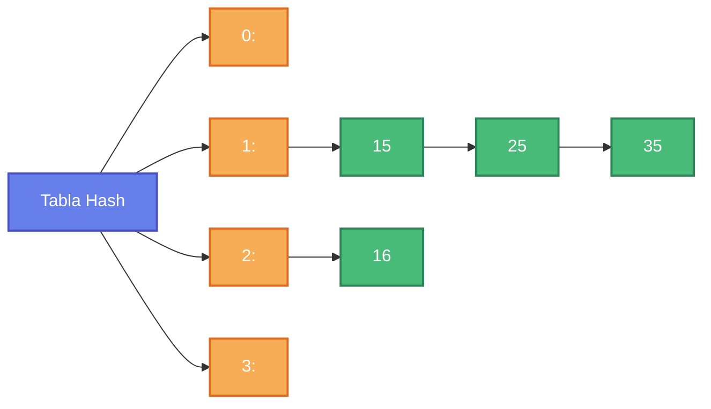

## 🎯 Objetivos de Aprendizaje

### Objetivo General

Comprender y aplicar diversos algoritmos de búsqueda y estructuras de datos para conjuntos, analizando su eficiencia, casos de uso óptimos y trade-offs entre complejidad temporal, espacial y funcionalidad según las características de los datos y los requisitos del sistema.

### Objetivos Específicos

Al finalizar esta unidad, el estudiante será capaz de:

- Comprender el concepto fundamental de búsqueda, sus consideraciones clave y la relación entre estructura de datos subyacente y algoritmo de búsqueda apropiado.
- Analizar y comparar la complejidad temporal y espacial de diferentes algoritmos de búsqueda en sus casos mejor, promedio y peor.
- Implementar y aplicar algoritmos de búsqueda en estructuras ordenadas: binaria ($O(\log n)$) e interpolación ($O(\log \log n)$), comprendiendo sus requisitos y limitaciones.
- Comprender el funcionamiento de árboles binarios de búsqueda (ABB), analizar su rendimiento y reconocer la necesidad de estructuras auto-balanceadas (AVL, Rojo-Negro).
- Comprender el funcionamiento de las tablas hash, implementar funciones hash apropiadas, gestionar colisiones mediante encadenamiento y direccionamiento abierto, y controlar el factor de carga.
- Utilizar eficientemente map y unordered_map de C++ STL, seleccionando la estructura apropiada según la necesidad de ordenamiento, rendimiento y operaciones requeridas.
- Aplicar conjuntos de bits (bitset) para operaciones eficientes sobre conjuntos de enteros, aprovechando operaciones a nivel de bit y eficiencia de memoria.
- Evaluar y seleccionar el algoritmo y estructura de datos adecuados según múltiples criterios: tipo de datos, tamaño del conjunto, frecuencia de operaciones, requisitos de ordenamiento y restricciones de memoria.

## 📋 Contenidos y recursos

### 6.1 Concepto de Búsqueda

- **6.1.1** Definición y aplicaciones
- **6.1.2** Consideraciones clave
- **6.1.3** Restricciones y estructuras subyacentes

### 6.2 Algoritmos de Búsqueda en Estructuras Ordenadas

- **6.2.1** Búsqueda Binaria (Binary Search)
- **6.2.2** Búsqueda por Interpolación (Interpolation Search)

### 6.3 Búsqueda en Árboles Binarios de Búsqueda (ABB/BST)

- **6.3.1** Propiedad fundamental y algoritmo
- **6.3.2** Análisis de rendimiento
- **6.3.3** Estructuras de equilibrio

### 6.4 Tablas Hash (Hash Tables)

- **6.4.1** Concepto y función hash
- **6.4.2** Gestión de colisiones
- **6.4.3** Factor de carga y rendimiento

### 6.5 Map y Unordered_Map en C++

- **6.5.1** std::map - Diccionario ordenado
- **6.5.2** std::unordered_map - Diccionario con hash
- **6.5.3** Comparación y casos de uso

### 6.6 Conjunto de Bits (Bitset)

- **6.6.1** Definición y representación
- **6.6.2** Ventajas y operaciones
- **6.6.3** Limitaciones y casos de uso

### 🔗 Recursos Complementarios

- [Visualización de Búsqueda Binaria](https://www.cs.usfca.edu/~galles/visualization/Search.html)
- [Visualización de Tablas Hash](https://www.cs.usfca.edu/~galles/visualization/OpenHash.html)
- [Hash Table Visualization](https://visualgo.net/en/hashtable)

## Primer tema: 6.1 Concepto de Búsqueda

### 6.1.1 Definición y aplicaciones

La **búsqueda** es el proceso fundamental de **localizar un elemento específico** dentro de una estructura de datos.

#### Definición Formal

> La búsqueda consiste en determinar si un elemento con una clave específica existe en una colección de datos, y si existe, recuperar su información asociada o su posición.

#### Aplicaciones

La búsqueda se aplica en diversas estructuras:

- **Listas y arreglos:** Búsqueda secuencial o binaria
- **Bases de datos:** Consultas e índices
- **Estructuras jerárquicas:** Árboles binarios de búsqueda, AVL, Rojo-Negro
- **Diccionarios y mapas:** Tablas hash
- **Sistemas de archivos:** Búsqueda de archivos y directorios
- **Motores de búsqueda:** Indexación y recuperación de información

#### Importancia

La elección del algoritmo de búsqueda adecuado impacta directamente en la **eficiencia global del sistema**. Una búsqueda ineficiente puede convertirse en el cuello de botella de una aplicación.

### 6.1.2 Consideraciones clave

Al elegir un algoritmo de búsqueda, debemos considerar varios aspectos:

#### Tabla de Consideraciones

| Aspecto | Descripción |
|---------|-------------|
| **Complejidad Temporal** | Análisis del rendimiento en: **Mejor caso**, **Caso promedio**, **Peor caso**. Determina qué tan rápido el algoritmo encuentra (o determina la ausencia de) un elemento. |
| **Complejidad Espacial** | Memoria adicional requerida (principal o auxiliar). Considerar si es implementado de forma **iterativa** o **recursiva** (pila de llamadas). |
| **Frecuencia de Operaciones** | La proporción entre **búsquedas**, **inserciones** y **eliminaciones** influye en la elección de la estructura de datos óptima. |

#### Análisis de Complejidad Temporal

**Mejor caso:** Escenario más favorable (ej: elemento en primera posición)

**Caso promedio:** Rendimiento esperado con datos distribuidos aleatoriamente

**Peor caso:** Escenario menos favorable (ej: elemento no existe o está al final)

**Ejemplo:**

```cpp
// Búsqueda secuencial
bool buscarSecuencial(int arr[], int n, int clave) {
    for (int i = 0; i < n; i++) {
        if (arr[i] == clave) {
            return true;  // Mejor caso: O(1) - encontrado inmediatamente
        }
    }
    return false;  // Peor caso: O(n) - elemento no existe
}
// Caso promedio: O(n/2) = O(n)
```

#### Análisis de Complejidad Espacial

**Iterativo vs. Recursivo:**

- **Implementación iterativa:** Generalmente $O(1)$ espacio adicional
- **Implementación recursiva:** $O(h)$ espacio adicional, donde $h$ es la profundidad de recursión

### 6.1.3 Restricciones y estructuras subyacentes

#### Restricciones de los Datos

| Restricción | Implicación |
|-------------|-------------|
| **Datos Ordenados** | Si están **ordenados**, se pueden usar algoritmos eficientes como la **búsqueda binaria** o **por interpolación**. Si **no** lo están, se evitan los costos de preprocesamiento (ordenación), pero se limita a búsqueda secuencial o se requieren estructuras especiales. |
| **Estructura Subyacente** | La estructura de datos determina el algoritmo de búsqueda apropiado. |

#### Estructuras Subyacentes

**Arrays (Arreglos):**

- **Acceso directo:** $O(1)$ por índice
- **Búsqueda secuencial:** $O(n)$
- **Búsqueda binaria (si ordenado):** $O(\log n)$

**Listas Enlazadas:**

- **Acceso secuencial:** $O(n)$
- **Búsqueda secuencial:** $O(n)$
- **No soporta búsqueda binaria** (sin acceso directo)

**Árboles/Grafos:**

- **Relaciones jerárquicas**
- **Búsqueda en ABB:** $O(\log n)$ promedio
- **Recorridos DFS/BFS:** $O(V + E)$

**Tablas Hash:**

- **Búsqueda por clave:** $O(1)$ promedio
- **Ideal para búsqueda por clave única**

#### Tabla Comparativa de Estructuras

| Estructura | Acceso | Búsqueda | Inserción | Eliminación | Ordenada |
|------------|--------|----------|-----------|-------------|----------|
| **Array** | $O(1)$ | $O(n)$ o $O(\log n)$ | $O(n)$ | $O(n)$ | Opcional |
| **Lista Enlazada** | $O(n)$ | $O(n)$ | $O(1)$ | $O(1)$ | No |
| **ABB** | $O(\log n)$ | $O(\log n)$ | $O(\log n)$ | $O(\log n)$ | Sí (inorden) |
| **Tabla Hash** | $O(1)$ | $O(1)$ | $O(1)$ | $O(1)$ | No |

> **Nota:** Las complejidades de ABB son promedio. En el peor caso (árbol degenerado) son $O(n)$.

## Segundo tema: 6.2 Algoritmos de Búsqueda en Estructuras Ordenadas

### 6.2.1 Búsqueda Binaria (Binary Search)

La **Búsqueda Binaria** es uno de los algoritmos de búsqueda más eficientes para datos ordenados.

#### Principio de Búsqueda Binaria

**Requisito:** Los datos deben estar **ordenados**.

**Estrategia:** Divide y conquista (Divide and Conquer)

1. Compara el elemento a buscar con el elemento **central** del arreglo
2. Si coincide, retorna la posición
3. Si el elemento buscado es **menor**, descarta la mitad derecha
4. Si el elemento buscado es **mayor**, descarta la mitad izquierda
5. Repite el proceso en la mitad restante

#### Diagrama del Proceso



#### Implementación Iterativa

```cpp
int busquedaBinaria(int arr[], int n, int clave) {
    int izq = 0;
    int der = n - 1;
    
    while (izq <= der) {
        int medio = izq + (der - izq) / 2;  // Evita overflow
        
        // Verificar si la clave está en el medio
        if (arr[medio] == clave) {
            return medio;  // Elemento encontrado
        }
        
        // Si la clave es mayor, ignorar la mitad izquierda
        if (arr[medio] < clave) {
            izq = medio + 1;
        }
        // Si la clave es menor, ignorar la mitad derecha
        else {
            der = medio - 1;
        }
    }
    
    return -1;  // Elemento no encontrado
}
```

#### Implementación Recursiva

```cpp
int busquedaBinariaRecursiva(int arr[], int izq, int der, int clave) {
    if (izq > der) {
        return -1;  // Caso base: elemento no encontrado
    }
    
    int medio = izq + (der - izq) / 2;
    
    // Caso base: elemento encontrado
    if (arr[medio] == clave) {
        return medio;
    }
    
    // Buscar en la mitad izquierda
    if (arr[medio] > clave) {
        return busquedaBinariaRecursiva(arr, izq, medio - 1, clave);
    }
    
    // Buscar en la mitad derecha
    return busquedaBinariaRecursiva(arr, medio + 1, der, clave);
}
```

#### Análisis de Complejidad de Búsqueda Binaria

**Complejidad Temporal:**

- **Mejor caso:** $O(1)$ - El elemento está en el centro
- **Caso promedio:** $O(\log n)$
- **Peor caso:** $O(\log n)$ - El elemento no existe o está en los extremos

**Complejidad Espacial:**

- **Iterativa:** $O(1)$ - Espacio constante
- **Recursiva:** $O(\log n)$ - Profundidad de la pila de recursión

**Justificación de $O(\log n)$:**

En cada iteración, el espacio de búsqueda se reduce a la mitad:

$$n \rightarrow \frac{n}{2} \rightarrow \frac{n}{4} \rightarrow \frac{n}{8} \rightarrow \ldots \rightarrow 1$$

Número de divisiones: $\log_2 n$

#### Ventajas de Búsqueda Binaria

1. **Muy eficiente:** $O(\log n)$ para grandes conjuntos de datos
2. **Predecible:** Rendimiento consistente
3. **Simple:** Fácil de implementar y entender

#### Limitaciones de Búsqueda Binaria

1. **Requiere datos ordenados:** El costo de mantener el arreglo ordenado puede ser alto
2. **Inserción/Eliminación costosa:** $O(n)$ en arrays
3. **Acceso aleatorio:** Requiere estructura con acceso directo (no funciona con listas enlazadas)

#### Ejemplo de Ejecución

Buscar el valor **37** en el arreglo: `[2, 5, 8, 12, 16, 23, 38, 45, 56, 67, 78]`

```plain
Iteración 1: izq=0, der=10, medio=5
  arr[5] = 23 < 37 → Buscar en mitad derecha

Iteración 2: izq=6, der=10, medio=8
  arr[8] = 56 > 37 → Buscar en mitad izquierda

Iteración 3: izq=6, der=7, medio=6
  arr[6] = 38 > 37 → Buscar en mitad izquierda

Iteración 4: izq=6, der=5
  izq > der → Elemento no encontrado (retornar -1)
```

### 6.2.2 Búsqueda por Interpolación (Interpolation Search)

La **Búsqueda por Interpolación** es una mejora de la búsqueda binaria para datos **uniformemente distribuidos**.

#### Principio de Búsqueda por Interpolación

**Requisito:** Datos **ordenados** y **uniformemente distribuidos**.

**Estrategia:** En lugar de dividir siempre por la mitad, estima la posición del elemento usando una fórmula basada en el **valor de la clave**.

**Analogía:** Similar a cómo se busca una palabra en un diccionario:

- Si buscas "Manzana", no abres el diccionario por la mitad
- Lo abres aproximadamente en el tercio del principio

#### Fórmula de Interpolación

La posición estimada se calcula como:

$$pos = izq + \left\lfloor \frac{(clave - arr[izq]) \times (der - izq)}{arr[der] - arr[izq]} \right\rfloor$$

Donde:

- `izq` = índice izquierdo del rango
- `der` = índice derecho del rango
- `clave` = valor que se busca
- `arr[izq]` = valor en posición izquierda
- `arr[der]` = valor en posición derecha

#### Implementación

```cpp
int busquedaInterpolacion(int arr[], int n, int clave) {
    int izq = 0;
    int der = n - 1;
    
    while (izq <= der && clave >= arr[izq] && clave <= arr[der]) {
        // Caso especial: si todos los elementos son iguales
        if (izq == der) {
            if (arr[izq] == clave) return izq;
            return -1;
        }
        
        // Fórmula de interpolación
        int pos = izq + ((clave - arr[izq]) * (der - izq)) / 
                        (arr[der] - arr[izq]);
        
        // Verificar si encontramos el elemento
        if (arr[pos] == clave) {
            return pos;
        }
        
        // Si la clave es mayor, buscar en la mitad derecha
        if (arr[pos] < clave) {
            izq = pos + 1;
        }
        // Si la clave es menor, buscar en la mitad izquierda
        else {
            der = pos - 1;
        }
    }
    
    return -1;  // Elemento no encontrado
}
```

#### Análisis de Complejidad de Búsqueda por Interpolación

**Complejidad Temporal:**

- **Mejor caso:** $O(1)$ - Primera estimación es correcta
- **Caso promedio (distribución uniforme):** $O(\log \log n)$ - Más rápido que búsqueda binaria
- **Peor caso (distribución no uniforme):** $O(n)$ - Puede degenerar a búsqueda lineal

**Complejidad Espacial:** $O(1)$

#### Ventajas de Búsqueda por Interpolación

1. **Más rápido que búsqueda binaria:** $O(\log \log n)$ para datos uniformemente distribuidos
2. **Mejor estimación inicial:** Aprovecha la distribución de los datos
3. **Ideal para grandes conjuntos de datos uniformes**

#### Limitaciones de Búsqueda por Interpolación

1. **Requiere distribución uniforme:** Sin uniformidad, el rendimiento se degrada significativamente
2. **Requiere datos ordenados:** Misma limitación que búsqueda binaria
3. **Aritmética más compleja:** Más operaciones por iteración
4. **División por cero:** Requiere validación cuando `arr[der] == arr[izq]`

#### Comparación: Binaria vs. Interpolación

| Aspecto | Búsqueda Binaria | Búsqueda por Interpolación |
|---------|------------------|----------------------------|
| **Complejidad (promedio)** | $O(\log n)$ | $O(\log \log n)$ |
| **Complejidad (peor caso)** | $O(\log n)$ | $O(n)$ |
| **Requisito de distribución** | No importa | Debe ser uniforme |
| **Punto de división** | Siempre la mitad | Estimado por valor |
| **Simplicidad** | Más simple | Más compleja |
| **Uso recomendado** | Cualquier array ordenado | Arrays grandes y uniformes |

#### Ejemplo Comparativo

Buscar **55** en: `[10, 20, 30, 40, 50, 60, 70, 80, 90, 100]` (distribuido uniformemente)

**Búsqueda Binaria:**

```plain
Iteración 1: medio = 5, arr[5] = 60 > 55 → mitad izquierda
Iteración 2: medio = 2, arr[2] = 30 < 55 → mitad derecha
Iteración 3: medio = 4, arr[4] = 50 < 55 → mitad derecha
Iteración 4: medio = 5, arr[5] = 60 > 55 → elemento no existe
Total: 4 iteraciones
```

**Búsqueda por Interpolación:**

```plain
Iteración 1: pos = 0 + ((55-10)*(9-0))/(100-10) = 4.5 ≈ 4
             arr[4] = 50 < 55 → buscar derecha
Iteración 2: pos = 5 + ((55-60)*(9-5))/(100-60) = 4.5 ≈ 4 (ajustado: 5)
             arr[5] = 60 > 55 → elemento no existe
Total: 2 iteraciones
```

## Tercer tema: 6.3 Búsqueda en Árboles Binarios de Búsqueda (ABB/BST)

Los **Árboles Binarios de Búsqueda** proporcionan una estructura jerárquica eficiente para búsqueda, inserción y eliminación.

### 6.3.1 Propiedad fundamental y algoritmo

Para cualquier nodo en un ABB:

1. Todos los valores en el **subárbol izquierdo** son **menores** que el valor del nodo
2. Todos los valores en el **subárbol derecho** son **mayores** que el valor del nodo

$$\text{subárbol\_izq} < \text{nodo} < \text{subárbol\_der}$$

#### Algoritmo de Búsqueda

```cpp
struct Nodo {
    int dato;
    Nodo* izquierdo;
    Nodo* derecho;
    
    Nodo(int valor) : dato(valor), izquierdo(nullptr), derecho(nullptr) {}
};

// Versión iterativa
bool buscarABB(Nodo* raiz, int clave) {
    Nodo* actual = raiz;
    
    while (actual != nullptr) {
        if (clave == actual->dato) {
            return true;  // Elemento encontrado
        }
        else if (clave < actual->dato) {
            actual = actual->izquierdo;  // Buscar en subárbol izquierdo
        }
        else {
            actual = actual->derecho;  // Buscar en subárbol derecho
        }
    }
    
    return false;  // Elemento no encontrado
}

// Versión recursiva
bool buscarABBRecursivo(Nodo* nodo, int clave) {
    // Caso base: árbol vacío o elemento no encontrado
    if (nodo == nullptr) {
        return false;
    }
    
    // Caso base: elemento encontrado
    if (clave == nodo->dato) {
        return true;
    }
    
    // Buscar en subárbol izquierdo o derecho
    if (clave < nodo->dato) {
        return buscarABBRecursivo(nodo->izquierdo, clave);
    }
    else {
        return buscarABBRecursivo(nodo->derecho, clave);
    }
}
```

### 6.3.2 Análisis de rendimiento

**Caso Promedio (Árbol Equilibrado):**

| Operación | Complejidad |
|-----------|-------------|
| Búsqueda | $O(\log n)$ |
| Inserción | $O(\log n)$ |
| Eliminación | $O(\log n)$ |

**Peor Caso (Árbol Degenerado):**

| Operación | Complejidad |
|-----------|-------------|
| Búsqueda | $O(n)$ |
| Inserción | $O(n)$ |
| Eliminación | $O(n)$ |

### 6.3.3 Estructuras de equilibrio

Para mantener el rendimiento cerca de $O(\log n)$ se utilizan **árboles auto-balanceados**:

1. **Árboles AVL:** Balanceo estricto, ideal para búsquedas frecuentes
2. **Árboles Rojo-Negro:** Balanceo relajado, mejor para inserciones/eliminaciones
3. **Árboles B/B+:** Optimizados para acceso a disco

**Comparación:**

| Árbol | Altura Garantizada | Rotaciones (Inserción) | Uso Principal |
|-------|-------------------|------------------------|---------------|
| ABB Simple | $O(n)$ peor caso | 0 | Datos aleatorios |
| AVL | $O(\log n)$ | Hasta $O(\log n)$ | Búsquedas frecuentes |
| Rojo-Negro | $O(\log n)$ | Máximo 2 | Balance general |

## Cuarto tema: 6.4 Tablas Hash (Hash Tables)

Las **Tablas Hash** proporcionan acceso directo y rápido a los elementos mediante una función hash.

### 6.4.1 Concepto y función hash

Una **función hash** mapea una **clave** a un **índice** (dirección) en un array:

$$h(clave) \rightarrow índice$$

**Objetivo:** Lograr acceso directo en tiempo constante $O(1)$.

**Componentes Clave:**

1. **Función Hash:** Transforma la clave en un índice
2. **Array (Tabla):** Almacena los elementos
3. **Gestión de Colisiones:** Maneja casos donde dos claves mapean al mismo índice

**Función Hash Ideal:**

Características de una buena función hash:

- **Determinística:** La misma clave siempre produce el mismo índice
- **Uniforme:** Distribuye las claves uniformemente en el array
- **Eficiente:** Rápida de calcular
- **Minimiza colisiones:** Reduce la probabilidad de que dos claves mapeen al mismo índice

**Ejemplo de función hash simple:**

```cpp
int funcionHash(int clave, int tamTabla) {
    return clave % tamTabla;  // Módulo del tamaño de la tabla
}
```

### 6.4.2 Gestión de colisiones

**Colisión:** Ocurre cuando dos claves diferentes mapean al mismo índice.

$$h(clave_1) = h(clave_2) \text{ donde } clave_1 \neq clave_2$$

**Métodos de Resolución:**

#### Encadenamiento (Chaining)

Cada posición de la tabla almacena una **lista enlazada** de elementos que mapean a ese índice.



**Implementación:**

```cpp
#include <list>
#include <vector>

class TablaHashEncadenamiento {
private:
    std::vector<std::list<int>> tabla;
    int tamaño;
    
    int funcionHash(int clave) {
        return clave % tamaño;
    }
    
public:
    TablaHashEncadenamiento(int tam) : tamaño(tam) {
        tabla.resize(tamaño);
    }
    
    void insertar(int clave) {
        int indice = funcionHash(clave);
        tabla[indice].push_back(clave);
    }
    
    bool buscar(int clave) {
        int indice = funcionHash(clave);
        for (int elemento : tabla[indice]) {
            if (elemento == clave) {
                return true;
            }
        }
        return false;
    }
    
    void eliminar(int clave) {
        int indice = funcionHash(clave);
        tabla[indice].remove(clave);
    }
};
```

#### Direccionamiento Abierto (Open Addressing)

Todas las entradas se almacenan en el array principal. Cuando hay colisión, se busca la siguiente posición disponible.

**Métodos de sondeo:**

**a) Sondeo Lineal (Linear Probing):**

$$h(k, i) = (h(k) + i) \mod m$$

Busca secuencialmente: $h(k), h(k)+1, h(k)+2, \ldots$

**b) Sondeo Cuadrático (Quadratic Probing):**

$$h(k, i) = (h(k) + c_1 \cdot i + c_2 \cdot i^2) \mod m$$

**c) Hash Doble (Double Hashing):**

$$h(k, i) = (h_1(k) + i \cdot h_2(k)) \mod m$$

**Ejemplo de sondeo lineal:**

```cpp
class TablaHashAbierto {
private:
    std::vector<int> tabla;
    std::vector<bool> ocupado;
    int tamaño;
    int VACIO = -1;
    
    int funcionHash(int clave) {
        return clave % tamaño;
    }
    
public:
    TablaHashAbierto(int tam) : tamaño(tam) {
        tabla.resize(tamaño, VACIO);
        ocupado.resize(tamaño, false);
    }
    
    void insertar(int clave) {
        int indice = funcionHash(clave);
        int i = 0;
        
        // Sondeo lineal
        while (ocupado[(indice + i) % tamaño] && i < tamaño) {
            i++;
        }
        
        if (i < tamaño) {
            int posicion = (indice + i) % tamaño;
            tabla[posicion] = clave;
            ocupado[posicion] = true;
        }
    }
    
    bool buscar(int clave) {
        int indice = funcionHash(clave);
        int i = 0;
        
        while (i < tamaño) {
            int posicion = (indice + i) % tamaño;
            if (!ocupado[posicion]) {
                return false;  // Posición vacía, no existe
            }
            if (tabla[posicion] == clave) {
                return true;  // Encontrado
            }
            i++;
        }
        return false;
    }
};
```

#### Factor de Carga

El **factor de carga** ($\alpha$) es la relación entre el número de elementos y el tamaño de la tabla:

$$\alpha = \frac{n}{m}$$

Donde:

- $n$ = número de elementos almacenados
- $m$ = tamaño de la tabla

**Impacto:**

- **Factor de carga bajo** ($\alpha < 0.5$): Pocas colisiones, desperdicio de memoria
- **Factor de carga alto** ($\alpha > 0.75$): Muchas colisiones, rendimiento degradado

**Recomendación:** Mantener $\alpha$ entre 0.5 y 0.75. Redimensionar la tabla (rehashing) cuando se excede.

### 6.4.3 Factor de carga y rendimiento

**Análisis de Rendimiento:**

**Caso Promedio (buena función hash, factor de carga apropiado):**

| Operación | Encadenamiento | Direccionamiento Abierto |
|-----------|----------------|--------------------------|
| Búsqueda | $O(1)$ | $O(1)$ |
| Inserción | $O(1)$ | $O(1)$ |
| Eliminación | $O(1)$ | $O(1)$ |

**Peor Caso (muchas colisiones):**

| Operación | Complejidad |
|-----------|-------------|
| Búsqueda | $O(n)$ |
| Inserción | $O(n)$ |
| Eliminación | $O(n)$ |

**Aspectos Críticos para Mantener $O(1)$:**

1. **Función hash de calidad:** Distribución uniforme
2. **Factor de carga controlado:** Redimensionar cuando sea necesario
3. **Gestión de colisiones eficiente:** Elegir método apropiado

## Quinto tema: 6.5 Map y Unordered_Map en C++

En C++, la biblioteca estándar (STL) proporciona dos contenedores asociativos principales para almacenar pares **clave-valor**: `std::map` y `std::unordered_map`.

### 6.5.1 std::map - Diccionario ordenado

`std::map` es un **contenedor asociativo ordenado** que almacena pares clave-valor.

#### Características Principales de std::map

**Implementación interna:**

- Basado en un **Árbol Binario de Búsqueda auto-balanceado** (típicamente Árbol Rojo-Negro)
- Las claves se mantienen **ordenadas**
- No permite **claves duplicadas**

**Complejidad de operaciones:**

| Operación | Complejidad |
|-----------|-------------|
| Búsqueda | $O(\log n)$ |
| Inserción | $O(\log n)$ |
| Eliminación | $O(\log n)$ |
| Recorrido ordenado | $O(n)$ |

#### Sintaxis y Uso de std::map

```cpp
#include <iostream>
#include <map>
#include <string>

int main() {
    // Declaración: map<TipoClave, TipoValor>
    std::map<int, std::string> estudiantes;
    
    // Inserción - Método 1: operator[]
    estudiantes[101] = "Juan Pérez";
    estudiantes[102] = "María García";
    estudiantes[103] = "Carlos López";
    
    // Inserción - Método 2: insert
    estudiantes.insert({104, "Ana Martínez"});
    estudiantes.insert(std::make_pair(105, "Luis Rodríguez"));
    
    // Acceso a elementos
    std::cout << "Estudiante 102: " << estudiantes[102] << std::endl;
    
    // Búsqueda - find() retorna un iterador
    auto it = estudiantes.find(103);
    if (it != estudiantes.end()) {
        std::cout << "Encontrado: " << it->first << " - " 
                  << it->second << std::endl;
    }
    
    // Verificar existencia - count()
    if (estudiantes.count(101) > 0) {
        std::cout << "La clave 101 existe" << std::endl;
    }
    
    // Recorrido (automáticamente ordenado por clave)
    std::cout << "\nLista de estudiantes (ordenada):" << std::endl;
    for (const auto& par : estudiantes) {
        std::cout << "ID: " << par.first << ", Nombre: " 
                  << par.second << std::endl;
    }
    
    // Eliminar elemento
    estudiantes.erase(103);
    
    // Tamaño
    std::cout << "\nTotal estudiantes: " << estudiantes.size() << std::endl;
    
    // Verificar si está vacío
    std::cout << "¿Vacío? " << (estudiantes.empty() ? "Sí" : "No") << std::endl;
    
    return 0;
}
```

**Salida:**

```plain
Estudiante 102: María García
Encontrado: 103 - Carlos López
La clave 101 existe

Lista de estudiantes (ordenada):
ID: 101, Nombre: Juan Pérez
ID: 102, Nombre: María García
ID: 103, Nombre: Carlos López
ID: 104, Nombre: Ana Martínez
ID: 105, Nombre: Luis Rodríguez

Total estudiantes: 4
¿Vacío? No
```

#### Requisitos de la Clave para std::map

Para usar un tipo como clave en `std::map`, debe:

1. **Ser comparable:** Debe soportar el operador `<` (menor que)
2. **Ser copiable:** Tener constructor de copia

**Ejemplo con tipo personalizado:**

```cpp
struct Fecha {
    int dia, mes, anio;
    
    // Operador de comparación necesario para std::map
    bool operator<(const Fecha& otra) const {
        if (anio != otra.anio) return anio < otra.anio;
        if (mes != otra.mes) return mes < otra.mes;
        return dia < otra.dia;
    }
};

std::map<Fecha, std::string> eventos;
eventos[{25, 12, 2024}] = "Navidad";
eventos[{1, 1, 2025}] = "Año Nuevo";
```

#### Ventajas de std::map

1. **Elementos ordenados:** Mantiene las claves ordenadas automáticamente
2. **Recorrido ordenado:** Iterar sobre elementos en orden
3. **Predecible:** Complejidad garantizada $O(\log n)$
4. **Rango de búsqueda:** Soporta `lower_bound()` y `upper_bound()`

#### Desventajas de std::map

1. **Más lento:** $O(\log n)$ vs $O(1)$ de hash
2. **Mayor overhead:** Estructura de árbol requiere más memoria

### 6.5.2 std::unordered_map - Diccionario con hash

`std::unordered_map` es un **contenedor asociativo basado en tabla hash** que almacena pares clave-valor.

#### Características Principales de std::unordered_map

**Implementación interna:**

- Basado en **Tabla Hash** (hash table)
- Las claves **no están ordenadas**
- No permite **claves duplicadas**
- Usa **encadenamiento** para resolver colisiones (por defecto)

**Complejidad de operaciones:**

| Operación | Caso Promedio | Peor Caso |
|-----------|---------------|-----------|
| Búsqueda | $O(1)$ | $O(n)$ |
| Inserción | $O(1)$ | $O(n)$ |
| Eliminación | $O(1)$ | $O(n)$ |
| Recorrido | $O(n)$ | $O(n)$ |

#### Sintaxis y Uso de std::unordered_map

```cpp
#include <iostream>
#include <unordered_map>
#include <string>

int main() {
    // Declaración: unordered_map<TipoClave, TipoValor>
    std::unordered_map<std::string, int> inventario;
    
    // Inserción
    inventario["manzanas"] = 50;
    inventario["naranjas"] = 30;
    inventario["plátanos"] = 45;
    inventario["uvas"] = 25;
    
    // Acceso
    std::cout << "Manzanas en stock: " << inventario["manzanas"] << std::endl;
    
    // Búsqueda
    auto it = inventario.find("naranjas");
    if (it != inventario.end()) {
        std::cout << "Naranjas: " << it->second << " unidades" << std::endl;
    }
    
    // Recorrido (orden NO garantizado)
    std::cout << "\nInventario completo:" << std::endl;
    for (const auto& item : inventario) {
        std::cout << item.first << ": " << item.second << std::endl;
    }
    
    // Actualizar valor
    inventario["manzanas"] += 20;  // Agregar 20 manzanas
    std::cout << "\nManzanas actualizadas: " << inventario["manzanas"] << std::endl;
    
    // Eliminar
    inventario.erase("uvas");
    
    return 0;
}
```

**Salida (orden puede variar):**

```plain
Manzanas en stock: 50
Naranjas: 30 unidades

Inventario completo:
plátanos: 45
naranjas: 30
manzanas: 50
uvas: 25

Manzanas actualizadas: 70
```

#### Requisitos de la Clave para std::unordered_map

Para usar un tipo como clave en `std::unordered_map`, debe:

1. **Ser hasheable:** Tener una función hash disponible
2. **Ser comparable por igualdad:** Soportar el operador `==`

**Tipos básicos (int, string, etc.)** ya tienen función hash definida.

**Ejemplo con tipo personalizado:**

```cpp
#include <unordered_map>
#include <functional>

struct Punto {
    int x, y;
    
    bool operator==(const Punto& otro) const {
        return x == otro.x && y == otro.y;
    }
};

// Especialización de std::hash para Punto
namespace std {
    template <>
    struct hash<Punto> {
        size_t operator()(const Punto& p) const {
            // Combinar hash de x y y
            return hash<int>()(p.x) ^ (hash<int>()(p.y) << 1);
        }
    };
}

int main() {
    std::unordered_map<Punto, std::string> mapa;
    mapa[{0, 0}] = "Origen";
    mapa[{10, 20}] = "Punto A";
    
    return 0;
}
```

#### Ventajas de std::unordered_map

1. **Muy rápido:** Promedio $O(1)$ para todas las operaciones
2. **Eficiente:** Mejor rendimiento para búsquedas frecuentes
3. **Menos overhead:** Comparado con árbol en algunos casos

#### Desventajas de std::unordered_map

1. **No ordenado:** Las claves no mantienen orden
2. **Peor caso:** Puede degenerar a $O(n)$ con muchas colisiones
3. **Mayor consumo de memoria:** Tabla hash puede tener espacios vacíos
4. **No soporta rangos:** No tiene `lower_bound()` ni `upper_bound()`

### 6.5.3 Comparación y casos de uso

#### Tabla Comparativa Completa

| Característica | std::map | std::unordered_map |
|----------------|----------|---------------------|
| **Estructura interna** | Árbol Rojo-Negro | Tabla Hash |
| **Orden de elementos** | Ordenado por clave | No ordenado |
| **Complejidad búsqueda** | $O(\log n)$ | $O(1)$ promedio, $O(n)$ peor caso |
| **Complejidad inserción** | $O(\log n)$ | $O(1)$ promedio, $O(n)$ peor caso |
| **Complejidad eliminación** | $O(\log n)$ | $O(1)$ promedio, $O(n)$ peor caso |
| **Requisito de clave** | Operador `<` | Función hash y operador `==` |
| **Iteración** | En orden ascendente | Sin orden específico |
| **Uso de memoria** | Moderado (nodos de árbol) | Alto (tabla + listas) |
| **Búsqueda de rango** | Sí (lower_bound, upper_bound) | No |
| **Rendimiento predecible** | Sí, siempre $O(\log n)$ | Depende de colisiones |

#### Cuándo Usar Cada Uno

**Usar `std::map` cuando:**

1. **Necesitas elementos ordenados:**
   - Mostrar elementos en orden
   - Procesar elementos de menor a mayor

2. **Necesitas búsqueda por rango:**
   - Encontrar todos los elementos entre dos valores
   - Usar `lower_bound()` o `upper_bound()`

3. **Rendimiento predecible es importante:**
   - Sistemas en tiempo real
   - Cuando el peor caso debe estar acotado

4. **Las claves no son fácilmente hasheables:**
   - Tipos complejos sin función hash obvia

**Ejemplo de caso de uso:**

```cpp
// Clasificación de estudiantes por calificación (ordenada)
std::map<double, std::string> ranking;
ranking[95.5] = "Ana";
ranking[87.3] = "Carlos";
ranking[92.1] = "María";

// Imprimir top 3 (orden descendente es automático si usas mayor)
for (auto it = ranking.rbegin(); it != ranking.rend(); ++it) {
    std::cout << it->second << ": " << it->first << std::endl;
}
```

**Usar `std::unordered_map` cuando:**

1. **Velocidad es crítica:**
   - Búsquedas muy frecuentes
   - Aplicaciones de alto rendimiento

2. **El orden no importa:**
   - Cachés
   - Contadores de frecuencia
   - Diccionarios de traducción

3. **Claves son fácilmente hasheables:**
   - int, string, tipos básicos
   - Tipos con buena función hash

4. **Volumen de datos es grande:**
   - Millones de elementos donde $O(1)$ vs $O(\log n)$ hace diferencia

**Ejemplo de caso de uso:**

```cpp
// Contador de frecuencia de palabras
std::unordered_map<std::string, int> frecuencias;
std::string texto = "hola mundo hola c++ mundo";

// Contar palabras
std::istringstream stream(texto);
std::string palabra;
while (stream >> palabra) {
    frecuencias[palabra]++;
}

// Mostrar frecuencias
for (const auto& par : frecuencias) {
    std::cout << par.first << ": " << par.second << std::endl;
}
```

#### Ejemplo Práctico Comparativo

**Problema:** Sistema de caché para traducción de palabras

```cpp
#include <iostream>
#include <map>
#include <unordered_map>
#include <chrono>

// Caso 1: map (ordenado)
void usarMap() {
    std::map<std::string, std::string> diccionario;
    diccionario["hello"] = "hola";
    diccionario["world"] = "mundo";
    diccionario["computer"] = "computadora";
    
    // Ventaja: podemos iterar en orden alfabético
    for (const auto& par : diccionario) {
        std::cout << par.first << " -> " << par.second << std::endl;
    }
}

// Caso 2: unordered_map (más rápido)
void usarUnorderedMap() {
    std::unordered_map<std::string, std::string> cache;
    cache["hello"] = "hola";
    cache["world"] = "mundo";
    cache["computer"] = "computadora";
    
    // Ventaja: búsqueda más rápida O(1)
    auto it = cache.find("hello");
    if (it != cache.end()) {
        std::cout << "Traducción rápida: " << it->second << std::endl;
    }
}

int main() {
    std::cout << "=== Usando map (ordenado) ===" << std::endl;
    usarMap();
    
    std::cout << "\n=== Usando unordered_map (rápido) ===" << std::endl;
    usarUnorderedMap();
    
    return 0;
}
```

#### Resumen de Recomendaciones

| Escenario | Recomendación |
|-----------|---------------|
| Búsquedas muy frecuentes, sin necesidad de orden | `unordered_map` |
| Necesito recorrer elementos en orden | `map` |
| Buscar elementos en un rango de valores | `map` |
| Máximo rendimiento en búsquedas | `unordered_map` |
| Rendimiento predecible garantizado | `map` |
| Gran volumen de datos con búsquedas intensivas | `unordered_map` |
| Claves son strings o enteros | Ambos funcionan bien |
| Claves son tipos complejos | `map` (más fácil) |

## Sexto tema: 6.6 Conjunto de Bits (Bitset)

### 6.6.1 Definición y representación

#### Definición de Conjunto

Un **Conjunto** es una colección **desordenada** de elementos **únicos** (sin duplicados).

**Operaciones básicas:**

- **Pertenencia:** Verificar si un elemento está en el conjunto
- **Inserción:** Agregar un elemento al conjunto
- **Eliminación:** Remover un elemento del conjunto
- **Unión:** Combinar dos conjuntos
- **Intersección:** Elementos comunes entre dos conjuntos
- **Diferencia:** Elementos en un conjunto pero no en otro

#### Conjunto de Bits (Bitset)

El **Conjunto de bits** (bitset) es una estructura de datos compacta que utiliza **bits** para representar la pertenencia de elementos a un conjunto.

**Representación:**

- Cada **bit** representa si un elemento (mapeado a un índice entero) está o no en el conjunto
- **Bit = 1:** El elemento está en el conjunto
- **Bit = 0:** El elemento no está en el conjunto

**Ejemplo:**

Representar el conjunto {0, 2, 5, 7} en un bitset de 8 bits:

```plain
Índices:  7  6  5  4  3  2  1  0
Bits:    [1][0][1][0][0][1][0][1]
         ↑     ↑        ↑     ↑
         7     5        2     0  ← Elementos presentes
```

**Valor binario:** `10100101`

#### Representación en Memoria

Un bitset utiliza un array de enteros (por ejemplo, `unsigned int` o `unsigned long long`) para almacenar los bits.

**Ejemplo con enteros de 32 bits:**

```cpp
// Conjunto de hasta 128 elementos
unsigned int bitset[4];  // 4 × 32 = 128 bits
```

#### Operaciones con Bits

**Establecer un bit (agregar elemento):**

```cpp
void agregar(unsigned int bitset[], int elemento) {
    int indice = elemento / 32;      // Índice del entero
    int posicion = elemento % 32;    // Posición del bit
    bitset[indice] |= (1 << posicion);  // OR con máscara
}
```

**Verificar un bit (pertenencia):**

```cpp
bool pertenece(unsigned int bitset[], int elemento) {
    int indice = elemento / 32;
    int posicion = elemento % 32;
    return (bitset[indice] & (1 << posicion)) != 0;  // AND con máscara
}
```

**Limpiar un bit (eliminar elemento):**

```cpp
void eliminar(unsigned int bitset[], int elemento) {
    int indice = elemento / 32;
    int posicion = elemento % 32;
    bitset[indice] &= ~(1 << posicion);  // AND con máscara negada
}
```

### 6.6.2 Ventajas y operaciones

#### Ventajas del Bitset

##### 1. Eficiencia Temporal

Las operaciones básicas se realizan en **tiempo constante** $O(1)$:

| Operación | Complejidad |
|-----------|-------------|
| Pertenencia | $O(1)$ |
| Inserción | $O(1)$ |
| Eliminación | $O(1)$ |

##### 2. Operaciones de Conjuntos Eficientes

Las operaciones de conjuntos se realizan mediante **operaciones a nivel de bit**, que son extremadamente rápidas:

**Unión (A ∪ B):**

```cpp
void unionConjuntos(unsigned int A[], unsigned int B[], 
                    unsigned int resultado[], int n) {
    for (int i = 0; i < n; i++) {
        resultado[i] = A[i] | B[i];  // OR bit a bit
    }
}
// Complejidad: O(n/w) donde w es el tamaño de palabra (32 o 64 bits)
```

**Intersección (A ∩ B):**

```cpp
void interseccionConjuntos(unsigned int A[], unsigned int B[], 
                           unsigned int resultado[], int n) {
    for (int i = 0; i < n; i++) {
        resultado[i] = A[i] & B[i];  // AND bit a bit
    }
}
```

**Diferencia (A - B):**

```cpp
void diferenciaConjuntos(unsigned int A[], unsigned int B[], 
                         unsigned int resultado[], int n) {
    for (int i = 0; i < n; i++) {
        resultado[i] = A[i] & ~B[i];  // AND con NOT de B
    }
}
```

**Tabla de operaciones de conjuntos:**

| Operación | Símbolo | Operación de Bits | Complejidad |
|-----------|---------|-------------------|-------------|
| Unión | A ∪ B | A \| B | $O(n/w)$ |
| Intersección | A ∩ B | A & B | $O(n/w)$ |
| Diferencia | A - B | A & ~B | $O(n/w)$ |
| Complemento | ~A | ~A | $O(n/w)$ |

##### 3. Uso Eficiente de Memoria

Si el universo de elementos es conocido y no excesivamente grande, el bitset utiliza la memoria de manera muy eficiente:

**Comparación de uso de memoria:**

Representar conjunto de 1000 elementos posibles:

| Estructura | Memoria Requerida |
|------------|-------------------|
| **Array de booleanos** | 1000 bytes = ~1 KB |
| **Bitset** | 125 bytes (1000 bits) |
| **Vector/Lista** | Variable (depende de elementos presentes) |

**Ahorro de memoria:** El bitset usa **1/8 del espacio** comparado con un array de booleanos.

#### Ejemplo Completo en C++

```cpp
#include <iostream>
#include <bitset>

int main() {
    // C++ STL proporciona std::bitset
    std::bitset<32> conjunto;  // Conjunto de hasta 32 elementos
    
    // Insertar elementos
    conjunto.set(5);   // Agregar 5
    conjunto.set(10);  // Agregar 10
    conjunto.set(15);  // Agregar 15
    
    // Verificar pertenencia
    std::cout << "¿5 está en el conjunto? " 
              << (conjunto.test(5) ? "Sí" : "No") << std::endl;
    
    std::cout << "¿7 está en el conjunto? " 
              << (conjunto.test(7) ? "Sí" : "No") << std::endl;
    
    // Eliminar elemento
    conjunto.reset(10);  // Eliminar 10
    
    // Operaciones de conjuntos
    std::bitset<32> A("10101");  // {0, 2, 4}
    std::bitset<32> B("01101");  // {0, 2, 3}
    
    std::bitset<32> unionAB = A | B;          // {0, 2, 3, 4}
    std::bitset<32> interseccionAB = A & B;   // {0, 2}
    std::bitset<32> diferenciaAB = A & ~B;    // {4}
    
    std::cout << "A:             " << A << std::endl;
    std::cout << "B:             " << B << std::endl;
    std::cout << "A ∪ B:         " << unionAB << std::endl;
    std::cout << "A ∩ B:         " << interseccionAB << std::endl;
    std::cout << "A - B:         " << diferenciaAB << std::endl;
    
    // Contar elementos
    std::cout << "Elementos en A: " << A.count() << std::endl;
    
    return 0;
}
```

**Salida:**

```plain
¿5 está en el conjunto? Sí
¿7 está en el conjunto? No
A:             00000000000000000000000000010101
B:             00000000000000000000000000001101
A ∪ B:         00000000000000000000000000011101
A ∩ B:         00000000000000000000000000000101
A - B:         00000000000000000000000000010000
Elementos en A: 3
```

### 6.6.3 Limitaciones y casos de uso

#### Limitaciones del Bitset

##### 1. Universo Limitado

**Problema:** Requiere conocer el **tamaño máximo** del conjunto de antemano.

**Implicación:** No es adecuado para conjuntos de tamaño dinámico o potencialmente infinito.

**Ejemplo:**

```cpp
std::bitset<1000> conjunto;  // Solo puede representar elementos 0-999
// No se puede agregar el elemento 1001 sin redefinir el bitset
```

##### 2. Índices Enteros

**Problema:** Solo funciona con elementos que pueden ser **mapeados a índices enteros**.

**No es adecuado para:**

- Strings
- Objetos complejos
- Números de punto flotante
- Claves no numéricas

**Solución:** Se requiere un mapeo previo (hash) a enteros, lo cual agrega complejidad.

##### 3. Universo Fijo

**Problema:** No es adecuado para conjuntos con un **universo de elementos arbitrario o muy grande**.

**Ejemplo problemático:**

```cpp
// Representar todos los números de 64 bits
std::bitset<18446744073709551616> conjunto;  // ¡IMPOSIBLE! 2^64 bits
// Requeriría 2 exabytes de memoria
```

#### Casos de Uso Apropiados

**Usar Bitset cuando:**

1. **El universo es pequeño y conocido:**
   - Ejemplo: Días de la semana (7 elementos)
   - Ejemplo: Meses del año (12 elementos)
   - Ejemplo: Flags de estado (booleanos)

2. **Los elementos son enteros en un rango limitado:**
   - Ejemplo: Números de 0 a 1000
   - Ejemplo: Caracteres ASCII (0-127)

3. **Las operaciones de conjuntos son frecuentes:**
   - Filtrado de datos
   - Comprobación de permisos
   - Algoritmos de grafos (nodos visitados)

4. **La memoria es crítica:**
   - Sistemas embebidos
   - Grandes conjuntos de datos booleanos

#### Tabla Comparativa de Estructuras para Conjuntos

| Estructura | Ventajas | Desventajas | Uso Ideal |
|------------|----------|-------------|-----------|
| **Bitset** | $O(1)$ operaciones, Operaciones de conjuntos rápidas, Memoria eficiente | Universo limitado, Solo enteros, Tamaño fijo | Universo pequeño y conocido, enteros |
| **std::set (ABB)** | Elementos ordenados, Tamaño dinámico, Cualquier tipo comparable | $O(\log n)$ operaciones, Más memoria | Elementos ordenados, tamaño dinámico |
| **std::unordered_set (Hash)** | $O(1)$ promedio, Tamaño dinámico, Cualquier tipo hasheable | No ordenado, Más memoria, $O(n)$ peor caso | Búsqueda rápida, no requiere orden |
| **Array booleano** | $O(1)$ operaciones, Simple | 8× más memoria que bitset, Universo fijo | Similar a bitset, menos crítico en memoria |

#### Ejemplo Práctico: Criba de Eratóstenes

Un uso clásico del bitset es el algoritmo **Criba de Eratóstenes** para encontrar números primos:

```cpp
#include <iostream>
#include <bitset>

const int MAX = 1000000;
std::bitset<MAX + 1> esPrimo;

void cribaEratostenes(int n) {
    // Inicialmente todos son primos (bits en 1)
    esPrimo.set();
    esPrimo[0] = esPrimo[1] = false;  // 0 y 1 no son primos
    
    for (int i = 2; i * i <= n; i++) {
        if (esPrimo[i]) {
            // Marcar todos los múltiplos de i como no primos
            for (int j = i * i; j <= n; j += i) {
                esPrimo[j] = false;
            }
        }
    }
}

int main() {
    cribaEratostenes(100);
    
    std::cout << "Números primos hasta 100: ";
    for (int i = 2; i <= 100; i++) {
        if (esPrimo[i]) {
            std::cout << i << " ";
        }
    }
    std::cout << std::endl;
    
    return 0;
}
```

**Ventaja del bitset en este caso:**

- Representa 1 millón de números usando solo ~125 KB de memoria
- Operaciones muy rápidas para marcar múltiplos

### Conclusión de la Unidad

Los algoritmos de búsqueda y estructuras de conjuntos son fundamentales en el diseño de sistemas eficientes. La elección correcta depende de múltiples factores:

**Guía de selección:**

1. **Para arrays ordenados:** Búsqueda binaria o interpolación
2. **Para búsqueda dinámica con orden:** ABB (mejor: AVL o Rojo-Negro) o `std::map`
3. **Para búsqueda por clave rápida:** Tablas hash o `std::unordered_map`
4. **Para diccionarios ordenados:** `std::map`
5. **Para diccionarios con máximo rendimiento:** `std::unordered_map`
6. **Para conjuntos de enteros pequeños:** Bitset

**Resumen de estructuras en C++:**

- **`std::map`**: Búsquedas en $O(\log n)$, elementos ordenados, búsqueda por rango
- **`std::unordered_map`**: Búsquedas en $O(1)$ promedio, sin orden, máximo rendimiento
- **Bitset**: Operaciones en $O(1)$, muy eficiente en memoria para conjuntos de enteros

Comprender las ventajas, limitaciones y complejidades de cada enfoque es esencial para diseñar soluciones eficientes y escalables.
