## 🎯 Objetivos de Aprendizaje

### Objetivo General

Comprender la teoría de grafos, sus representaciones computacionales y algoritmos fundamentales para resolver problemas sobre estructuras relacionales.

### Objetivos Específicos

Al finalizar esta unidad, el estudiante será capaz de:

- Comprender la definición formal y los componentes fundamentales de un grafo.
- Conocer las representaciones en memoria (matriz y listas de adyacencia) y sus ventajas/desventajas.
- Implementar y analizar los recorridos BFS y DFS.
- Aplicar algoritmos clásicos: ordenamiento topológico (Kahn), árboles de expansión mínima (Prim y Kruskal) y comprender el problema del viajante (TSP).

## 📋 Contenidos y recursos

### 7.1 Definición y conceptos fundamentales

- **7.1.1** Definición formal de grafo, vértices y aristas
- **7.1.2** Componentes y tipos de grafos
- **7.1.3** Diagramas y ejemplos básicos

### 7.2 Representaciones en memoria

- **7.2.1** Matriz de adyacencia: definición, ejemplo y complejidad
- **7.2.2** Lista de adyacencia: definición, ejemplo y complejidad
- **7.2.3** Comparación rápida entre ambas representaciones

### 7.3 Recorridos y búsquedas

- **7.3.1** BFS: cola, niveles y distancias en grafos no ponderados
- **7.3.2** DFS: recursión/iterativo, usos y detección de ciclos
- **7.3.3** Aplicaciones: componentes conexas, orden topológico, reachability

### 7.4 Algoritmos de optimización en grafos

- **7.4.1** Ordenamiento topológico (Kahn)
- **7.4.2** Árbol de expansión mínima: Prim y Kruskal (DSU)
- **7.4.3** Algoritmo de Dijkstra: caminos mínimos en grafos ponderados
- **7.4.4** Algoritmo de Floyd-Warshall: todos los pares de caminos mínimos

### 7.5 Problemas de recorridos y caminos especiales

- **7.5.1** Camino y Ciclo Euleriano: algoritmo de Hierholzer
- **7.5.2** Camino y Ciclo Hamiltoniano: backtracking y NP-completitud
- **7.5.3** Problema del viajante (TSP): enfoques exactos y heurísticos

### 🔗 Recursos Complementarios

- [AyED 07 - Grafos v1](https://res.cloudinary.com/dmwto06rn/raw/upload/v1762293421/pdfs/AyED_07_-_Grafos_v1_ygjhbt.pdf)
- [AyED 07 - Grafos v2](https://res.cloudinary.com/dmwto06rn/raw/upload/v1762293421/pdfs/AyED_07_-_Grafos_v2_ptne1r.pdf)
- [BFS](https://www.cs.usfca.edu/~galles/visualization/BFS.html)
- [DFS](https://www.cs.usfca.edu/~galles/visualization/DFS.html)
- [Ordenamiento Topológico (usando DFS)](https://www.cs.usfca.edu/~galles/visualization/TopoSortDFS.html)
- [Dijkstra](https://www.cs.usfca.edu/~galles/visualization/Dijkstra.html)
- [Kruskal](https://www.cs.usfca.edu/~galles/visualization/Kruskal.html)
- [Prim](https://www.cs.usfca.edu/~galles/visualization/Prim.html)

## Primer tema: 7.1 Definición y Conceptos Fundamentales

### 7.1.1 Definición Formal

Un grafo se define como un par ordenado $G=(V,E)$, donde:

- $V$ es un conjunto no vacío de vértices (nodos).
- $E$ es un conjunto de aristas (o arcos) que representan relaciones entre vértices.

### 7.1.2 Componentes y Tipos de Grafos

| Componente / Concepto | Definición |
|---|---|
| Vértice (Nodo) | Elemento fundamental que almacena información. |
| Arista (Arco) | Conexión entre dos vértices. |
| Grafo No Dirigido | Aristas son pares no ordenados (bidireccional). |
| Grafo Dirigido (Digrafo) | Aristas son pares ordenados (dirección). |
| Grafo Ponderado | Aristas con un peso (distancia, costo, tiempo). |
| Adyacencia | Dos vértices son adyacentes si existe una arista entre ellos. |
| Grado | No dirigido: número de aristas incidentes. Dirigido: grado de entrada y de salida. |
| Camino | Secuencia de aristas que conecta dos vértices. |
| Ciclo | Camino que comienza y termina en el mismo vértice. |
| DAG | Grafo dirigido acíclico. |
| Conexo | En grafo no dirigido, existe un camino entre cada par de vértices. |

### 7.1.3 Diagramas y Ejemplos Básicos

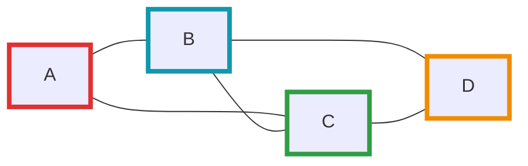

Este diagrama muestra un grafo no dirigido simple con vértices A, B, C y D.

## Segundo tema: 7.2 Representación de Grafos en Memoria

### 7.2.1 Matriz de Adyacencia (Adjacency Matrix)

Se usa una matriz $M$ de tamaño $|V|\times|V|$. $M[i][j]=1$ (o peso) si existe arista; $0$ o $\infty$ si no existe.

Ventajas:

- Verificar adyacencia en $O(1)$.
- Implementación simple y directa.

Desventajas:

- Espacio $O(|V|^2)$ — ineficiente para grafos dispersos.

### 7.2.2 Lista de Adyacencia (Adjacency List)

Estructura: arreglo (o vector) de listas; cada índice corresponde a un vértice y su lista contiene vecinos.

Ventajas:

- Uso de memoria $O(|V|+|E|)$ — eficiente en grafos dispersos.
- Iterar vecinos es rápido y directo.

Desventajas:

- Verificar adyacencia puede costar $O(grado(v))$ (grado del vértice) en el peor caso.

### 7.2.3 Comparación Rápida

| Criterio | Matriz de Adyacencia | Lista de Adyacencia |
|---|---|---|
| **Espacio en memoria** | $O(V^2)$ | $O(V + E)$ |
| **Verificar si existe arista $(u,v)$** | $O(1)$ | $O(grado(u))$ |
| **Encontrar todos los vecinos de $v$** | $O(V)$ | $O(grado(v))$ |
| **Agregar un vértice** | $O(V^2)$ | $O(1)$ |
| **Agregar una arista** | $O(1)$ | $O(1)$ |
| **Eliminar una arista** | $O(1)$ | $O(grado(v))$ |
| **Eliminar un vértice** | $O(V^2)$ | $O(V + E)$ |
| **Mejor para grafos densos** | ✅ Sí | ❌ No |
| **Mejor para grafos dispersos** | ❌ No | ✅ Sí |

#### ¿Cuándo usar cada representación?

**Matriz de Adyacencia:**

- Grafos densos (muchas aristas: $E \approx V^2$)
- Necesidad frecuente de verificar si existe una arista específica
- Algoritmos que requieren acceso aleatorio a aristas
- Grafos pequeños donde el espacio $O(V^2)$ es aceptable

**Lista de Adyacencia:**

- Grafos dispersos (pocas aristas: $E \ll V^2$)
- Necesidad de iterar sobre vecinos frecuentemente
- Grafos grandes donde el espacio es crítico
- Mayoría de algoritmos de grafos (BFS, DFS, Dijkstra, etc.)

## Tercer tema: 7.3 Algoritmos de Recorrido

### 7.3.1 Búsqueda en Amplitud (BFS — Breadth-First Search)

**Objetivo:** Explorar por niveles, ideal para caminos mínimos en grafos no ponderados.

**Estructura clave:** Cola (queue).

**Complejidad:** $O(|V|+|E|)$ usando lista de adyacencia.

**Implementación (C++ — iterativa usando arrays y matriz de adyacencia):**

```cpp
#include <queue>
#include <cstring> // memset

// Ejemplo usando matriz de adyacencia.
// MAX debe elegirse según el problema o usarse dinámica.
const int MAX = 100;
int adj[MAX][MAX]; // 0/1 indica adyacencia

// bfs desde 's', 'n' es número de vértices, 'dist' es array de salida
void bfs_array(int s, int n, int dist[]) {
    for (int i = 0; i < n; ++i) dist[i] = -1;
    std::queue<int> q;
    dist[s] = 0;
    q.push(s);

    while (!q.empty()) {
        int v = q.front(); 
        q.pop();

        // recorrer todos los posibles vecinos usando la matriz
        for (int u = 0; u < n; ++u) {
            if (adj[v][u] && dist[u] == -1) {
                dist[u] = dist[v] + 1;
                q.push(u);
            }
        }
    }
}
```

**Aplicaciones:** caminos mínimos por número de aristas, componentes conexas en grafos no dirigidos, niveles de jerarquía.

#### Diagrama: BFS (capas) — ejemplo visual

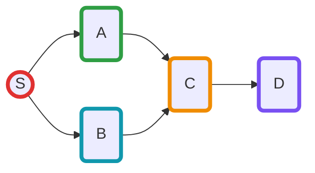

En este ejemplo, 'S' es la fuente (nivel 0). Los nodos A y B forman la capa 1; C y D están en capas siguientes según distancias desde S.

### 7.3.2 Búsqueda en Profundidad (DFS — Depth-First Search)

**Objetivo:** Explorar tan profundo como sea posible antes de retroceder. Útil para detección de ciclos y ordenamiento topológico.

**Estructura clave:** Pila (stack) — implícitamente la pila de llamadas en la versión recursiva.

**Complejidad:** $O(|V|+|E|)$.

**Implementación recursiva (C++ — usando arrays y matriz de adyacencia):**

```cpp
// dfs recursivo usando matriz de adyacencia 'adj' y array 'vis'
void dfs_rec_array(int v, int n, int vis[]) {
    vis[v] = 1; // 1 = visitado
    for (int u = 0; u < n; ++u) {
        if (adj[v][u] && !vis[u]) dfs_rec_array(u, n, vis);
    }
}

void dfs_array(int s, int n, int vis[]) {
    for (int i = 0; i < n; ++i) vis[i] = 0;
    dfs_rec_array(s, n, vis);
}
```

**Aplicaciones:** detección de ciclos, componentes fuertemente conexas (con Kosaraju/Tarjan), orden topológico (en DAGs).

#### Diagrama: DFS (profundidad) — ejemplo visual

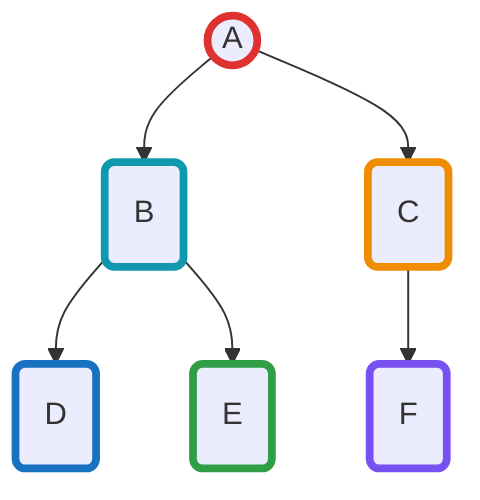

En este ejemplo de DFS comenzando desde 'A', el algoritmo explora primero el camino A→B→D, retrocede a B para visitar E, luego retrocede a A para explorar C→F. El orden de visita sería: A, B, D, E, C, F (asumiendo que exploramos vecinos en orden alfabético).

### 7.3.3 Aplicaciones de BFS y DFS

#### Componentes Conexas

**Definición:** En un grafo no dirigido, una componente conexa es un subgrafo maximal donde existe un camino entre cualquier par de vértices.

**Algoritmo (usando DFS o BFS):**

```cpp
// Encuentra todas las componentes conexas de un grafo no dirigido
// Retorna el número de componentes y asigna a cada vértice su componente en 'comp'
int find_components(int n, int comp[]) {
    for (int i = 0; i < n; ++i) comp[i] = -1;
    
    int num_components = 0;
    for (int i = 0; i < n; ++i) {
        if (comp[i] == -1) {
            // Iniciar DFS desde este vértice no visitado
            dfs_component(i, n, comp, num_components);
            num_components++;
        }
    }
    return num_components;
}

void dfs_component(int v, int n, int comp[], int current_comp) {
    comp[v] = current_comp;
    for (int u = 0; u < n; ++u) {
        if (adj[v][u] && comp[u] == -1) {
            dfs_component(u, n, comp, current_comp);
        }
    }
}
```

**Aplicaciones prácticas:**

- Análisis de redes sociales (identificar grupos aislados)
- Detección de islas en mapas
- Análisis de conectividad en redes de computadoras

#### Reachability (Alcanzabilidad)

**Definición:** Determinar si existe un camino desde un vértice $s$ hasta un vértice $t$ en un grafo dirigido o no dirigido.

**Algoritmo (BFS o DFS):**

```cpp
// Verifica si existe un camino de 's' a 't'
bool is_reachable(int s, int t, int n) {
    if (s == t) return true;
    
    int vis[MAX];
    for (int i = 0; i < n; ++i) vis[i] = 0;
    
    // BFS desde s
    std::queue<int> q;
    vis[s] = 1;
    q.push(s);
    
    while (!q.empty()) {
        int v = q.front();
        q.pop();
        
        for (int u = 0; u < n; ++u) {
            if (adj[v][u] && !vis[u]) {
                if (u == t) return true;
                vis[u] = 1;
                q.push(u);
            }
        }
    }
    return false;
}
```

**Aplicaciones prácticas:**

- Sistemas de navegación (¿es posible llegar del punto A al B?)
- Análisis de dependencias en compiladores
- Verificación de accesibilidad en sitios web

#### Orden Topológico (usando DFS)

**Definición:** En un DAG (Grafo Dirigido Acíclico), un ordenamiento topológico es una ordenación lineal de los vértices tal que para cada arista dirigida $(u,v)$, el vértice $u$ aparece antes que $v$.

**Algoritmo (DFS con pila):**

```cpp
// Orden topológico usando DFS
// Retorna false si hay un ciclo (no es DAG)
bool topological_sort_dfs(int n, int result[]) {
    int vis[MAX];      // 0: no visitado, 1: en proceso, 2: completado
    int stack[MAX];
    int top = 0;
    
    for (int i = 0; i < n; ++i) vis[i] = 0;
    
    for (int i = 0; i < n; ++i) {
        if (vis[i] == 0) {
            if (!dfs_topo(i, n, vis, stack, top)) {
                return false; // Ciclo detectado
            }
        }
    }
    
    // Copiar resultado (está en orden inverso)
    for (int i = 0; i < n; ++i) {
        result[i] = stack[n - 1 - i];
    }
    return true;
}

bool dfs_topo(int v, int n, int vis[], int stack[], int &top) {
    vis[v] = 1; // Marca como "en proceso"
    
    for (int u = 0; u < n; ++u) {
        if (adj[v][u]) {
            if (vis[u] == 1) return false; // Ciclo detectado
            if (vis[u] == 0 && !dfs_topo(u, n, vis, stack, top)) {
                return false;
            }
        }
    }
    
    vis[v] = 2; // Marca como completado
    stack[top++] = v;
    return true;
}
```

**Aplicaciones prácticas:**

- Planificación de tareas con dependencias (sistemas de construcción como Make, Gradle)
- Orden de compilación de módulos
- Resolución de prerrequisitos en cursos universitarios
- Scheduling de procesos en sistemas operativos

#### Diagrama: Orden Topológico — ejemplo

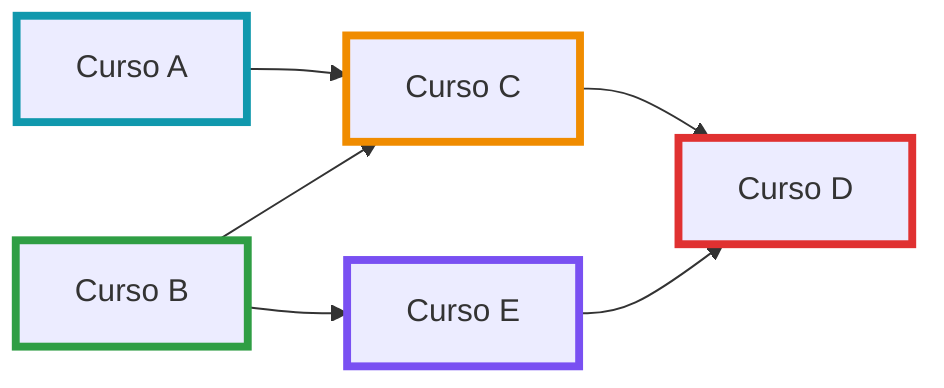

**Posibles órdenes topológicos válidos:**

- A, B, C, E, D
- B, A, C, E, D
- A, B, E, C, D
- B, E, A, C, D

Todos respetan la restricción de que los prerrequisitos aparecen antes que sus dependientes.

## Cuarto tema: 7.4 Algoritmos de Optimización en Grafos

### 7.4.1 Ordenamiento Topológico Kahn (Topological Sort)

Definición: orden lineal de vértices en un DAG tal que para cada arista $(u,v)$, $u$ aparece antes que $v$.

**Algoritmo de Kahn (basado en grado de entrada) — versión con arrays y matriz de adyacencia:**

```cpp
// topological_kahn_array: retorna el número de vértices ordenados (n) en 'topo'
// o -1 si hay ciclo. 'indeg' no se modifica porque trabajamos sobre una copia.
int topological_kahn_array(int n, int indeg[], int topo[]) {
    int indeg2[MAX];
    for (int i = 0; i < n; ++i) indeg2[i] = indeg[i];

    std::queue<int> q;
    for (int i = 0; i < n; ++i) if (indeg2[i] == 0) q.push(i);

    int idx = 0;
    while (!q.empty()) {
        int v = q.front(); q.pop();
        topo[idx++] = v;
        // Usando matriz de adyacencia global 'adj'
        for (int u = 0; u < n; ++u) {
            if (adj[v][u]) {
                indeg2[u]--;
                if (indeg2[u] == 0) q.push(u);
            }
        }
    }

    if (idx != n) return -1; // Grafo con ciclo -> no hay orden topológico
    return idx; // debería ser n
}
```

**Aplicaciones:** planificación de tareas con dependencias, compilación, resolución de prerrequisitos.

### 7.4.2 Árbol de Expansión Mínima (MST)

Definición: subgrafo conexo sin ciclos que conecta todos los vértices con suma mínima de pesos.

Algoritmos clásicos:

- Prim: extiende un conjunto de vértices agregando la arista de menor peso que une nuevo vértice.
- Kruskal: ordena aristas por peso y agrega aristas si no forman ciclo (DSU / Union-Find).

#### Implementación de Kruskal (C++ - esquema)

```cpp
// Kruskal usando arrays
struct Edge { int u, v; long long w; };

const int MAX = 100;

struct DSU {
    int p[MAX];
    int r[MAX];
    DSU(int n){ for(int i=0;i<n;i++){ p[i]=i; r[i]=0; } }
    int find(int x){ return p[x]==x?x:p[x]=find(p[x]); }
    bool unite(int a,int b){ a=find(a); b=find(b); if(a==b) return false; if(r[a]<r[b]) std::swap(a,b); p[b]=a; if(r[a]==r[b]) r[a]++; return true; }
};

long long kruskal(int n, Edge edges[], int m) {
    std::sort(edges, edges + m, [](const Edge&a,const Edge&b){return a.w<b.w;});
    DSU dsu(n);
    long long cost = 0;
    for (int i = 0; i < m; ++i) if (dsu.unite(edges[i].u, edges[i].v)) cost += edges[i].w;
    return cost;
}
```

#### Implementación de Prim (esquema con heap)

```cpp
// Prim O(n^2) usando matriz de pesos adjw (INF = sin arista)
const long long INF = (1LL<<60);
long long adjw[MAX][MAX]; // Debe inicializarse con INF y pesos donde haya arista

long long prim_array(int s, int n) {
    static char used[MAX];
    static long long min_e[MAX];
    for (int i = 0; i < n; ++i) { used[i] = 0; min_e[i] = INF; }
    min_e[s] = 0;
    long long total = 0;
    for (int i = 0; i < n; ++i) {
        int v = -1;
        for (int j = 0; j < n; ++j) if (!used[j] && (v == -1 || min_e[j] < min_e[v])) v = j;
        if (min_e[v] == INF) return -1; // grafo desconectado
        used[v] = 1;
        total += min_e[v];
        for (int to = 0; to < n; ++to) if (!used[to] && adjw[v][to] < min_e[to]) min_e[to] = adjw[v][to];
    }
    return total;
}
```

#### Diagrama: MST — ejemplo (aristas ponderadas)

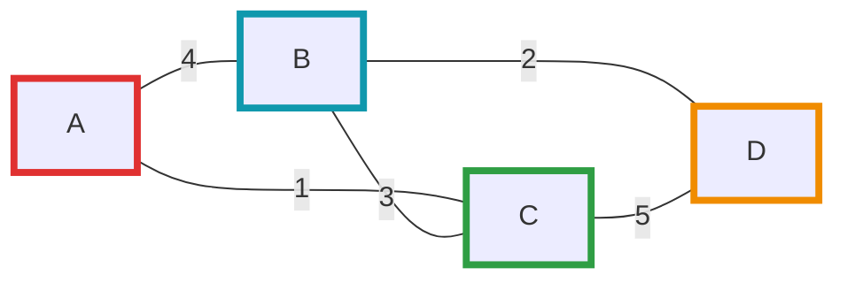

En este ejemplo con pesos, Kruskal elegiría las aristas de menor peso (A-C:1, B-D:2, B-C:3) para formar el MST con costo total de 6. Prim construiría el mismo árbol agregando vértices gradualmente desde una fuente elegida.

**Complejidades:**

- Prim (con heap): $O((|V|+|E|)\log |V|)$
- Kruskal: $O(|E|\log|E|)$

### 7.4.3 Algoritmo de Dijkstra: Caminos Mínimos en Grafos Ponderados

**Definición:** El algoritmo de Dijkstra encuentra el camino más corto desde un vértice origen a todos los demás vértices en un grafo ponderado con pesos no negativos.

**Restricción importante:** Las aristas deben tener pesos **no negativos** ($w(u,v) \geq 0$). Para grafos con pesos negativos, se debe usar Bellman-Ford.

**Complejidad:**

- Con cola de prioridad (heap): $O((|V|+|E|)\log|V|)$
- Sin optimizar (búsqueda lineal): $O(|V|^2)$

#### Idea del Algoritmo

1. Mantener un conjunto de vértices visitados y distancias tentativas
2. Inicialmente, la distancia al origen es 0 y al resto es infinito
3. En cada paso, seleccionar el vértice no visitado con menor distancia
4. Actualizar las distancias de sus vecinos (relajación)
5. Marcar el vértice como visitado
6. Repetir hasta procesar todos los vértices

#### Implementación con Priority Queue (Heap)

```cpp
#include <queue>
#include <vector>
#include <utility>

const int MAXN = 100000;
const long long INF = 1e18;

struct Edge {
    int to;
    long long weight;
};

std::vector<Edge> graph[MAXN]; // Lista de adyacencia
long long dist[MAXN];           // Distancias mínimas desde el origen
bool vis[MAXN];                 // Vértices visitados

void dijkstra(int start, int n) {
    // Inicializar distancias
    for (int i = 0; i < n; ++i) {
        dist[i] = INF;
        vis[i] = false;
    }
    
    dist[start] = 0;
    
    // Priority queue: {distancia, vértice}
    // Por defecto es max-heap, usamos negativo o comparador custom
    std::priority_queue<std::pair<long long, int>, 
                       std::vector<std::pair<long long, int>>,
                       std::greater<std::pair<long long, int>>> pq;
    
    pq.push({0, start});
    
    while (!pq.empty()) {
        auto [d, u] = pq.top();
        pq.pop();
        
        // Si ya fue visitado, ignorar
        if (vis[u]) continue;
        vis[u] = true;
        
        // Relajar aristas adyacentes
        for (const Edge& e : graph[u]) {
            int v = e.to;
            long long w = e.weight;
            
            if (dist[u] + w < dist[v]) {
                dist[v] = dist[u] + w;
                pq.push({dist[v], v});
            }
        }
    }
}
```

#### Implementación Simple con Arrays (O(V²))

Para grafos densos o cuando el tamaño es pequeño:

```cpp
const int MAX = 1000;
const long long INF = 1e18;
long long adjw[MAX][MAX]; // Matriz de pesos (INF si no hay arista)
long long dist[MAX];
bool vis[MAX];

void dijkstra_simple(int start, int n) {
    // Inicializar
    for (int i = 0; i < n; ++i) {
        dist[i] = INF;
        vis[i] = false;
    }
    
    dist[start] = 0;
    
    for (int iter = 0; iter < n; ++iter) {
        // Encontrar vértice no visitado con distancia mínima
        int u = -1;
        for (int i = 0; i < n; ++i) {
            if (!vis[i] && (u == -1 || dist[i] < dist[u])) {
                u = i;
            }
        }
        
        if (dist[u] == INF) break; // No hay más vértices alcanzables
        
        vis[u] = true;
        
        // Relajar aristas
        for (int v = 0; v < n; ++v) {
            if (adjw[u][v] < INF) { // Si existe arista u -> v
                dist[v] = std::min(dist[v], dist[u] + adjw[u][v]);
            }
        }
    }
}
```

#### Reconstrucción del Camino

Para obtener no solo las distancias sino también los caminos:

```cpp
int parent[MAXN]; // Guardar el padre de cada vértice en el camino

void dijkstra_with_path(int start, int n) {
    for (int i = 0; i < n; ++i) {
        dist[i] = INF;
        vis[i] = false;
        parent[i] = -1;
    }
    
    dist[start] = 0;
    std::priority_queue<std::pair<long long, int>, 
                       std::vector<std::pair<long long, int>>,
                       std::greater<std::pair<long long, int>>> pq;
    
    pq.push({0, start});
    
    while (!pq.empty()) {
        auto [d, u] = pq.top();
        pq.pop();
        
        if (vis[u]) continue;
        vis[u] = true;
        
        for (const Edge& e : graph[u]) {
            int v = e.to;
            long long w = e.weight;
            
            if (dist[u] + w < dist[v]) {
                dist[v] = dist[u] + w;
                parent[v] = u; // Guardar el padre
                pq.push({dist[v], v});
            }
        }
    }
}

// Reconstruir el camino desde start hasta target
std::vector<int> get_path(int start, int target) {
    if (dist[target] == INF) return {}; // No hay camino
    
    std::vector<int> path;
    for (int v = target; v != -1; v = parent[v]) {
        path.push_back(v);
    }
    
    std::reverse(path.begin(), path.end());
    return path;
}
```

#### Diagrama: Dijkstra — ejemplo visual

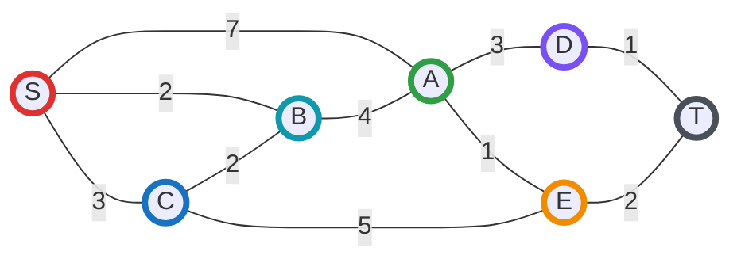

**Ejecución paso a paso desde S:**

1. **Inicio:** dist[S]=0, todos los demás = ∞
2. **Visitar S:** Actualizar vecinos: A=7, B=2, C=3
3. **Visitar B (menor: 2):** Actualizar A=min(7, 2+4)=6
4. **Visitar C (menor: 3):** Actualizar B (no mejora), E=min(∞, 3+5)=8
5. **Visitar A (menor: 6):** Actualizar D=6+3=9, E=min(8, 6+1)=7
6. **Visitar E (menor: 7):** Actualizar T=7+2=9
7. **Visitar T y D:** Completar

**Distancias finales:** S→B=2, S→C=3, S→A=6, S→E=7, S→D=9, S→T=9

**Camino más corto a T:** S→B→A→E→T (costo: 2+4+1+2=9)

#### Variantes y Extensiones

##### 1. Dijkstra con múltiples orígenes

Para encontrar distancias desde varios puntos de origen simultáneamente:

```cpp
void dijkstra_multi_source(std::vector<int>& sources, int n) {
    for (int i = 0; i < n; ++i) {
        dist[i] = INF;
        vis[i] = false;
    }
    
    std::priority_queue<std::pair<long long, int>, 
                       std::vector<std::pair<long long, int>>,
                       std::greater<std::pair<long long, int>>> pq;
    
    // Agregar todos los orígenes con distancia 0
    for (int src : sources) {
        dist[src] = 0;
        pq.push({0, src});
    }
    
    // El resto del algoritmo es igual
    while (!pq.empty()) {
        auto [d, u] = pq.top();
        pq.pop();
        
        if (vis[u]) continue;
        vis[u] = true;
        
        for (const Edge& e : graph[u]) {
            int v = e.to;
            long long w = e.weight;
            
            if (dist[u] + w < dist[v]) {
                dist[v] = dist[u] + w;
                pq.push({dist[v], v});
            }
        }
    }
}
```

##### 2. Dijkstra con límite de paradas

Útil para problemas con restricciones de número de aristas:

```cpp
// dist2[v][k] = distancia mínima a v usando exactamente k aristas
long long dist2[MAXN][101]; // Hasta 100 aristas

void dijkstra_with_stops(int start, int n, int max_stops) {
    for (int i = 0; i < n; ++i) {
        for (int k = 0; k <= max_stops; ++k) {
            dist2[i][k] = INF;
        }
    }
    
    dist2[start][0] = 0;
    
    // {distancia, vértice, número de paradas}
    std::priority_queue<std::tuple<long long, int, int>,
                       std::vector<std::tuple<long long, int, int>>,
                       std::greater<std::tuple<long long, int, int>>> pq;
    
    pq.push({0, start, 0});
    
    while (!pq.empty()) {
        auto [d, u, stops] = pq.top();
        pq.pop();
        
        if (stops > max_stops) continue;
        if (d > dist2[u][stops]) continue;
        
        for (const Edge& e : graph[u]) {
            int v = e.to;
            long long w = e.weight;
            int new_stops = stops + 1;
            
            if (new_stops <= max_stops && d + w < dist2[v][new_stops]) {
                dist2[v][new_stops] = d + w;
                pq.push({dist2[v][new_stops], v, new_stops});
            }
        }
    }
}
```

#### Comparación con Otros Algoritmos de Caminos Mínimos

| Algoritmo | Pesos Negativos | Complejidad | Caso de Uso |
|-----------|-----------------|-------------|-------------|
| **Dijkstra** | ❌ No | $O((V+E)\log V)$ | Grafos con pesos no negativos |
| **Bellman-Ford** | ✅ Sí | $O(VE)$ | Grafos con pesos negativos, detecta ciclos negativos |
| **Floyd-Warshall** | ✅ Sí | $O(V^3)$ | Todos los pares de caminos más cortos |
| **BFS** | Solo peso 1 | $O(V+E)$ | Grafos no ponderados |
| **0-1 BFS** | Solo pesos 0 y 1 | $O(V+E)$ | Grafos con pesos binarios |

#### Aplicaciones Prácticas

**Dijkstra se usa en:**

- **Sistemas de navegación GPS:** Encontrar la ruta más corta entre dos puntos
- **Enrutamiento de redes:** Protocolos como OSPF (Open Shortest Path First)
- **Juegos:** Pathfinding para personajes o unidades (combinado con A*)
- **Redes de transporte:** Optimización de rutas de entrega, vuelos, trenes
- **Telecomunicaciones:** Minimizar latencia en redes
- **Análisis de redes sociales:** Encontrar grado de separación entre personas

#### Optimizaciones y Consideraciones

**Mejoras de rendimiento:**

1. **Usar deque en lugar de priority_queue** cuando los pesos son pequeños
2. **Bidirectional Dijkstra:** Buscar desde origen y destino simultáneamente
3. **A* (A-Star):** Variante de Dijkstra con heurística para objetivo específico
4. **Dial's Algorithm:** Para grafos con pesos enteros pequeños

**Errores comunes:**

- Olvidar verificar si el vértice ya fue visitado al sacarlo de la cola
- No inicializar correctamente las distancias con INF
- Usar Dijkstra con pesos negativos (produce resultados incorrectos)
- No usar `long long` cuando las distancias pueden desbordarse

### 7.4.4 Algoritmo de Floyd-Warshall: Todos los Pares de Caminos Mínimos

**Definición:** El algoritmo de Floyd-Warshall encuentra las distancias más cortas entre **todos los pares** de vértices en un grafo ponderado. A diferencia de Dijkstra (que encuentra caminos desde un solo origen), este algoritmo calcula la matriz completa de distancias.

**Características principales:**

- ✅ Funciona con **pesos negativos** (pero no con ciclos negativos)
- ✅ Puede **detectar ciclos negativos**
- ✅ Implementación simple y elegante
- ❌ Complejidad $O(V^3)$ — no eficiente para grafos grandes

**Complejidad:**

- Tiempo: $O(V^3)$
- Espacio: $O(V^2)$

#### Idea del Algoritmo (Floyd-Warshall)

El algoritmo usa **programación dinámica** con la siguiente idea:

- $dist[i][j][k]$ = distancia mínima de $i$ a $j$ usando solo vértices $\{0, 1, ..., k-1\}$ como intermedios
- Relación de recurrencia:
  - $dist[i][j][k] = \min(dist[i][j][k-1], dist[i][k][k-1] + dist[k][j][k-1])$

Optimización: Solo necesitamos 2 dimensiones porque actualizamos in-place:

- $dist[i][j] = \min(dist[i][j], dist[i][k] + dist[k][j])$

#### Implementación Básica

```cpp
const int MAXN = 500;
const long long INF = 1e18;
long long dist[MAXN][MAXN]; // Matriz de distancias
int n; // número de vértices

void floyd_warshall() {
    // dist[i][j] ya debe estar inicializada:
    // - dist[i][i] = 0
    // - dist[i][j] = peso de arista (i,j) si existe
    // - dist[i][j] = INF si no hay arista
    
    // Probar cada vértice como intermedio
    for (int k = 0; k < n; ++k) {
        for (int i = 0; i < n; ++i) {
            for (int j = 0; j < n; ++j) {
                if (dist[i][k] < INF && dist[k][j] < INF) {
                    dist[i][j] = std::min(dist[i][j], dist[i][k] + dist[k][j]);
                }
            }
        }
    }
}
```

#### Detección de Ciclos Negativos

Un ciclo negativo existe si después de ejecutar el algoritmo, algún vértice tiene distancia negativa a sí mismo:

```cpp
bool has_negative_cycle() {
    for (int i = 0; i < n; ++i) {
        if (dist[i][i] < 0) {
            return true; // Ciclo negativo detectado
        }
    }
    return false;
}
```

#### Reconstrucción de Caminos

Para reconstruir el camino más corto entre dos vértices:

```cpp
int next[MAXN][MAXN]; // next[i][j] = siguiente vértice en el camino de i a j

void floyd_warshall_with_path() {
    // Inicializar next
    for (int i = 0; i < n; ++i) {
        for (int j = 0; j < n; ++j) {
            if (i != j && dist[i][j] < INF) {
                next[i][j] = j; // Camino directo
            } else {
                next[i][j] = -1; // No hay camino
            }
        }
    }
    
    // Floyd-Warshall con actualización de next
    for (int k = 0; k < n; ++k) {
        for (int i = 0; i < n; ++i) {
            for (int j = 0; j < n; ++j) {
                if (dist[i][k] < INF && dist[k][j] < INF) {
                    if (dist[i][k] + dist[k][j] < dist[i][j]) {
                        dist[i][j] = dist[i][k] + dist[k][j];
                        next[i][j] = next[i][k]; // Tomar mismo siguiente que i->k
                    }
                }
            }
        }
    }
}

// Reconstruir el camino de u a v
std::vector<int> reconstruct_path(int u, int v) {
    if (next[u][v] == -1) return {}; // No hay camino
    
    std::vector<int> path;
    path.push_back(u);
    
    while (u != v) {
        u = next[u][v];
        path.push_back(u);
    }
    
    return path;
}
```

#### Ejemplo de Uso Completo

```cpp
#include <iostream>
#include <vector>
#include <algorithm>

const int MAXN = 100;
const long long INF = 1e18;

void solve_floyd_warshall(int n, std::vector<std::tuple<int,int,long long>>& edges) {
    long long dist[MAXN][MAXN];
    
    // Inicializar matriz de distancias
    for (int i = 0; i < n; ++i) {
        for (int j = 0; j < n; ++j) {
            if (i == j) {
                dist[i][j] = 0;
            } else {
                dist[i][j] = INF;
            }
        }
    }
    
    // Agregar aristas
    for (auto [u, v, w] : edges) {
        dist[u][v] = std::min(dist[u][v], w);
    }
    
    // Floyd-Warshall
    for (int k = 0; k < n; ++k) {
        for (int i = 0; i < n; ++i) {
            for (int j = 0; j < n; ++j) {
                if (dist[i][k] < INF && dist[k][j] < INF) {
                    dist[i][j] = std::min(dist[i][j], dist[i][k] + dist[k][j]);
                }
            }
        }
    }
    
    // Verificar ciclo negativo
    for (int i = 0; i < n; ++i) {
        if (dist[i][i] < 0) {
            std::cout << "Ciclo negativo detectado!\n";
            return;
        }
    }
    
    // Imprimir matriz de distancias
    std::cout << "Matriz de distancias mínimas:\n";
    for (int i = 0; i < n; ++i) {
        for (int j = 0; j < n; ++j) {
            if (dist[i][j] == INF) {
                std::cout << "INF ";
            } else {
                std::cout << dist[i][j] << " ";
            }
        }
        std::cout << "\n";
    }
}
```

#### Diagrama: Floyd-Warshall — ejemplo visual

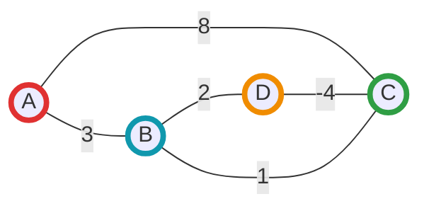

**Ejemplo de ejecución:**

Grafo inicial con 4 vértices (A=0, B=1, C=2, D=3):

```text
Matriz inicial:
    A   B   C   D
A [ 0   3   8  INF]
B [INF  0  INF  2 ]
C [INF  1   0  INF]
D [INF INF -4   0 ]
```

Después de Floyd-Warshall:

```text
Matriz final:
    A   B   C   D
A [ 0   3   1   5 ]
B [INF  0  -2   2 ]
C [INF  1   0   3 ]
D [INF -3  -4   0 ]
```

**Observaciones:**

- A→C: mejor camino es A→B→D→C (costo: 3+2-4=1) en lugar del directo (8)
- D→B: camino es D→C→B (costo: -4+1=-3)
- Hay un ciclo con peso negativo: B→D→C→B (2-4+1=-1)

#### Variantes y Aplicaciones

##### 1. Clausura Transitiva (Transitive Closure)

Determinar si existe un camino entre cada par de vértices (sin importar el peso):

```cpp
bool reach[MAXN][MAXN]; // reach[i][j] = ¿existe camino de i a j?

void transitive_closure(int n) {
    // Inicializar con aristas directas
    for (int i = 0; i < n; ++i) {
        for (int j = 0; j < n; ++j) {
            reach[i][j] = (i == j) || (dist[i][j] < INF);
        }
    }
    
    // Floyd-Warshall para alcanzabilidad
    for (int k = 0; k < n; ++k) {
        for (int i = 0; i < n; ++i) {
            for (int j = 0; j < n; ++j) {
                reach[i][j] = reach[i][j] || (reach[i][k] && reach[k][j]);
            }
        }
    }
}
```

##### 2. Minimax / Maximin Path

Encontrar el camino donde el máximo peso de arista es mínimo:

```cpp
long long maximin[MAXN][MAXN];

void minimax_path(int n) {
    // Inicializar (maximin[i][j] = peso de arista directa o INF)
    
    for (int k = 0; k < n; ++k) {
        for (int i = 0; i < n; ++i) {
            for (int j = 0; j < n; ++j) {
                // Tomar el mínimo del máximo peso en cada ruta
                maximin[i][j] = std::min(maximin[i][j], 
                                        std::max(maximin[i][k], maximin[k][j]));
            }
        }
    }
}
```

#### Comparación: Floyd-Warshall vs Múltiples Dijkstra

| Aspecto | Floyd-Warshall | Dijkstra × V veces |
|---------|----------------|---------------------|
| **Complejidad** | $O(V^3)$ | $O(V \cdot (V+E)\log V)$ |
| **Pesos negativos** | ✅ Sí (sin ciclos) | ❌ No |
| **Mejor para grafos densos** | ✅ Sí | ❌ No |
| **Mejor para grafos dispersos** | ❌ No | ✅ Sí |
| **Implementación** | Muy simple | Más compleja |
| **Espacio** | $O(V^2)$ | $O(V+E)$ |

**Regla práctica:**

- **Floyd-Warshall:** grafos densos, $V \leq 500$, puede tener pesos negativos
- **Dijkstra repetido:** grafos dispersos, $V$ grande, solo pesos no negativos

#### Aplicaciones Prácticas de Floyd-Warshall

**Floyd-Warshall se usa en:**

- **Redes de comunicación:** Calcular latencias entre todos los pares de nodos
- **Análisis de rutas:** Matriz de distancias para planificación de transporte
- **Juegos:** Precálculo de distancias en mapas para IA
- **Teoría de grafos:** Detectar componentes fuertemente conexas, diámetro del grafo
- **Economía:** Análisis de arbitraje en mercados financieros (detectar ciclos de ganancia)
- **Redes sociales:** Calcular grados de separación entre todos los usuarios

#### Optimizaciones

**Para grafos con características especiales:**

1. **Grafos no dirigidos:** Solo calcular mitad superior de la matriz (simétrica)
2. **Grafos dispersos:** Usar representación comprimida o considerar Dijkstra repetido
3. **Grafos grandes:** Dividir en componentes conexas y aplicar Floyd-Warshall a cada una
4. **Paralelización:** Los loops pueden paralelizarse (especialmente el loop más interno)

**Ejemplo con optimización de memoria:**

```cpp
// Si solo nos importa si existe camino (no la distancia exacta)
bool reachable[MAXN][MAXN];

void floyd_warshall_bool(int n) {
    for (int k = 0; k < n; ++k) {
        for (int i = 0; i < n; ++i) {
            for (int j = 0; j < n; ++j) {
                reachable[i][j] |= (reachable[i][k] & reachable[k][j]);
            }
        }
    }
}
```

## Quinto tema: 7.5 Problemas de Recorridos y Caminos Especiales

### 7.5.1 Camino y Ciclo Euleriano: Algoritmo de Hierholzer

**Definición:** Un **camino euleriano** es un camino en un grafo que visita cada **arista** exactamente una vez. Un **ciclo euleriano** es un camino euleriano que comienza y termina en el mismo vértice.

**Nota importante:** No confundir con camino/ciclo hamiltoniano (que visita cada **vértice** una vez).

#### Teorema de Euler

**Para grafos no dirigidos:**

- **Ciclo euleriano existe** si y solo si:
  - El grafo es conexo (ignorando vértices aislados)
  - Todos los vértices tienen grado par

- **Camino euleriano existe** si y solo si:
  - El grafo es conexo
  - Exactamente 0 o 2 vértices tienen grado impar
  - Si hay 2 vértices de grado impar, el camino debe comenzar en uno y terminar en el otro

**Para grafos dirigidos:**

- **Ciclo euleriano existe** si y solo si:
  - El grafo es fuertemente conexo
  - Cada vértice tiene grado de entrada = grado de salida

- **Camino euleriano existe** si y solo si:
  - El grafo es débilmente conexo
  - A lo más un vértice tiene (grado_salida - grado_entrada) = 1 (inicio)
  - A lo más un vértice tiene (grado_entrada - grado_salida) = 1 (fin)
  - Todos los demás vértices: grado_entrada = grado_salida

#### Algoritmo de Hierholzer

El algoritmo de Hierholzer encuentra un camino/ciclo euleriano eficientemente en $O(E)$ tiempo.

**Idea del algoritmo:**

1. Comenzar desde cualquier vértice con aristas disponibles (o vértice de inicio si es camino)
2. Seguir aristas sin repetir, marcándolas como usadas
3. Si quedamos atascados, retroceder y buscar subciclos no explorados
4. Combinar todos los subciclos encontrados

**Implementación para grafo no dirigido:**

```cpp
#include <vector>
#include <stack>
#include <algorithm>

const int MAXN = 100000;
std::vector<std::pair<int, int>> graph[MAXN]; // {vecino, id_arista}
bool used_edge[MAXN * 2]; // Marcar aristas usadas
int degree[MAXN];

std::vector<int> find_eulerian_path(int n, int m, int start) {
    std::stack<int> curr_path;
    std::vector<int> circuit;
    
    curr_path.push(start);
    int curr_v = start;
    
    while (!curr_path.empty()) {
        if (!graph[curr_v].empty()) {
            // Tomar siguiente arista no usada
            auto [next_v, edge_id] = graph[curr_v].back();
            graph[curr_v].pop_back();
            
            if (!used_edge[edge_id]) {
                used_edge[edge_id] = true;
                curr_path.push(curr_v);
                curr_v = next_v;
            }
        } else {
            // No hay más aristas desde curr_v
            circuit.push_back(curr_v);
            curr_v = curr_path.top();
            curr_path.pop();
        }
    }
    
    std::reverse(circuit.begin(), circuit.end());
    return circuit;
}

// Verificar si existe camino euleriano y encontrar punto de inicio
int find_start_vertex(int n) {
    int start = 0;
    int odd_count = 0;
    
    for (int i = 0; i < n; ++i) {
        if (degree[i] % 2 == 1) {
            odd_count++;
            start = i; // Comenzar desde vértice de grado impar
        }
    }
    
    if (odd_count != 0 && odd_count != 2) {
        return -1; // No existe camino euleriano
    }
    
    return start;
}
```

**Implementación para grafo dirigido:**

```cpp
std::vector<int> graph_dir[MAXN]; // Lista de adyacencia
int in_degree[MAXN];
int out_degree[MAXN];

std::vector<int> find_eulerian_path_directed(int n, int start) {
    std::stack<int> curr_path;
    std::vector<int> circuit;
    
    curr_path.push(start);
    int curr_v = start;
    
    while (!curr_path.empty()) {
        if (!graph_dir[curr_v].empty()) {
            int next_v = graph_dir[curr_v].back();
            graph_dir[curr_v].pop_back();
            
            curr_path.push(curr_v);
            curr_v = next_v;
        } else {
            circuit.push_back(curr_v);
            curr_v = curr_path.top();
            curr_path.pop();
        }
    }
    
    std::reverse(circuit.begin(), circuit.end());
    return circuit;
}

// Verificar y encontrar vértice de inicio para grafo dirigido
int find_start_vertex_directed(int n) {
    int start = 0;
    int start_vertices = 0;
    int end_vertices = 0;
    
    for (int i = 0; i < n; ++i) {
        if (out_degree[i] - in_degree[i] == 1) {
            start_vertices++;
            start = i;
        } else if (in_degree[i] - out_degree[i] == 1) {
            end_vertices++;
        } else if (in_degree[i] != out_degree[i]) {
            return -1; // No puede haber camino euleriano
        }
    }
    
    // Ciclo euleriano: todos balanceados
    if (start_vertices == 0 && end_vertices == 0) {
        // Encontrar cualquier vértice con aristas
        for (int i = 0; i < n; ++i) {
            if (out_degree[i] > 0) return i;
        }
    }
    
    // Camino euleriano: exactamente un inicio y un fin
    if (start_vertices == 1 && end_vertices == 1) {
        return start;
    }
    
    return -1; // No existe camino euleriano
}
```

#### Ejemplo Completo de Uso

```cpp
#include <iostream>
#include <vector>
#include <stack>
#include <algorithm>

// Función completa para resolver camino euleriano en grafo no dirigido
void solve_eulerian_undirected() {
    int n, m; // n vértices, m aristas
    std::cin >> n >> m;
    
    std::vector<std::pair<int, int>> graph[n];
    int degree[n] = {0};
    bool used_edge[m] = {false};
    
    for (int i = 0; i < m; ++i) {
        int u, v;
        std::cin >> u >> v;
        graph[u].push_back({v, i});
        graph[v].push_back({u, i});
        degree[u]++;
        degree[v]++;
    }
    
    // Verificar existencia y encontrar inicio
    int odd_count = 0;
    int start = 0;
    for (int i = 0; i < n; ++i) {
        if (degree[i] % 2 == 1) {
            odd_count++;
            start = i;
        }
    }
    
    if (odd_count != 0 && odd_count != 2) {
        std::cout << "No existe camino euleriano\n";
        return;
    }
    
    // Aplicar algoritmo de Hierholzer
    std::stack<int> curr_path;
    std::vector<int> circuit;
    
    curr_path.push(start);
    int curr_v = start;
    
    while (!curr_path.empty()) {
        if (!graph[curr_v].empty()) {
            auto [next_v, edge_id] = graph[curr_v].back();
            graph[curr_v].pop_back();
            
            if (!used_edge[edge_id]) {
                used_edge[edge_id] = true;
                curr_path.push(curr_v);
                curr_v = next_v;
            }
        } else {
            circuit.push_back(curr_v);
            curr_v = curr_path.top();
            curr_path.pop();
        }
    }
    
    std::reverse(circuit.begin(), circuit.end());
    
    // Imprimir camino
    std::cout << "Camino euleriano:\n";
    for (int v : circuit) {
        std::cout << v << " ";
    }
    std::cout << "\n";
}
```

#### Diagrama: Camino Euleriano — ejemplo

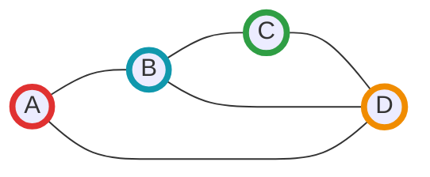

**Análisis del grafo:**

- Grados: A=2, B=3, C=2, D=3
- Hay exactamente 2 vértices de grado impar (B y D)
- **Existe camino euleriano** que debe empezar en B o D

**Un posible camino euleriano:** B → A → D → B → C → D

Este camino visita las 5 aristas exactamente una vez.

#### Diagrama: Ciclo Euleriano — ejemplo

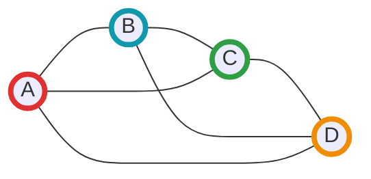

**Análisis del grafo:**

- Grados: A=3, B=3, C=3, D=3
- Todos los vértices tienen grado impar
- **No existe ciclo euleriano** (necesitan grado par)
- **No existe camino euleriano** (necesita 0 o 2 vértices de grado impar, tiene 4)

**Grafo corregido para ciclo euleriano:**

Si agregamos arista A-B, todos tendrían grado par y existiría un ciclo euleriano.

#### Aplicaciones del Camino Euleriano

**Problemas clásicos:**

1. **Puentes de Königsberg (1736):** Problema histórico que inspiró la teoría de grafos
   - ¿Es posible cruzar los 7 puentes de la ciudad sin repetir ninguno?
   - Euler demostró que no es posible (no existe camino euleriano)

2. **Ruta del cartero chino:** Encontrar la ruta más corta que cubra todas las calles
   - Si existe camino euleriano, esa es la solución
   - Si no, agregar aristas duplicadas mínimas

3. **Secuenciación de ADN:** Ensamblar fragmentos de ADN
   - Construir grafo de De Bruijn
   - Camino euleriano representa la secuencia completa

4. **Diseño de circuitos:** Verificar trazado de PCBs
   - Camino euleriano asegura que se puede trazar sin levantar el lápiz

5. **Juegos y puzzles:**
   - Dibujar figuras sin levantar el lápiz
   - Recorrer un laberinto pasando por todas las puertas

#### Variantes y Extensiones del Camino Euleriano

##### 1. Ciclo Euleriano en Multigrafos

Grafos con múltiples aristas entre el mismo par de vértices:

```cpp
// Usar multiset para permitir aristas múltiples
std::multiset<int> graph_multi[MAXN];

std::vector<int> hierholzer_multigrafo(int start, int n) {
    std::stack<int> curr_path;
    std::vector<int> circuit;
    
    curr_path.push(start);
    int curr_v = start;
    
    while (!curr_path.empty()) {
        if (!graph_multi[curr_v].empty()) {
            int next_v = *graph_multi[curr_v].begin();
            graph_multi[curr_v].erase(graph_multi[curr_v].find(next_v));
            graph_multi[next_v].erase(graph_multi[next_v].find(curr_v));
            
            curr_path.push(curr_v);
            curr_v = next_v;
        } else {
            circuit.push_back(curr_v);
            curr_v = curr_path.top();
            curr_path.pop();
        }
    }
    
    std::reverse(circuit.begin(), circuit.end());
    return circuit;
}
```

##### 2. Encontrar Todos los Caminos Eulerianos

Para enumerar todos los posibles caminos eulerianos (puede haber exponencialmente muchos):

```cpp
void find_all_eulerian_paths(int v, std::vector<int>& path, 
                              std::vector<std::vector<int>>& all_paths) {
    if (/* todas las aristas usadas */) {
        all_paths.push_back(path);
        return;
    }
    
    for (/* cada arista no usada desde v */) {
        // Marcar arista como usada
        path.push_back(next_v);
        find_all_eulerian_paths(next_v, path, all_paths);
        path.pop_back();
        // Desmarcar arista
    }
}
```

##### 3. Camino Semi-Euleriano

Hacer que un grafo sea euleriano agregando el mínimo número de aristas:

```cpp
// Para hacer ciclo euleriano: emparejar vértices de grado impar
std::vector<std::pair<int,int>> make_eulerian(int n) {
    std::vector<int> odd_vertices;
    for (int i = 0; i < n; ++i) {
        if (degree[i] % 2 == 1) {
            odd_vertices.push_back(i);
        }
    }
    
    std::vector<std::pair<int,int>> edges_to_add;
    
    // Emparejar vértices de grado impar (matching perfecto mínimo)
    for (size_t i = 0; i + 1 < odd_vertices.size(); i += 2) {
        edges_to_add.push_back({odd_vertices[i], odd_vertices[i+1]});
    }
    
    return edges_to_add;
}
```

#### Complejidad y Consideraciones

**Complejidad temporal:**

- Verificar existencia: $O(V + E)$
- Algoritmo de Hierholzer: $O(E)$
- Total: $O(V + E)$

**Complejidad espacial:** $O(V + E)$

**Ventajas:**

- Muy eficiente, lineal en número de aristas
- Fácil de implementar
- Funciona para grafos dirigidos y no dirigidos

**Consideraciones:**

- El grafo debe ser conexo (o débilmente conexo para dirigidos)
- Usar estructuras apropiadas para evitar repetir aristas
- En multigrafos, usar multiset o marcar aristas específicas

### 7.5.2 Camino y Ciclo Hamiltoniano: Backtracking y NP-Completitud

**Definición:** Un **camino hamiltoniano** es un camino en un grafo que visita cada **vértice** exactamente una vez. Un **ciclo hamiltoniano** es un camino hamiltoniano que comienza y termina en el mismo vértice (formando un ciclo).

**Diferencia clave con caminos eulerianos:**

- **Euleriano:** Visita cada **arista** exactamente una vez
- **Hamiltoniano:** Visita cada **vértice** exactamente una vez

#### Complejidad del Problema

A diferencia del camino euleriano (que tiene un algoritmo eficiente $O(E)$), el problema del camino hamiltoniano es **NP-completo**. Esto significa:

- No se conoce algoritmo polinomial para resolverlo
- Verificar si una solución propuesta es válida es fácil ($O(V)$)
- Encontrar la solución puede requerir tiempo exponencial

**Implicaciones prácticas:**

- Para grafos pequeños (n ≤ 20): backtracking es viable
- Para grafos medianos (20 < n ≤ 100): heurísticas y podas inteligentes
- Para grafos grandes: algoritmos aproximados o metaheurísticas

#### No Existe Criterio Simple

A diferencia del teorema de Euler (condición necesaria y suficiente basada en grados), **no existe una condición simple** que determine si un grafo tiene camino hamiltoniano.

**Algunos teoremas útiles (condiciones suficientes, no necesarias):**

**Teorema de Dirac (1952):** Si $G$ es un grafo simple con $n \geq 3$ vértices y cada vértice tiene grado $\geq n/2$, entonces $G$ tiene un ciclo hamiltoniano.

**Teorema de Ore (1960):** Si para cada par de vértices no adyacentes $u, v$ se cumple que $\deg(u) + \deg(v) \geq n$, entonces $G$ tiene un ciclo hamiltoniano.

**Nota:** Estas son condiciones suficientes pero no necesarias. Un grafo puede tener ciclo hamiltoniano sin cumplir estos teoremas.

#### Algoritmo por Backtracking

La estrategia de backtracking explora sistemáticamente todas las posibles secuencias de vértices, retrocediendo cuando encuentra un callejón sin salida.

**Implementación básica:**

```cpp
#include <vector>
#include <iostream>

const int MAXN = 20;
std::vector<int> graph[MAXN];
bool visited[MAXN];
std::vector<int> path;
int n; // número de vértices

// Verificar si existe arista entre u y v
bool is_adjacent(int u, int v) {
    for (int neighbor : graph[u]) {
        if (neighbor == v) return true;
    }
    return false;
}

// Backtracking para encontrar camino hamiltoniano
bool hamiltonian_path_util(int pos, int start_vertex) {
    // Caso base: visitamos todos los vértices
    if (pos == n) {
        return true;
    }
    
    // Intentar agregar cada vértice no visitado
    for (int v = 0; v < n; ++v) {
        // Verificar si v puede ser el siguiente vértice
        if (!visited[v] && (pos == 0 || is_adjacent(path[pos - 1], v))) {
            visited[v] = true;
            path.push_back(v);
            
            if (hamiltonian_path_util(pos + 1, start_vertex)) {
                return true;
            }
            
            // Backtrack
            visited[v] = false;
            path.pop_back();
        }
    }
    
    return false;
}

// Encontrar camino hamiltoniano comenzando desde start
bool find_hamiltonian_path(int start) {
    visited[start] = true;
    path.push_back(start);
    
    if (hamiltonian_path_util(1, start)) {
        return true;
    }
    
    visited[start] = false;
    path.pop_back();
    return false;
}

// Intentar desde todos los vértices posibles
bool has_hamiltonian_path() {
    for (int i = 0; i < n; ++i) {
        path.clear();
        std::fill(visited, visited + n, false);
        
        if (find_hamiltonian_path(i)) {
            return true;
        }
    }
    return false;
}
```

**Implementación para ciclo hamiltoniano:**

```cpp
// Backtracking para encontrar ciclo hamiltoniano
bool hamiltonian_cycle_util(int pos, int start_vertex) {
    // Caso base: visitamos todos los vértices
    if (pos == n) {
        // Verificar si hay arista de regreso al inicio
        return is_adjacent(path[pos - 1], start_vertex);
    }
    
    // Intentar agregar cada vértice no visitado
    for (int v = 0; v < n; ++v) {
        if (!visited[v] && is_adjacent(path[pos - 1], v)) {
            visited[v] = true;
            path.push_back(v);
            
            if (hamiltonian_cycle_util(pos + 1, start_vertex)) {
                return true;
            }
            
            // Backtrack
            visited[v] = false;
            path.pop_back();
        }
    }
    
    return false;
}

// Encontrar ciclo hamiltoniano
bool find_hamiltonian_cycle(int start) {
    visited[start] = true;
    path.push_back(start);
    
    return hamiltonian_cycle_util(1, start);
}
```

#### Optimizaciones y Podas

Para mejorar el rendimiento del backtracking básico:

##### 1. Poda por Grado

Si en cualquier punto un vértice no visitado tiene todos sus vecinos visitados (excepto el actual), no puede haber solución:

```cpp
// Verificar si es posible continuar
bool is_safe(int v, int pos) {
    // v debe ser adyacente al último vértice del path
    if (pos > 0 && !is_adjacent(path[pos - 1], v)) {
        return false;
    }
    
    // v no debe estar visitado
    if (visited[v]) {
        return false;
    }
    
    // Poda: si v tiene grado 1 y no es el último vértice, no puede ser solución
    if (pos < n - 1) {
        int unvisited_neighbors = 0;
        for (int neighbor : graph[v]) {
            if (!visited[neighbor]) {
                unvisited_neighbors++;
            }
        }
        if (unvisited_neighbors == 0) {
            return false;
        }
    }
    
    return true;
}
```

##### 2. Ordenamiento por Grado (Heurística de Warnsdorff)

Intentar primero los vértices con menor grado de vecinos no visitados:

```cpp
// Comparador para ordenar candidatos
struct Candidate {
    int vertex;
    int unvisited_degree;
    
    bool operator<(const Candidate& other) const {
        return unvisited_degree < other.unvisited_degree;
    }
};

bool hamiltonian_path_optimized(int pos, int start_vertex) {
    if (pos == n) return true;
    
    // Recolectar candidatos con su grado
    std::vector<Candidate> candidates;
    
    for (int v = 0; v < n; ++v) {
        if (is_safe(v, pos)) {
            int unvisited_deg = 0;
            for (int neighbor : graph[v]) {
                if (!visited[neighbor]) unvisited_deg++;
            }
            candidates.push_back({v, unvisited_deg});
        }
    }
    
    // Ordenar por grado ascendente (probar primero vértices con menos opciones)
    std::sort(candidates.begin(), candidates.end());
    
    for (const auto& candidate : candidates) {
        int v = candidate.vertex;
        visited[v] = true;
        path.push_back(v);
        
        if (hamiltonian_path_optimized(pos + 1, start_vertex)) {
            return true;
        }
        
        visited[v] = false;
        path.pop_back();
    }
    
    return false;
}
```

##### 3. Detección de Puentes y Articulaciones

Si al agregar un vértice creamos un puente que separa vértices no visitados, podemos podar:

```cpp
// Verificar si al agregar v desconectamos el grafo
bool would_disconnect(int v) {
    visited[v] = true;
    
    // Contar componentes conexas de vértices no visitados
    int components = 0;
    bool temp_visited[MAXN] = {false};
    
    for (int i = 0; i < n; ++i) {
        if (!visited[i] && !temp_visited[i]) {
            components++;
            if (components > 1) {
                visited[v] = false;
                return true; // Más de una componente, v desconecta el grafo
            }
            // BFS/DFS para marcar componente
            // ... (implementación omitida para brevedad)
        }
    }
    
    visited[v] = false;
    return false;
}
```

#### Ejemplo Completo con Todas las Optimizaciones

```cpp
#include <iostream>
#include <vector>
#include <algorithm>

class HamiltonianPathFinder {
private:
    std::vector<std::vector<int>> graph;
    std::vector<bool> visited;
    std::vector<int> path;
    int n;
    
    bool is_adjacent(int u, int v) {
        return std::find(graph[u].begin(), graph[u].end(), v) != graph[u].end();
    }
    
    int count_unvisited_neighbors(int v) {
        int count = 0;
        for (int neighbor : graph[v]) {
            if (!visited[neighbor]) count++;
        }
        return count;
    }
    
    bool is_safe(int v, int pos) {
        if (visited[v]) return false;
        if (pos > 0 && !is_adjacent(path[pos - 1], v)) return false;
        
        // Poda: vértice sin vecinos no visitados (excepto si es el último)
        if (pos < n - 1 && count_unvisited_neighbors(v) == 0) {
            return false;
        }
        
        return true;
    }
    
    bool solve(int pos) {
        if (pos == n) return true;
        
        // Recolectar y ordenar candidatos
        std::vector<std::pair<int, int>> candidates; // {degree, vertex}
        
        for (int v = 0; v < n; ++v) {
            if (is_safe(v, pos)) {
                int degree = count_unvisited_neighbors(v);
                candidates.push_back({degree, v});
            }
        }
        
        // Ordenar por grado ascendente
        std::sort(candidates.begin(), candidates.end());
        
        for (auto [degree, v] : candidates) {
            visited[v] = true;
            path.push_back(v);
            
            if (solve(pos + 1)) return true;
            
            visited[v] = false;
            path.pop_back();
        }
        
        return false;
    }
    
public:
    HamiltonianPathFinder(int vertices) : n(vertices) {
        graph.resize(n);
        visited.resize(n, false);
    }
    
    void add_edge(int u, int v) {
        graph[u].push_back(v);
        graph[v].push_back(u);
    }
    
    bool find_path(int start = 0) {
        path.clear();
        std::fill(visited.begin(), visited.end(), false);
        
        visited[start] = true;
        path.push_back(start);
        
        return solve(1);
    }
    
    void print_path() {
        if (path.empty()) {
            std::cout << "No se encontró camino hamiltoniano\n";
            return;
        }
        
        std::cout << "Camino hamiltoniano encontrado:\n";
        for (size_t i = 0; i < path.size(); ++i) {
            std::cout << path[i];
            if (i < path.size() - 1) std::cout << " -> ";
        }
        std::cout << "\n";
    }
};

// Ejemplo de uso
int main() {
    HamiltonianPathFinder finder(5);
    
    // Crear un grafo de ejemplo (ciclo con diagonal)
    finder.add_edge(0, 1);
    finder.add_edge(1, 2);
    finder.add_edge(2, 3);
    finder.add_edge(3, 4);
    finder.add_edge(4, 0);
    finder.add_edge(0, 2); // Diagonal
    
    if (finder.find_path(0)) {
        finder.print_path();
    } else {
        std::cout << "No existe camino hamiltoniano desde 0\n";
    }
    
    return 0;
}
```

#### Diagrama: Ejemplo de Camino Hamiltoniano

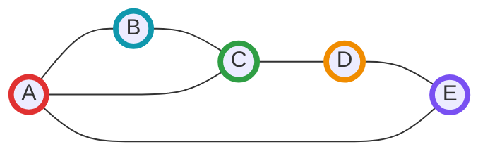

**Análisis del grafo:**

- 5 vértices: A, B, C, D, E
- El grafo es un ciclo con una cuerda (A-C)
- **Caminos hamiltonianos posibles:**
  - A → B → C → D → E (usa el ciclo exterior)
  - A → C → B (luego no puede continuar)
  - A → E → D → C → B
  - Y muchos más...

**Un camino hamiltoniano válido:** A → B → C → D → E

**Un ciclo hamiltoniano válido:** A → B → C → D → E → A

#### Aplicaciones del Camino Hamiltoniano

**1. Problema del Viajante (TSP):**

- Es un camino hamiltoniano ponderado que minimiza el costo total
- En el ciclo hamiltoniano se busca volver al origen con costo mínimo

**2. Enrutamiento de circuitos impresos:**

- Perforar todos los puntos sin levantar la broca
- Minimizar distancia total recorrida

**3. Planificación de tareas:**

- Ejecutar n tareas visitando cada una exactamente una vez
- Con restricciones de precedencia (grafo dirigido)

**4. Juegos y puzzles:**

- Problema del caballo en ajedrez (recorrer todo el tablero)
- Rompecabezas de recorridos

**5. Secuenciación de ADN:**

- Ordenar fragmentos de manera que cada uno aparezca exactamente una vez
- Similar a ensamblaje de genoma

#### Algoritmos Aproximados y Heurísticas

Para grafos grandes donde el backtracking es inviable:

##### 1. Algoritmo del Vecino Más Cercano

```cpp
std::vector<int> nearest_neighbor_hamiltonian(int start) {
    std::vector<int> path;
    std::vector<bool> visited(n, false);
    
    int current = start;
    path.push_back(current);
    visited[current] = true;
    
    for (int i = 1; i < n; ++i) {
        int next = -1;
        int min_dist = INT_MAX;
        
        // Encontrar vecino no visitado más cercano
        for (int v : graph[current]) {
            if (!visited[v]) {
                // Si es ponderado, usar peso de la arista
                if (next == -1 || v < min_dist) {
                    next = v;
                    min_dist = v;
                }
            }
        }
        
        if (next == -1) {
            // No hay camino hamiltoniano
            return {};
        }
        
        current = next;
        path.push_back(current);
        visited[current] = true;
    }
    
    return path;
}
```

**Complejidad:** $O(V^2)$  
**Garantía:** No garantiza encontrar solución óptima ni siquiera que exista

##### 2. Búsqueda Local (2-opt para caminos)

```cpp
void improve_hamiltonian_path(std::vector<int>& path) {
    bool improved = true;
    
    while (improved) {
        improved = false;
        
        for (size_t i = 0; i + 1 < path.size(); ++i) {
            for (size_t j = i + 2; j < path.size(); ++j) {
                // Intentar reversar el segmento [i+1, j]
                std::reverse(path.begin() + i + 1, path.begin() + j + 1);
                
                // Verificar si sigue siendo válido y si mejoró
                if (is_valid_path(path) && is_better(path)) {
                    improved = true;
                } else {
                    // Revertir el cambio
                    std::reverse(path.begin() + i + 1, path.begin() + j + 1);
                }
            }
        }
    }
}
```

#### Comparación: Euleriano vs Hamiltoniano

| Aspecto | Camino Euleriano | Camino Hamiltoniano |
|---------|------------------|---------------------|
| **Definición** | Visita cada **arista** una vez | Visita cada **vértice** una vez |
| **Complejidad** | $O(E)$ (polinomial) | NP-completo (exponencial) |
| **Criterio de existencia** | Teorema de Euler (simple) | No existe criterio simple |
| **Algoritmo** | Hierholzer (eficiente) | Backtracking (exponencial) |
| **Aplicación típica** | Rutas postales, circuitos | TSP, planificación de tareas |
| **Para grafos grandes** | Siempre factible | Solo con heurísticas/aproximaciones |
| **Verificación** | $O(V + E)$ | $O(V)$ |

#### Complejidad y Consideraciones del Camino Hamiltoniano

**Complejidad temporal:**

- Backtracking básico: $O(V!)$ en el peor caso
- Con podas: puede reducirse a $O(2^V \cdot V^2)$ con programación dinámica
- Heurísticas: $O(V^2)$ a $O(V^3)$

**Complejidad espacial:** $O(V)$ para el path y visited

**Consideraciones prácticas:**

- Para $n \leq 15$: backtracking directo es viable
- Para $15 < n \leq 25$: usar podas y optimizaciones
- Para $n > 25$: considerar heurísticas o programación dinámica con bitmask (TSP-style)
- El problema de decisión (¿existe?) es tan difícil como encontrar la solución

**Variante con programación dinámica (similar a TSP):**

Si el problema es encontrar camino hamiltoniano con pesos, se puede usar DP con bitmask en $O(2^n \cdot n^2)$:

```cpp
const int INF = 1e9;
int dp[1 << 20][20]; // dp[mask][last] = existe camino con vértices en mask terminando en last

bool has_hamiltonian_dp(int n) {
    // Inicializar
    for (int mask = 0; mask < (1 << n); ++mask) {
        for (int i = 0; i < n; ++i) {
            dp[mask][i] = INF;
        }
    }
    
    // Caso base: empezar desde cada vértice
    for (int i = 0; i < n; ++i) {
        dp[1 << i][i] = 0;
    }
    
    // DP
    for (int mask = 0; mask < (1 << n); ++mask) {
        for (int last = 0; last < n; ++last) {
            if (!(mask & (1 << last))) continue;
            if (dp[mask][last] == INF) continue;
            
            for (int next = 0; next < n; ++next) {
                if (mask & (1 << next)) continue;
                if (!is_adjacent(last, next)) continue;
                
                int new_mask = mask | (1 << next);
                dp[new_mask][next] = std::min(dp[new_mask][next], dp[mask][last] + 1);
            }
        }
    }
    
    // Verificar si existe camino que visita todos los vértices
    int full_mask = (1 << n) - 1;
    for (int i = 0; i < n; ++i) {
        if (dp[full_mask][i] < INF) {
            return true;
        }
    }
    
    return false;
}
```

### 7.5.3 Problema del Viajante (TSP - Traveling Salesman Problem)

**Definición:** Dado un grafo completo ponderado con $n$ vértices, encontrar el ciclo hamiltoniano de costo mínimo (un ciclo que visita cada vértice exactamente una vez y regresa al origen).

**Complejidad:** TSP es un problema NP-completo. No se conoce un algoritmo de tiempo polinomial para resolverlo de manera exacta.

#### Enfoque Exacto: Programación Dinámica con Bitmask

**Idea:** Usar programación dinámica donde el estado es $(i, S)$:

- $i$: vértice actual
- $S$: conjunto de vértices ya visitados (representado como bitmask)
- $dp[i][S]$: costo mínimo para visitar todos los vértices en $S$ terminando en $i$

**Complejidad:** $O(n^2 \cdot 2^n)$ — factible solo para $n \leq 20$ aproximadamente.

**Implementación:**

```cpp
const int MAXN = 20;
const long long INF = 1e18;
long long dist[MAXN][MAXN];  // Matriz de distancias
long long dp[MAXN][1 << MAXN]; // dp[i][mask] = costo mínimo
int n; // número de ciudades

long long tsp_exact() {
    // Inicializar dp con infinito
    for (int i = 0; i < n; ++i) {
        for (int mask = 0; mask < (1 << n); ++mask) {
            dp[i][mask] = INF;
        }
    }
    
    // Caso base: empezar desde ciudad 0
    dp[0][1] = 0; // mask = 1 significa solo ciudad 0 visitada
    
    // Iterar sobre todos los subconjuntos
    for (int mask = 1; mask < (1 << n); ++mask) {
        for (int i = 0; i < n; ++i) {
            if (!(mask & (1 << i))) continue; // i no está en mask
            if (dp[i][mask] == INF) continue;
            
            // Intentar ir a ciudad j
            for (int j = 0; j < n; ++j) {
                if (mask & (1 << j)) continue; // j ya visitada
                int new_mask = mask | (1 << j);
                dp[j][new_mask] = std::min(dp[j][new_mask], 
                                           dp[i][mask] + dist[i][j]);
            }
        }
    }
    
    // Encontrar el mínimo regresando a la ciudad 0
    long long ans = INF;
    int full_mask = (1 << n) - 1;
    for (int i = 1; i < n; ++i) {
        ans = std::min(ans, dp[i][full_mask] + dist[i][0]);
    }
    
    return ans;
}
```

#### Enfoques Heurísticos (Aproximaciones)

Para grafos grandes ($n > 20$), usamos heurísticas que dan soluciones buenas pero no necesariamente óptimas:

##### 1. Vecino Más Cercano (Nearest Neighbor)

**Algoritmo:**

1. Comenzar en un vértice arbitrario
2. En cada paso, ir al vértice no visitado más cercano
3. Regresar al vértice inicial al final

**Complejidad:** $O(n^2)$

**Ventajas:** Rápido y simple

**Desventajas:** Puede dar soluciones hasta 2 veces peores que el óptimo

```cpp
long long tsp_nearest_neighbor(int start) {
    bool vis[MAXN] = {false};
    int current = start;
    vis[current] = true;
    long long total_cost = 0;
    
    for (int step = 1; step < n; ++step) {
        long long min_dist = INF;
        int next = -1;
        
        // Encontrar vecino más cercano no visitado
        for (int i = 0; i < n; ++i) {
            if (!vis[i] && dist[current][i] < min_dist) {
                min_dist = dist[current][i];
                next = i;
            }
        }
        
        vis[next] = true;
        total_cost += min_dist;
        current = next;
    }
    
    // Regresar al inicio
    total_cost += dist[current][start];
    return total_cost;
}
```

##### 2. Algoritmo de Christofides

**Garantía teórica:** Produce una solución a lo más 1.5 veces el óptimo (si el grafo satisface la desigualdad triangular).

**Pasos principales:**

1. Encontrar MST del grafo
2. Encontrar vértices de grado impar en el MST
3. Hacer un matching mínimo en esos vértices
4. Combinar MST y matching para formar un grafo euleriano
5. Encontrar ciclo euleriano y convertirlo en hamiltoniano

**Complejidad:** $O(n^3)$

##### 3. Optimización Local: 2-opt

**Idea:** Mejorar iterativamente una solución eliminando cruces.

**Procedimiento:**

1. Comenzar con un tour inicial (por ejemplo, con vecino más cercano)
2. Probar intercambiar cada par de aristas
3. Si el intercambio mejora el tour, aceptarlo
4. Repetir hasta que no haya mejoras

```cpp
void two_opt_improve(int tour[], int n) {
    bool improved = true;
    while (improved) {
        improved = false;
        for (int i = 0; i < n - 1; ++i) {
            for (int j = i + 2; j < n; ++j) {
                // Calcular costo actual
                long long current = dist[tour[i]][tour[i+1]] + 
                                   dist[tour[j]][tour[(j+1)%n]];
                
                // Calcular costo después del swap
                long long new_cost = dist[tour[i]][tour[j]] + 
                                    dist[tour[i+1]][tour[(j+1)%n]];
                
                if (new_cost < current) {
                    // Revertir segmento [i+1, j]
                    std::reverse(tour + i + 1, tour + j + 1);
                    improved = true;
                }
            }
        }
    }
}
```

#### Diagrama: TSP — ejemplo visual

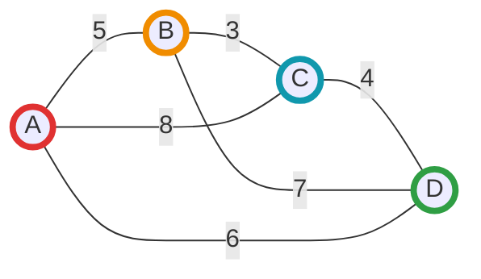

**Ejemplo:** En este grafo, un posible tour es A→B→C→D→A con costo 5+3+4+6=18. El algoritmo exacto probaría todos los posibles tours para encontrar el óptimo.

#### Comparación de Enfoques

| Enfoque | Complejidad | Calidad de Solución | Uso Recomendado |
|---------|-------------|---------------------|-----------------|
| **DP con Bitmask** | $O(n^2 \cdot 2^n)$ | Óptima | $n \leq 20$ |
| **Vecino Más Cercano** | $O(n^2)$ | Aproximación (factor ≤2) | Solución rápida inicial |
| **Christofides** | $O(n^3)$ | Aproximación (factor ≤1.5) | Balance calidad/tiempo |
| **2-opt** | $O(n^2)$ por iteración | Mejora local | Refinar soluciones |

**Aplicaciones prácticas del TSP:**

- Planificación de rutas de entrega
- Diseño de circuitos impresos (PCB drilling)
- Secuenciación de ADN
- Planificación de turnos de mantenimiento
- Optimización de rutas turísticas

## Resumen

Unidad introductoria a grafos, representaciones y algoritmos básicos que forman la base para temas avanzados como caminos mínimos, flujos y algoritmos sobre grafos dirigidos.
